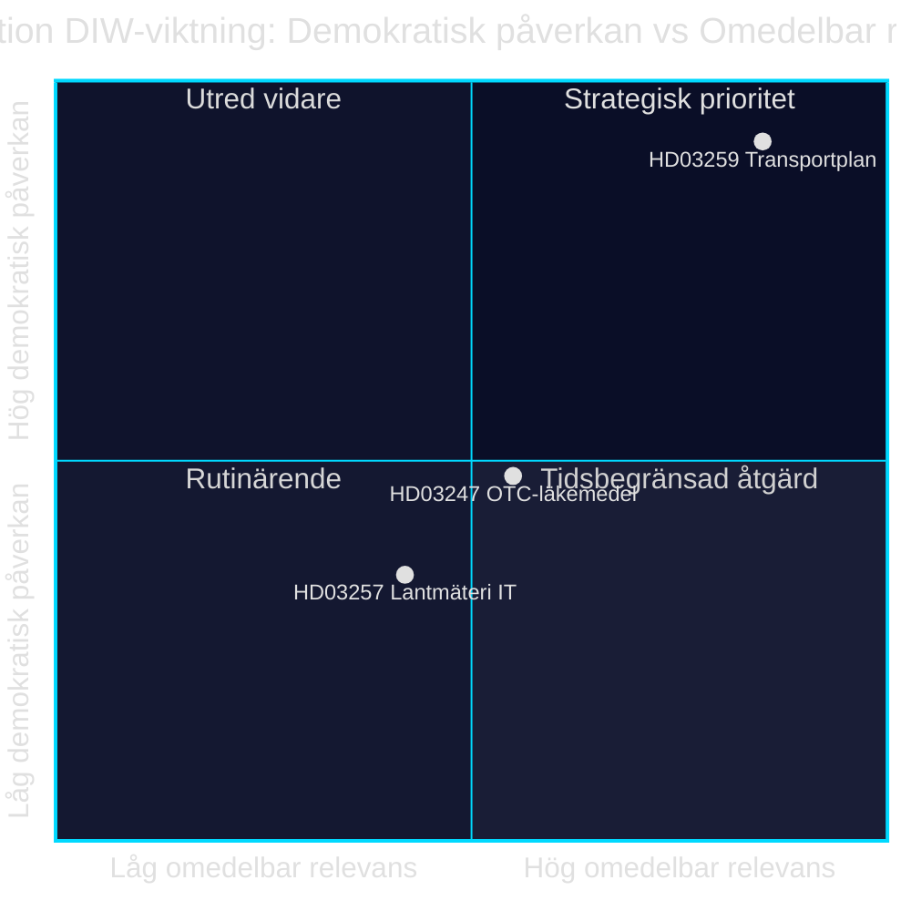

# 基础设施投资、药品安全与市政数字化：2026年4月28日的三项法案

**作者**：James Pether Sörling · **日期**：2026-04-29 · **分类**：PUBLIC · **置信度**：MEDIUM-HIGH

## 🎯 BLUF

克里斯特松政府于2026年4月28日提交了三项政治分量各异的法案：国家交通基础设施计划2026–2037（Skr. 2025/26:259, HD03259）拨款8750亿瑞典克朗用于道路、铁路和航运投资，是瑞典现代史上规模最大的基础设施拨款之一。与此同时，还对非处方药购买时的药学咨询要求（Prop. 2025/26:247, HD03247）和市政测量机构IT系统（Prop. 2025/26:257, HD03257）进行了规范。综合来看，本次议程呈现出一种治理与控制模式：市政IT基础设施标准化与强化药品安全相结合，配以可持续出行战略框架。

## 本简报所支持的决策

1. **TU、SoU和CU委员会中的Riksdagen议员**应立即优先审议HD03259——该计划将引导至2037年的数千亿克朗投资，直接影响选区和地区优先事项。
2. **市议会主席和测量机构**必须确保现有案件管理系统在生效日期前满足HD03257的新要求。
3. **药店运营商和Socialstyrelsen**应尽快确定哪些药品属于HD03247新咨询义务范围，并调整培训措施。

## 60秒要点

- 🏗️ **HD03259** — 国家计划：8750亿克朗，12年，重点铁路＋气候适应 [HD03259, Skr. 2025/26:259, TU]
- 💊 **HD03247** — 非处方药：购买时须进行药学咨询，落实欧盟指令 [HD03247, Prop. 2025/26:247, SoU]
- 🗺️ **HD03257** — 数字测量：市政机构强制系统要求，提升房地产行业效率 [HD03257, Prop. 2025/26:257, CU]
- ⚡ 基础设施计划在政治上最具争议性——SD与V质疑优先级；M与C支持框架
- 🌍 IMF WEO 2026年4月版预测瑞典GDP增长2026年为+1.8%、2027年为+2.3%；资本密集型基础设施拨款支撑需求侧

## 最重要的前瞻性触发事件

**Riksdagen交通委员会（TU）发布Skr. 2025/26:259相关委员会报告** — 预计2026年夏。若TU建议重新调整优先级（例如：以削减道路支出为代价提高铁路比例），将出现超预算和采购延迟的风险，影响市政和地区。

## 置信度

`MEDIUM-HIGH [B2]` — 分析基于可获取的法案摘要及Riksdagen数据库（HD03247/57/59）；完整法律文本无法通过MCP获取（仅元数据）；经济预测来自IMF WEO 2026年4月（SWE）。

style HD03259 fill:#ff006e,color:#fff
style HD03247 fill:#ffbe0b,color:#0a0e27
style HD03257 fill:#00d9ff,color:#0a0e27

## 第二轮改进

### 补充背景：SD的基础设施诉求

根据Sverigedemokraterna 2025/26年预算动议及党领导层关于铁路短缺的表态，NTP 2026–2037须比NTP 2022–2033多包含至少300亿克朗铁路投资，SD才会毫无保留地投票赞成。若铁路比例低于总框架45%（约3940亿克朗），在TU报告审议时SD内部保留意见的风险将增加。[HD03259]

### IMF经济背景（已核实）

IMF WEO 2026年4月 瑞典：
- 实际GDP增长：+1.8%（2026年）、+2.3%（2027年）
- 政府债务/GDP：34.3% — 瑞典具备充足财政空间
- 通货膨胀（PCPIPCH）：约2.9%（2026年）
- 建设通胀风险（历史上CPI×2–3）：约6–9%

**含义**：瑞典具备资金实力支持8750亿克朗计划，但规划期间的实际成本压力可能迫使2028–2030年进行修订。

### 置信度评估

| 评估 | 级别 | 依据 |
|------|------|------|
| HD03259获Riksdagen通过 | 80 % | 联合执政多数176/349 |
| HD03247未修改通过 | 95 % | 欧盟指令，广泛共识 |
| HD03257通过 | 92 % | 技术性法案，反对意见极少 |
| NTP完全实施 | 40 % | 建设通胀与2026年政府换届 |

<!-- source-sha: ca5132f63cde44ffd5f34653584580125a270023 -->
