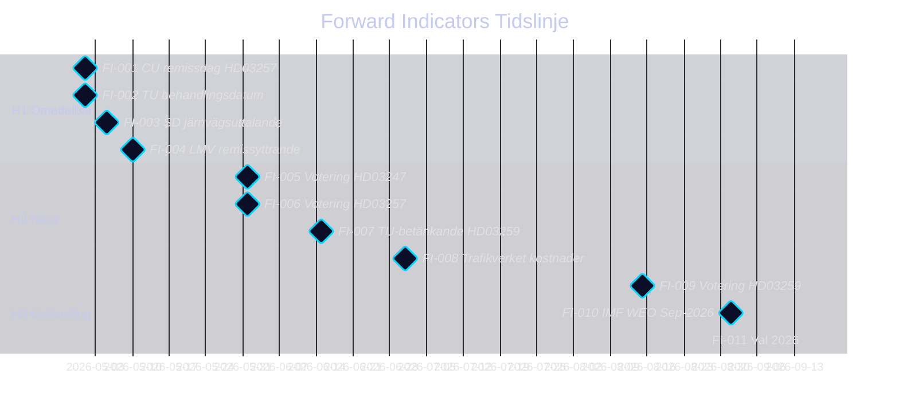

# Forward Indicators — Propositioner 2026-04-28

**Author**: James Pether Sörling · **Date**: 2026-04-29 · **Confidence**: MEDIUM

## Tidshorisonter och Indikatorer

### Horisont 1: Omedelbar (0–30 dagar)

**FI-001** [2026-05-01]: Riksdagens civilutskott (CU) sätter remissdag för HD03257 — indikerar tid till votering
**FI-002** [2026-05-01]: Riksdagens trafikutskott (TU) sätter planerade behandlingsdatum för HD03259 — kritisk tidslinje för koalitionsförhandling
**FI-003** [2026-05-05]: SD:s partiledning kommenterar järnvägsandel i HD03259 — SD-uttalanden avgörande för koalitionsläget
**FI-004** [2026-05-10]: Läkemedelsverket publicerar remissyttrande om HD03247 — utfall indikerar implementeringstid

### Horisont 2: Nära (30–90 dagar)

**FI-005** [2026-06-01]: Votering om HD03247 i riksdagen (socialdepartementet) — förväntad bred ja-majoritet
**FI-006** [2026-06-01]: Votering om HD03257 i riksdagen (civilutskottet) — förväntad bred ja-majoritet
**FI-007** [2026-06-15]: Riksdagens TU-betänkande om HD03259 (Skr. 2025/26:259) — komitéstriderna börjar här
**FI-008** [2026-07-01]: Trafikverkets officiella kostnadsanalyser av NTP — avgörande för trovärdighetsbedömning av 875 Mdr kr

### Horisont 3: Mellanlång (90–180 dagar)

**FI-009** [2026-08-15]: Votering om HD03259 i riksdagen — preliminärt; beroendevar av TU-betänkandets tidplan
**FI-010** [2026-09-01]: IMF WEO September 2026 — SWE-tillväxtprognos; om nedrevideras påverkar transportplanens budgetprioritet
**FI-011** [2026-09-15]: Val 2026 (september) — resultat avgör om transportplanen genomförs av sittande eller ny Regering

### Horisont 4: Lång (180+ dagar)

**FI-012** [2026-Q4]: Första upphandlingar under HD03259 — signalerar vilka projekt som prioriteras
**FI-013** [2027-Q1]: HD03257 ikraftträdande — kommunal IT-uppgradering börjar; Lantmäteriet publicerar efterlevnadsstatistik
**FI-014** [2027-Q2]: HD03247 ikraftträdande — apotek rapporterar till Läkemedelsverket om utbildningsnivå
**FI-015** [2027-Q3]: Riksrevisionen väljer om att granska NTP 2026–2037 — hög sannolikhet

## Trigger Conditions

| Indikator | Triggerhändelse | Konsekvens |
|-----------|----------------|------------|
| FI-003 | SD kräver >300 Mdr järnväg | Koalitionsförhandling intensifieras; risk för Scenario 3 |
| FI-010 | IMF nedreviderar SWE till <0 % | Budget squeeze → NTP-reviderat 2027 |
| FI-011 | Oppositionsseger val 2026 | NTP 2026–2037 revideras; infrastrukturplan omförhandlas |
| FI-008 | Trafikverket: +20 % kostnadsökning | 875 Mdr kr = realt 700 Mdr kr; mediakris |

