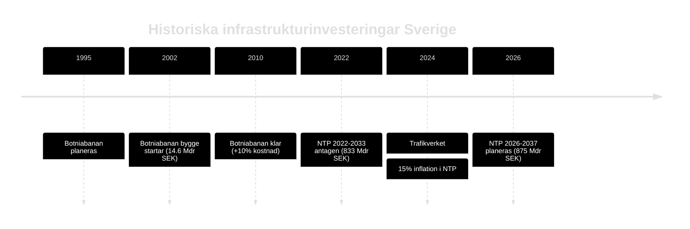

# Historical Parallels — Propositioner 2026-04-28

**Author**: James Pether Sörling · **Date**: 2026-04-29 · **Confidence**: MEDIUM

## Historiska paralleller

### HD03259 — Nationell transportplan 2026–2037

**Parallell 1: NTP 2022–2033 (833 Mdr kr)**
- Antagen under Magdalena Anderssons regering, fokus på järnväg och hållbarhet
- Genomförandeutfall: Trafikverket rapporterade 2024 om +15 % kostnadsinflation → realt bortfall ~125 Mdr kr
- **Lärdomar**: 875 Mdr kr-planen riskerar liknande inflation om inga indexkorrigeringsmekanismer byggs in
- **Signifikans**: Direkt institutionellt minne — Riksrevisionen granskar NTP efter varje mandatperiod

**Parallell 2: Stomjärnvägsprojekt 1990-tal (Botniabanan)**
- Botniabanan (2002–2010): Budget 14,6 Mdr kr, slutkostnad ~16 Mdr kr (+10 %)
- Norrbotniabanan ingår i HD03259 — samma geografi, liknande genomföranderisker
- **Lärdomar**: Norra Sverige-projekt har historiskt hårt väder, svag konkurrens, höga underhållskrav

**Parallell 3: Europeiska transportplaner (TEN-T Core Network)**
- EU-kommissionen reviderade TEN-T Core Network 2024 — Sverige åtar sig fullständig ERTMS-utbyggnad till 2040
- EU-krav kan tvinga upp kostnaderna om nationell plan underfinanserar ERTMS
- **Signifikans**: Skapar extern låsning för NTP genomförande

### HD03247 — OTC-läkemedelsrådgivning

**Parallell 4: Apoteksomreglering 2009**
- Avregleringen av apoteksmonopolet 2009 skapade 1 400+ apotek (från 900)
- Glesbygdsproblematiken uppstod direkt: apotek i tätorter, inte glesbygd
- **Lärdomar**: Ny reglering av rådgivningskrav kan ha oavsedda geografiska fördelningseffekter
- [HD03247]

**Parallell 5: Norsk receptfriläkemedelspolicy 2020**
- Norge implementerade EU-direktivet 2020 med liknande farmaceutisk rådgivning
- Utfall: 93 % av apotek uppfyllde krav inom 18 månader; 7 % stängde eller tog stöd
- **Signifikans**: Positiv referenspunkt för HD03247 genomförbarhet

### HD03257 — Kommunal lantmäteri IT

**Parallell 6: Lantmäteriets digitalisering 2015–2020**
- Lantmäteriet digitaliserade fastighetsregistret 2015–2020 (kostnad ~1,2 Mdr kr)
- Kommunala lantmäterimyndigheter hängde inte med → gap idag
- **Lärdomar**: HD03257 är en naturlig uppföljning; bör inte möta institutionellt motstånd
- [HD03257]

## Sammantagen lärdomsanalys

| Parallell | Relevans | Nyckelinsikt |
|-----------|----------|--------------|
| NTP 2022–2033 | HÖG | Inflationsrisk är reell och dokumenterad |
| Botniabanan | MEDIUM | Norra Sverige-projekt dyrare än estimerat |
| TEN-T 2024 | HÖG | EU-krav skapar extern kostnadspress |
| Apoteksomreglering 2009 | MEDIUM | Rådgivningskrav riskerar glesbygdstillgång |
| Norsk OTC-policy | MEDIUM | Genomförbart med 18 månaders tidplan |
| Lantmäteridigitialisering | LÅG | Positivt prejudikat |

