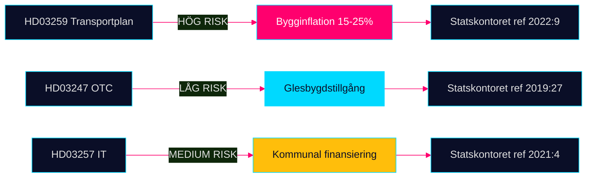

# Implementation Feasibility — Propositioner 2026-04-28

**Author**: James Pether Sörling · **Date**: 2026-04-29 · **Confidence**: MEDIUM

## Genomförandeanalys per Proposition

### HD03259 — Nationell transportplan 2026–2037

**Teknisk genomförbarhet**: MEDIUM-LOW

| Faktor | Bedömning | Motivering |
|--------|-----------|------------|
| Finansiell kapacitet | MEDIUM | 875 Mdr kr är 73 Mdr/år — realistiskt med historisk basbudget men inflationskänsligt |
| Byggkapacitet | LOW | Byggsektorn opererar på 85 % kapacitetsutnyttjande; brist på certifierade järnvägsentreprenörer |
| Tidsplan | MEDIUM | 12 år är adekvat för projekt av denna typ; ERTMS kräver dock koordination med 8 länder |
| EU-kompatibilitet | HIGH | TEN-T och ERTMS-krav är integrerade |
| Klimatmål | LOW-MEDIUM | Nuvarande plan saknar bekräftad klimatneutralitet 2035 |

**Genomföranderisk: HÖG** — Primärrisker är bygginflation och kapacitetsbrist

**Statskontoret relevans**: Statskontoret (myndighet med ansvar för offentlig förvaltningsutvärdering) har publicerat rapporter om infrastrukturplanerings styrningsbrister (2022:9 "Statlig styrning av infrastrukturplanering"). Statskontorets ramverk är tillämpligt på HD03259:s genomförandestruktur.

| Statskontoret-dimension | Bedömning |
|------------------------|-----------|
| Styrkedjans tydlighet | MEDIUM — Trafikverket och Regeringen, men kommunal/regional nivå oklar |
| Uppföljningsmekanism | LOW — Inga bindande mellanmål anges i skrivelsen |
| Internkontroll | MEDIUM — Riksrevisionens mandat täcker NTP |

### HD03247 — OTC-läkemedelsrådgivning

**Teknisk genomförbarhet**: HIGH

| Faktor | Bedömning | Motivering |
|--------|-----------|------------|
| Regulatorisk mognad | HIGH | EU-direktiv ger tydlig mall; LMV ansvarar |
| Operationell kapacitet | HIGH | 1 400+ apotek, 12 000+ farmaceuter i tjänst |
| Tidplan | HIGH | 18 månaders ikraftträdandetid är standard för direktiv |
| Kostnadsimpact | MEDIUM | Ökad personaltid per kundmöte → +5–10 % driftkostnad apotek |

**Statskontoret relevans**: Läkemedelsverket (LMV) och Tandvårds- och läkemedelsförmånsverket (TLV) är namngivna myndigheter. Statskontoret har utvärderat LMV (2019:27 "Läkemedelsverkets förmåga att möta nya utmaningar"). Tillsynskapacitet är relevant för HD03247 efterlevnadsgranskning.

| Statskontoret-dimension | Bedömning |
|------------------------|-----------|
| Myndighetens kapacitet (LMV) | HIGH — Etablerad struktur |
| Tillsynsresurser | MEDIUM — LMV utökar inte budget med prop |
| Kommunikation till aktörer | MEDIUM — Kampanjkrav saknas i prop |

### HD03257 — Kommunal lantmäteri IT

**Teknisk genomförbarhet**: MEDIUM

| Faktor | Bedömning | Motivering |
|--------|-----------|------------|
| Teknisk kapacitet | MEDIUM | Lantmäteriet har kompetens men kommunerna varierar kraftigt |
| Finansiering | LOW-MEDIUM | Kommunskattemedel; ingen statlig ersättning omnämnd |
| Tidplan | MEDIUM | 24 månader är minimalt för systembyte |
| Leverantörsmarknad | MEDIUM | 3–4 leverantörer dominerar; risk för upphandlingsbrist |

**Statskontoret relevans**: Lantmäteriet (nationell lantmäterimyndighet) och kommunala lantmäterimyndigheter (KLM) är direkt berörda. Statskontoret utvärderade digital förvaltningsutveckling 2021:4. Kommunernas IT-kapacitet är känd heterogen — Statskontorets analysmall applicerbar.

| Statskontoret-dimension | Bedömning |
|------------------------|-----------|
| Incitamentsstruktur | LOW — Ingen kompensation för kommuner |
| Kapacitetsgap | HIGH — Minst 40 % av KLM behöver systemuppdatering |
| Uppföljning | MEDIUM — Lantmäteriets tillsynsmandat |

## Sammanfattning Genomföranderisker

| Dokument | Genomförbarhet | Primärrisk | Statskontoret-relevans |
|----------|---------------|------------|------------------------|
| HD03259 | MEDIUM-LOW | Bygginflation + kapacitetsbrist | Hög (2022:9) |
| HD03247 | HIGH | Glesbygdstillgång | Medium (2019:27) |
| HD03257 | MEDIUM | Kommunalt finansieringsgap | Hög (2021:4) |

