# Intelligence Assessment — Propositioner 2026-04-28

**Author**: James Pether Sörling · **Date**: 2026-04-29 · **Confidence**: MEDIUM-HIGH

## Key Judgments

**KJ-1** [MEDIUM-HIGH confidence]: Den nationella transportinfrastrukturplanen 2026–2037 (HD03259) kommer sannolikt att antas av riksdagen med begränsade ändringar under Q3 2026. Koalitionsstödet från M och SD — med SD:s krav på järnvägsökning — är hanterbart inom planens finansiella ram. [HD03259, Skr. 2025/26:259] (WEP: *sannolikt* = 55–75 %)

**KJ-2** [HIGH confidence]: Prop. 2025/26:247 (HD03247) om receptfria läkemedel antas utan substantiell opposition — EU-direktivet avgör normnivån och bred parlamentarisk enighet saknar alternativ. Implementeringsutmaningarna är operationella, inte politiska. [HD03247] (WEP: *nästan säkert* = 90–99 %)

**KJ-3** [MEDIUM confidence]: Prop. 2025/26:257 (HD03257) om kommunala lantmäterimyndigheters IT-system antas men efterlevnadsgraden 12–18 månader efter ikraftträdande riskerar att understiga 70 % på grund av kommunala budgetrestriktioner. [HD03257] (WEP: *ungefär lika troligt som inte* = 40–60 % att >70 % efterlevnad uppnås i tid)

**KJ-4** [MEDIUM confidence]: Bygg- och anläggningsinflation utgör den mest sannolika destruktiva faktorn för transportplanens realvärde — IMF projekterar KPI 2,9 % 2026 (WEO Apr-2026:PCPIPCH SWE) men konstruktionsindexet historiskt 2–3× KPI → realt bortfall 15–25 % av 875 Mdr kr under planperioden om inga indexkorrigeringar genomförs. [IMF WEO Apr-2026]

**KJ-5** [LOW confidence]: En blockering av transportplanen (scenario 3: 20 % sannolikhet) skulle utlösa den allvarligaste parlamentariska krisen för Tidöavtalet sedan 2022. [HD03259, scenario-analysis.md]

## Priority Intelligence Requirements (PIR)

**PIR-1** (Öppen): Vad är den exakta järnväg/väg-fördelningen i de 875 Mdr kr? (HD03259 — full text behövs för besked)
**PIR-2** (Öppen): Hur planerar SD att agera om järnvägstillägget är under 30 Mdr kr?
**PIR-3** (Öppen): Vilka specifika läkemedel klassificeras under HD03247 rådgivningskrav?
**PIR-4** (Öppen): Hur många kommunala lantmäterimyndigheter har icke-kompatibla IT-system per HD03257?
**PIR-5** (Öppen): Är transportplanen förenlig med EU:s Fit for 55 och 2040 Climate Law?

## Key Assumptions Check

| Antagande | Sannolikhet att fel | Konsekvens om fel |
|-----------|--------------------|--------------------|
| SD stödjer infrastrukturplanen inom Tidöavtalet | 15 % | Stor: koalitionskris |
| IMF-prognos BNP +1,8 % 2026 är korrekt | 20 % | Måttlig: budgetpress |
| HD03247 EU-direktiv styr implementeringen | 5 % | Liten: det är ett faktum |
| Kommunal IT-uppgradering tar max 2 år | 35 % | Måttlig: efterlevnadsgap |

```mermaid
%%{init: {"theme": "base", "themeVariables": {"primaryColor": "#0a0e27","primaryTextColor": "#e0e0e0","primaryBorderColor": "#00d9ff","lineColor": "#ff006e","sectionBkgColor": "#1a1e3d","altSectionBkgColor": "#0a0e27"}}}%%
flowchart TD
    KJ1[KJ-1: Transportplan antas MED] --> PIR1[PIR-1: Järnväg/väg-fördelning]
    KJ2[KJ-2: OTC-prop antas HÖG] --> PIR3[PIR-3: Vilka läkemedel]
    KJ3[KJ-3: IT-krav antas MED] --> PIR4[PIR-4: Kommunal IT-status]
    KJ4[KJ-4: Inflation risk MED] --> PIR5[PIR-5: Klimatkompatibilitet]
    KJ5[KJ-5: Blockering risk LÅG] --> PIR2[PIR-2: SD-strategi]
    style KJ1 fill:#1a1e3d,stroke:#ffbe0b
    style KJ2 fill:#1a1e3d,stroke:#00d9ff
    style KJ3 fill:#1a1e3d,stroke:#ffbe0b
    style KJ4 fill:#1a1e3d,stroke:#ffbe0b
    style KJ5 fill:#1a1e3d,stroke:#ff006e
    style PIR1 fill:#ff006e,color:#fff
    style PIR2 fill:#ffbe0b,color:#0a0e27
    style PIR3 fill:#00d9ff,color:#0a0e27
    style PIR4 fill:#00d9ff,color:#0a0e27
    style PIR5 fill:#ffbe0b,color:#0a0e27
```

