# Media Framing Analysis — Propositioner 2026-04-28

**Author**: James Pether Sörling · **Date**: 2026-04-29 · **Confidence**: LOW-MEDIUM (predicted framing)

## Förväntade ramverk per proposition

### HD03259 — Nationell transportplan 2026–2037

**Frame 1: "Historisk satsning" (Koalitionsnarratv)**
- Avsändare: Ulf Kristersson, Andreas Carlson (L), Tidömedia
- Nyckelbudskap: "Det största infrastrukturpaketet i modern tid"
- Medier: SVT Agenda, Expressen, Dagens Industri
- Risk för frame: Opposition kontrar med inflationsargument

**Frame 2: "Väg på bekostnad av järnväg" (Oppositionsnarrativ)**
- Avsändare: Magdalena Andersson (S), Magnus Ek (C), Miljöpartiet
- Nyckelbudskap: "Klimatmålen offras för motorvägar"
- Medier: Aftonbladet, Rapport SVT, ETC
- Risk för frame: SD:s järnvägskrav synliggörs

**Frame 3: "Norrbotniabanan och Norrlandsfrågan"**
- Avsändare: Norrbottenspolitiker, regionala medier
- Nyckelbudskap: "Hur mycket till norra Sverige?"
- Medier: Norrbottens-Kuriren, P4 Norrbotten, Västerbottens-Kuriren
- Sannolik vinkel: Om Norrbotniabanan är finansierad → positiv frame

**Frame 4: "Kostnadsrisker och budgetsprickor"**
- Avsändare: Riksrevisionen, ekonomikorrespondenter
- Nyckelbudskap: "875 miljarder räcker inte — inflation slukar värdet"
- Medier: SvD Näringsliv, Ekot SR, DN Ekonomi
- Trolig tidpunkt: Trafikverkets revidering Q4 2026

### HD03247 — OTC-läkemedelsrådgivning

**Frame 5: "Säkrare läkemedelsanvändning"**
- Koalitionsnarrativ: Patientsäkerhet och EU-anpassning
- Medier: Läkartidningen, Pharmaindustri
- Sannolik tone: Teknisk-positiv, låg nyhetsvärde

**Frame 6: "Risk för glesbygdsapotek"**
- Oppositionsnarrativ: Kostnadstryck kan stänga lokalapotek
- Medier: Regionala tidningar, Landsbygdsnytt
- Sannolik ton: Kritisk, med human interest

### HD03257 — Kommunal lantmäteri IT

**Frame 7: "Digital förvaltning" (neutral)**
- Inga starka politiska ramar; teknisk-administrativ nyhet
- Trolig bevakning: Fastighets- och teknikmedier

## Propagandaanalys (OSINT-perspektiv)

**Desinformationsrisker kring HD03259**:
- Falsk premiss: "Sverige riskerar EU-böter om planen antas" → Osann; TEN-T-krav gäller infrastrukturstandarder
- Overstatement: "875 Mdr räcker till hela klimatomställningen" → Ointressant förenkling
- Understatement: "Bara 11 % mer än förra planen" → Tekniskt sant men missar inflationsjustering

**Övervakningsrekommendationer**:
1. Observera SD:s interna kommunikation om järnvägsandel (SNS, Arbetsgrupp transport)
2. Övervaka Trafikverkets omvärldsrapporter för kostnadssignaler
3. Granska oppositionspartiernas egna alternativplaner (S och V har egna NTP-kalkyler)

```mermaid
%%{init: {"theme": "base", "themeVariables": {"primaryColor": "#0a0e27","primaryTextColor": "#e0e0e0","primaryBorderColor": "#00d9ff","lineColor": "#ff006e","sectionBkgColor": "#1a1e3d","altSectionBkgColor": "#0a0e27"}}}%%
flowchart TD
    HD03259[HD03259 Transportplan] --> F1[Frame 1: Historisk satsning]
    HD03259 --> F2[Frame 2: Järnvägsgapet]
    HD03259 --> F3[Frame 3: Norrlandsfrågan]
    HD03259 --> F4[Frame 4: Kostnadsrisk]
    HD03247[HD03247 OTC] --> F5[Frame 5: Patientsäkerhet]
    HD03247 --> F6[Frame 6: Glesbygdsapotek]
    HD03257[HD03257 IT-lantmäteri] --> F7[Frame 7: Digital förvaltning]
    style F1 fill:#00d9ff,color:#0a0e27
    style F2 fill:#ff006e,color:#fff
    style F3 fill:#ffbe0b,color:#0a0e27
    style F4 fill:#ff006e,color:#fff
    style F5 fill:#00d9ff,color:#0a0e27
    style F6 fill:#ffbe0b,color:#0a0e27
    style F7 fill:#00d9ff,color:#0a0e27
```

