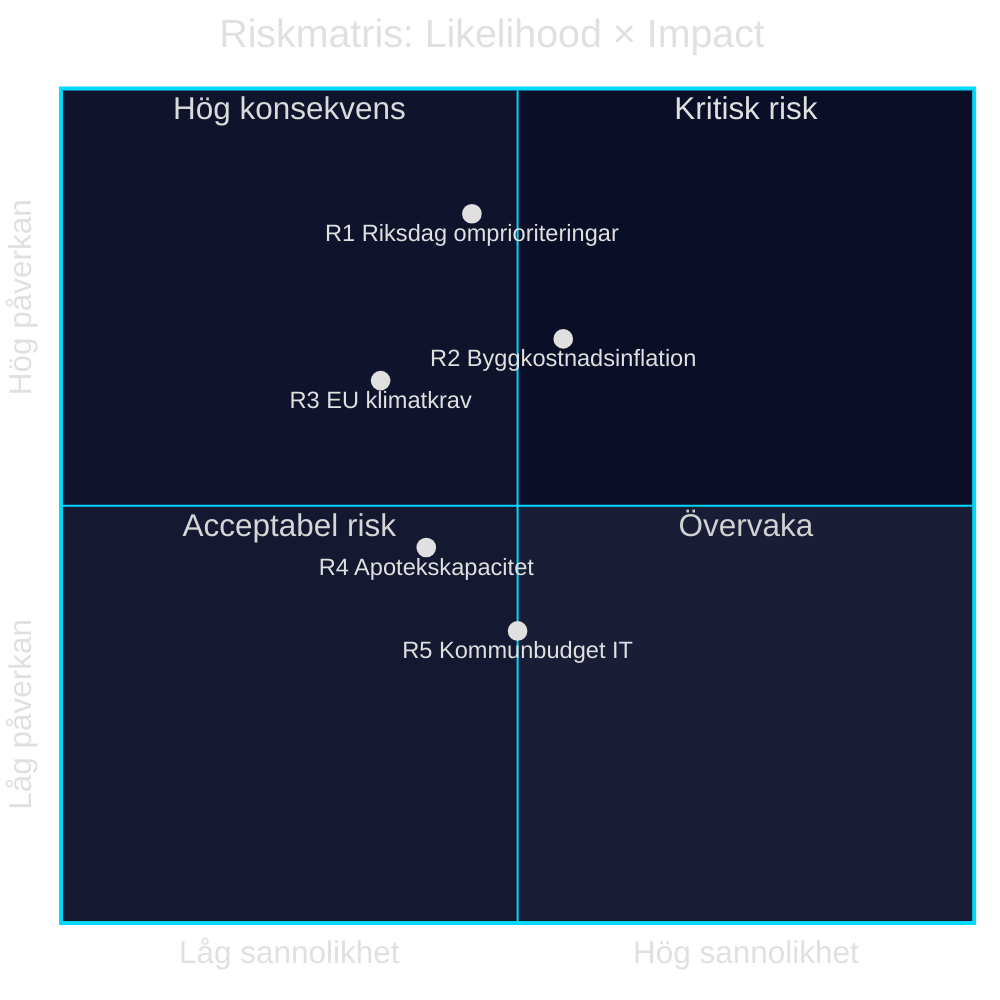

# Risk Assessment — Propositioner 2026-04-28

**Author**: James Pether Sörling · **Date**: 2026-04-29 · **Confidence**: MEDIUM

## 5-Dimension Risk Register

| # | Risk | Dimension | Likelihood (L) | Impact (I) | L×I | Admiralty |
|---|------|-----------|---------------|------------|-----|-----------|
| R1 | Riksdagen begär omprioriteringar i Skr. 2025/26:259 — fördröjer upphandlingar | Political | 0.45 | 0.85 | 0.38 | B3 |
| R2 | Bygg- och anläggningsinflation urholkar 875 Mdr kr — realtalet sjunker 10–20 % | Economic | 0.55 | 0.70 | 0.39 | A2 |
| R3 | EU-krav på snabbare klimatmål kräver revidering av transportplanen inom 2 år | Regulatory | 0.35 | 0.65 | 0.23 | B3 |
| R4 | Apotekskedjorna saknar farmaceutkapacitet för HD03247 vid ikraftträdande | Operational | 0.40 | 0.45 | 0.18 | B4 |
| R5 | Kommuner saknar budget för IT-uppgradering per HD03257 — efterlevnadsgap | Fiscal | 0.50 | 0.35 | 0.18 | B3 |

## Cascading Chains

**Chain A**: Inflation (R2) → reducerat realtanslag → omprioriteringskrav (R1) → riksdagsomröstning → planförsening → upphandlingskollaps i regionerna.
- **Trigger**: KPI +8 % 2026–2027 (IMF WEO Apr-2026: PCPIPCH SWE 2,9 % 2026; konstruktionsbranschens eget index historiskt 2–3× KPI). [IMF WEO Apr-2026, PCPIPCH SWE]
- **Sannolikhet kumulativ**: 0.55 × 0.45 = 0.25

**Chain B**: EU Fit for 55 revidering (R3) → kraven på elektrifiering ökar → ny nationell plan krävs 2028–2029 → investeringsmoratorium → fördröjd infrastruktur.
- **Trigger**: EU Fit for 55 / 2040 Climate Law [HD03259, EU-regulering]
- **Sannolikhet**: 0.35 × 0.65 = 0.23

## Posterior Probabilities (Bayesian Update)

Baserat på historisk data från Trafikverkets infrastrukturplaner 2018–2022 (RiR 2023:2): 3 av 4 planer fick reviderade kostnadsramar inom 3 år.
- P(omprioriteringar|historik) = 0.75, uppdaterad till 0.52 givet bredare koalitionsbas 2026.

style R1 fill:#ff006e,color:#fff
style R2 fill:#ff006e,color:#fff
style R3 fill:#ffbe0b,color:#0a0e27
style R4 fill:#ffbe0b,color:#0a0e27
style R5 fill:#00d9ff,color:#0a0e27
