# Scenario Analysis — Propositioner 2026-04-28

**Author**: James Pether Sörling · **Date**: 2026-04-29 · **Confidence**: MEDIUM

## Primärt fokus: HD03259 — Nationell transportinfrastrukturplan 2026–2037

### Scenario 1: Smidig parlamentarisk process — "Grön infrastruktur" (Sannolikhet: 45 %)

**Beskrivning**: TU antar skrivelsen med smärre klimatförstärkningar. Järnvägsinvesteringarna ökas med 15 Mdr kr via budgetomfördelning. M och SD håller fast vid Tidöavtalet. Upphandlingar startar Q3 2026.

**Förutsättningar**: SD nöjer sig med järnvägstillägget; S stödjer för att undvika blockeringskritik; klimatambitionerna bedöms EU-kompatibla.

**Konsekvenser**:
- Regional tillgänglighet förbättras 2028–2030 i glesbygd [HD03259]
- IMF BNP-multiplikatoreffekt +0,3 pp 2027–2028 (WEO Apr-2026, NGDP_RPCH SWE)
- Apotekregleringen (HD03247) antas parallellt utan kontroverser

**Ledande indikator**: TU:s ordförande tillkännager att SD stöder det tekniska underlaget senast 2026-06-01.

### Scenario 2: Partiell omprioriteringsprocess — "Järnväg mot väg" (Sannolikhet: 35 %)

**Beskrivning**: TU begär revidering av väg/järnväg-balansen. Regeringen ger 30 Mdr kr i järnvägstillägg men skjuter upp 25 Mdr kr i vägunderhåll. Försenat riksdagsgodkännande Q4 2026.

**Förutsättningar**: SD:s förhandlingsutrymme utnyttjas maximalt; M vill inte riskera koalitionsspruckan; opposition kan utrycka stöd för järnvägslinjen.

**Konsekvenser**:
- Vägunderhållsskulden ökar med 8–10 % mot tidigare plan [HD03259]
- Upphandlingsförseningar 6 månader → byggsektorn tappar planerade volymer
- HD03247 och HD03257 antas utan koppling till transportdebaclet

**Ledande indikator**: SD lämnar skriftlig reservationsskrift i TU senast 2026-05-20.

### Scenario 3: Politisk kris — "Blockering och återremiss" (Sannolikhet: 20 %)

**Beskrivning**: TU kan inte enas; skrivelsen återremitteras till Regeringen. Tidöavtalet belastas. Nyval-spekulationer ökar. Infrastrukturupphängning 12–18 månader.

**Förutsättningar**: SD bryter med M om järnvägsfinansiering; V och MP röstar med SD om procedurskäl; S väljer att utnyttja tillfället.

**Konsekvenser**:
- Trafikverket frånhänds planeringsmandat → interna omstruktureringar
- IMF: BNP-tillväxt 2027 sänks med -0,4 pp om infrastrukturinvesteringarna uteblir ett år [IMF WEO Apr-2026, NGDP_RPCH]
- HD03247 och HD03257 antas oberoende av infrastrukturkrisen

**Ledande indikator**: Officiell SD-pressrelease om otillfredsställande transportplan senast 2026-05-15.

```mermaid
%%{init: {"theme": "base", "themeVariables": {"primaryColor": "#0a0e27","primaryTextColor": "#e0e0e0","primaryBorderColor": "#00d9ff","lineColor": "#ff006e","sectionBkgColor": "#1a1e3d","altSectionBkgColor": "#0a0e27"}}}%%
flowchart LR
    Start[Skr. 2025/26:259 till riksdagen] --> TU_process[TU behandling]
    TU_process --> S1[45%: Smidig antagning]
    TU_process --> S2[35%: Omprioriteringar]
    TU_process --> S3[20%: Blockering + återremiss]
    S1 --> R1[Upphandling Q3 2026]
    S2 --> R2[Fördröjning 6 mån]
    S3 --> R3[Infrastrukturkris 12-18 mån]
    style S1 fill:#00d9ff,color:#0a0e27
    style S2 fill:#ffbe0b,color:#0a0e27
    style S3 fill:#ff006e,color:#fff
    style R1 fill:#1a1e3d,stroke:#00d9ff
    style R2 fill:#1a1e3d,stroke:#ffbe0b
    style R3 fill:#1a1e3d,stroke:#ff006e
```

