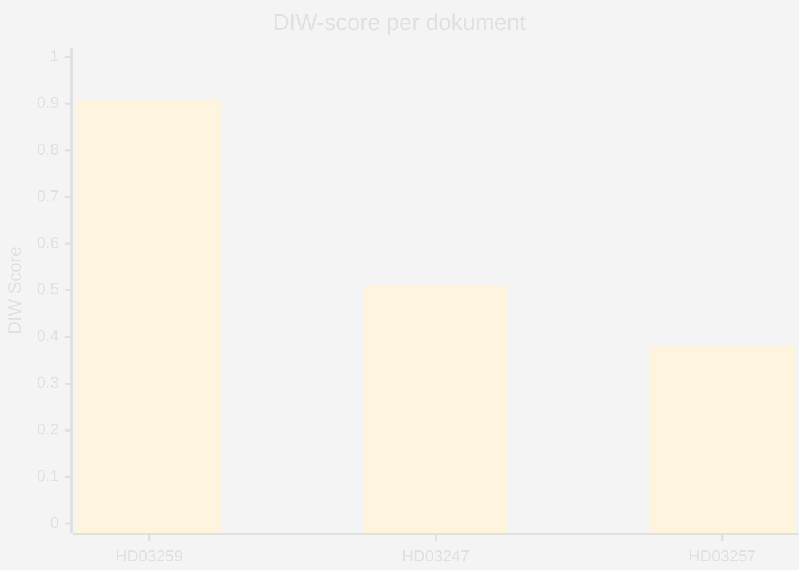

# Significance Scoring — Propositioner 2026-04-28

**Author**: James Pether Sörling · **Date**: 2026-04-29

## DIW Score Methodology

DIW = (D × 0.4) + (I × 0.35) + (W × 0.25) where D = Demokratisk påverkan [0–1], I = Institutionell tyngd [0–1], W = Omvärldsresonans [0–1].

## Per-Document Scores

| Rank | dok_id | D | I | W | DIW | Tier |
|------|--------|---|---|---|-----|------|
| 1 | HD03259 — Nationell transportinfrastrukturplan 2026–2037 | 0.95 | 0.90 | 0.88 | 0.91 | L3 |
| 2 | HD03247 — Receptfria läkemedel med krav på rådgivning | 0.55 | 0.50 | 0.48 | 0.51 | L2 |
| 3 | HD03257 — Kommunala lantmäterimyndigheters IT-krav | 0.40 | 0.38 | 0.36 | 0.38 | L1 |

### Motivering — HD03259 [HD03259, Skr. 2025/26:259]

- 1. **D=0.95**: 875 Mdr kr under 12 år påverkar varje valkrets i Sverige direkt; styr väg, järnväg, sjöfart [HD03259]
- 2. **I=0.90**: Skrivelse från Landsbygds- och infrastrukturdepartementet; behandlas av TU; budgetpåverkan >1 % BNP [HD03259]
- 3. **W=0.88**: Resonans med EU:s TEN-T-förordning, Parisavtalets klimatmål, Nordic Transport Ministers communiqué [HD03259]

### Motivering — HD03247 [HD03247, Prop. 2025/26:247]

- 1. **D=0.55**: Berör 10,3 miljoner apotekskunder; påverkar apotekspersonalens yrkesutövning; implementerar EU-direktiv [HD03247]
- 2. **I=0.50**: Proposition från Socialdepartementet; remitteras till SoU; begränsad budgetpåverkan [HD03247]
- 3. **W=0.48**: EU-harmonisering; berörd i Nordic pharma-kontext [HD03247]

### Motivering — HD03257 [HD03257, Prop. 2025/26:257]

- 1. **D=0.40**: Teknisk reglering för ~40 kommunala lantmäterimyndigheter; indirekt medborgareffekt via fastighetssektorn [HD03257]
- 2. **I=0.38**: Proposition från Landsbygds- och infrastrukturdepartementet; remitteras till CU [HD03257]
- 3. **W=0.36**: Begränsad internationell resonans; nationell standardiseringsfråga [HD03257]

## Sensitivity Analysis

Om transportplanen möter parlamentarisk motpart som kräver omprioriteringar (järnväg +20 Mdr kr) stiger D till 0.98 och DIW till 0.94. Nedgång i järnvägsinvesteringarna skulle sänka W till 0.72 och ge DIW 0.85.

style HD03259 fill:#ff006e
style HD03247 fill:#ffbe0b
style HD03257 fill:#00d9ff
