# Stakeholder Perspectives — Propositioner 2026-04-28

**Author**: James Pether Sörling · **Date**: 2026-04-29 · **Confidence**: MEDIUM

## 6-Lens Stakeholder Matrix

| Aktör | Roll | Position HD03259 | Position HD03247 | Position HD03257 | Inflytande | Intressen |
|-------|------|-----------------|-----------------|-----------------|-----------|----------|
| Moderaterna (M) | Koalitionsledare | Stöder ramen; vill ha väg+järnväg balans | Neutralt; EU-anpassning | Neutralt | VERY HIGH | Väljarmandat, infrastrukturlöften [HD03259] |
| Sverigedemokraterna (SD) | Stödparti (Tidöavtalet) | Accepterar ramen; kräver mer järnväg | Neutralt | Neutralt | HIGH | Valkretslöften, tågpendlare [HD03259] |
| Socialdemokraterna (S) | Oppositionsledare | Stöder princip; kräver mer klimatambition | Stöder | Neutralt | HIGH | Facklig anknytning, järnvägsarbetare [HD03259] |
| Vänsterpartiet (V) | Opposition | Ifrågasätter väginvesteringarna | Positiv | Neutralt | MEDIUM | Klimat, kollektivtrafik [HD03259] |
| Miljöpartiet (MP) | Opposition | Kräver Parisavtals-kompatibilitet | Positiv | Neutralt | MEDIUM | Klimat, cykel, kollektivtrafik [HD03259] |
| Trafikverket | Genomförande | Neutral; önskar klara prioriteringar | N/A | N/A | HIGH | Effektiv upphandling [HD03259] |
| Kommuner/Regioner | Direkt påverkade | Varierar; glesbygdskommuner vill ha mer vägpengar | Måste anpassa apotek | Måste uppgradera IT-system | HIGH | Lokal tillgänglighet [HD03259] [HD03247] [HD03257] |
| Apotekskedjor (Apoteket AB, Apotek Hjärtat) | Reguleringsadressat | N/A | Ambivalent — kostnad | N/A | MEDIUM | Lönsamhet, kundförtroende [HD03247] |
| Fastighetssektorn | Indirekt | Gynnas av förbättrad infrastruktur | N/A | Gynnas av effektivare lantmäteri | MEDIUM | Fastighetspriser, byggtakt [HD03259] [HD03257] |
| EU-kommissionen | Extern norm-setter | Kräver TEN-T-kompatibilitet | Kräver direktiv-impl. | Neutral | HIGH (extern) | Harmonisering [HD03259] [HD03247] |

## Influence Network

```mermaid
%%{init: {"theme": "base", "themeVariables": {"primaryColor": "#0a0e27","primaryTextColor": "#e0e0e0","primaryBorderColor": "#00d9ff","lineColor": "#ff006e","sectionBkgColor": "#1a1e3d","altSectionBkgColor": "#0a0e27"}}}%%
graph TD
    Kristersson[Ulf Kristersson PM] --> HD03259
    Carlson[Andreas Carlson] --> HD03259
    Carlson --> HD03257
    Forssmed[Jakob Forssmed] --> HD03247
    HD03259 --> TU[Transportutskottet]
    HD03247 --> SoU[Socialutskottet]
    HD03257 --> CU[Civilutskottet]
    TU --> M_pos[M: Stöder]
    TU --> SD_krav[SD: Kräver järnväg]
    TU --> S_pos[S: Mer klimat]
    SoU --> Apotek[Apotekskedjor]
    CU --> Kommuner[Kommunala lantmäterimyndigheter]
    style HD03259 fill:#ff006e,color:#fff
    style HD03247 fill:#ffbe0b,color:#0a0e27
    style HD03257 fill:#00d9ff,color:#0a0e27
    style Kristersson fill:#1a1e3d,stroke:#00d9ff
    style Carlson fill:#1a1e3d,stroke:#00d9ff
    style Forssmed fill:#1a1e3d,stroke:#00d9ff
    style TU fill:#1a1e3d,stroke:#ff006e
    style SoU fill:#1a1e3d,stroke:#ffbe0b
    style CU fill:#1a1e3d,stroke:#00d9ff
```

## Named Actor Analysis

- **Andreas Carlson** (Landsbygds- och infrastrukturdepartementet): ansvarig för både HD03259 och HD03257 — dubbelt tryck att leverera [HD03259] [HD03257]
- **Jakob Forssmed** (Socialdepartementet): HD03247-ansvarig; behöver säkra SoU-majoritet [HD03247]
- **Ulf Kristersson** (statsminister): signerat skrivelsen den 24 april 2026 [HD03259]
