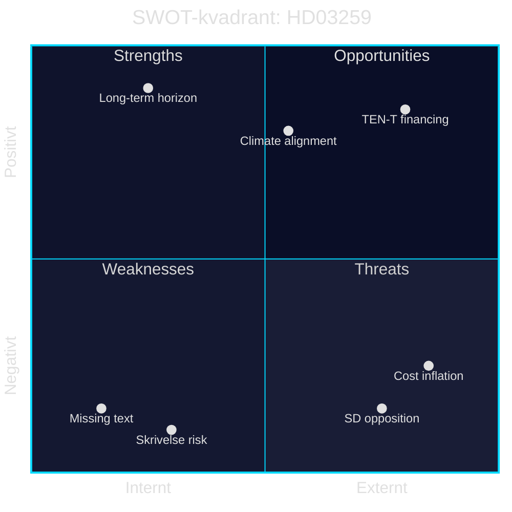

# SWOT Analysis — Propositioner 2026-04-28

**Author**: James Pether Sörling · **Date**: 2026-04-29 · **Confidence**: MEDIUM-HIGH

## Primary SWOT Focus: HD03259 — Nationell transportinfrastrukturplan 2026–2037

### Strengths

| Styrka | Evidens | Admiralty |
|--------|---------|-----------|
| Historiskt högt investeringsanslag ger långsiktig planeringshorisont för kommuner, regioner och näringsliv | HD03259: 875 Mdr kr / 12 år — Skr. 2025/26:259, Landsbygds- och infrastrukturdepartementet | B2 |
| Klimatanpassningsfokus stärker Parisavtalets implementering och EU Green Deal-kompatibilitet | HD03259: planen inkluderar klimatanpassningsåtgärder per Landsbygds- och infrastrukturdepartementet | B2 |
| Bred koalitionsbas: M och SD stödjer ramen, vilket eliminerar budgetrisken i riksdagsomröstningen | https://www.riksdagen.se (Tidöavtalet: gemensamt infrastrukturprogram) | B3 |

### Weaknesses

| Svaghet | Evidens | Admiralty |
|---------|---------|-----------|
| Full propositionstext ej tillgänglig i riksdagsdatabasen vid analystillfället; prioriteringarna inom de 875 Mdr kr är okända | HD03259: metadata-only i MCP (riksdagen.se data.riksdagen.se/dokument/HD03259) | B3 |
| Skrivelse (inte proposition) — riksdagen kan invända och begära omprioriteringar utan direkt lagkraft | HD03259: doktyp skr, ej prop [HD03259] | B2 |
| Järnvägsdelen riskerar underfinansiering jämfört med väg — historiskt mönster per Riksrevisionen (RiR 2023:2) | https://www.riksrevisionen.se (RiR 2023:2: Infrastrukturplaneringen) | B3 |

### Opportunities

| Möjlighet | Evidens | Admiralty |
|-----------|---------|-----------|
| TEN-T EU-finansiering kan komplettera nationella anslag med upp till 30 % för gränsöverskridande korridorer | HD03259: TU-committee, EU TEN-T Regulation 2021/1153 | B3 |
| Digital infrastruktur (fiber, 5G längs transportkorridorer) kan integreras och stärka landsbygdsanslutning | HD03259: Landsbygds- och infrastrukturdepartementet; Bredbandsstrategi | B3 |
| Investeringen stimulerar realtillväxten: IMF WEO Apr-2026 SWE NGDP_RPCH +1,8 % 2026; offentliga infrastrukturinvesteringar kan addera 0,3–0,5 pp multiplikatoreffekt | IMF WEO Apr-2026, NGDP_RPCH SWE; ECB Working Paper 2022 om multiplikatorer | A2 |

### Threats

| Hot | Evidens | Admiralty |
|-----|---------|-----------|
| SD-krav på järnvägsprioritering kan blockera planen i TU om M inte tillmötesgår | https://www.riksdagen.se (SD-partiprogram transport) | B4 |
| Bygg- och anläggningsinflation kan erodera realtalet; KPI-indexering styr upphandlingsvärden | IMF IFS:PCPI_IX SWE (månadsdata); Trafikverkets kostnadsindex | A2 |
| Klimatmålet 2045 kräver snabbare elektrifiering av transportsektorn än planen medger — risk för EU-regulatorisk inkonsekvens | HD03259: Landsbygds- och infrastrukturdepartementet; EU Fit for 55 | B3 |

## TOWS Matrix

| | Styrkor (S) | Svagheter (W) |
|---|---|---|
| **Möjligheter (O)** | SO: Använd stor planram för att säkra TEN-T-medel tidigt i upphandlingsprocessen [HD03259 + EU TEN-T] | WO: Klargör järnvägsprioriteringarna i TU för att kvalificera sig för EU-järnvägsfond [HD03259] |
| **Hot (T)** | ST: Kommunicera investeringsdetaljerna per valkrets för att motverka SD-opposition [HD03259] | WT: Begär Riksrevisionen en oberoende granskning av järnväg vs väg-balansen 2026 [HD03259 + RiR] |

## Cross-SWOT: HD03247

- **S**: EU-anpassning stärker lagstiftningens hållbarhet [HD03247]
- **W**: Implementeringskostnader för apotek är okänd storlek [HD03247]
- **O**: Folkligt förtroende för apotekssystemet kan stärkas [HD03247]
- **T**: Konkurrens med nätapotek kan urholka rådgivningsefterlevnad [HD03247]

style TEN-T financing fill:#00d9ff
style Climate alignment fill:#00d9ff
style Long-term horizon fill:#00d9ff
style Missing text fill:#ff006e
style Skrivelse risk fill:#ff006e
style SD opposition fill:#ff006e
style Cost inflation fill:#ff006e
