# Synthesis Summary — Propositioner 2026-04-28

**Author**: James Pether Sörling · **Date**: 2026-04-29 · **Confidence**: MEDIUM-HIGH [B2]

## Lead Story

Den nationella transportinfrastrukturplanen 2026–2037 (HD03259, Skr. 2025/26:259) dominerar dagordningen med ett investeringsramverk på 875 miljarder kronor — ett historiskt anslag som sätter spår i regional tillväxt, klimatomställning och partiernas valkalkylering inför 2026. Åtgärderna för receptfria läkemedel (HD03247) och kommunalt lantmäteri-IT (HD03257) tillhör det teknisk-administrativa spåret och stärker myndighetsstyrning utan att provocera koalitionsdynamiken.

## DIW-Weighted Ranking

| Rank | dok_id | Title | DIW Score | Tier |
|------|--------|-------|-----------|------|
| 1 | HD03259 | Nationell transportinfrastrukturplan 2026–2037 | 0.91 | L3 Intelligence-grade |
| 2 | HD03247 | Receptfria läkemedel med krav på rådgivning | 0.52 | L2 Strategic |
| 3 | HD03257 | Kommunala lantmäterimyndigheters IT-krav | 0.38 | L1 Surface |

DIW = Demokratisk påverkan × Institutionell tyngd × Omvärldsresonans

## Integrated Intelligence Picture

**Strategiskt mönster**: Regeringen kombinerar ett majoritetsstödjat infrastrukturpaket (moderaternas kärnvaluta: väginvesteringar; Sverigedemokraternas krav på järnvägsprioritering) med sektorspecifika reguleringspropositioner som inte utmanar Tidöavtalets kärna. Handlingsfriheten är begränsad: infrastrukturplanen måste vara antagen före sommaren för att upphandlingar ska hålla tidtabell. [HD03259]

**Ekonomisk kontext**: IMF WEO Apr-2026 projicerar reell BNP-tillväxt för Sverige på +1,8 % (2026) och +2,3 % (2027). Bruttoskulden beräknas till 34,3 % av BNP (FM:GGXWDG_NGDP, 2026 est.). Transportinvesteringen på 875 Mdr kr fördelat på 12 år (≈ 72,9 Mdr kr/år) uppgår till ca 1,0 % av BNP — inom den finansiella marginal som IMF bedömer förenlig med konsolideringsplanen (WEO Apr-2026, GGXCNL_NGDP).

**Hälso- och sjukvårdspolitik**: HD03247 implementerar EU-direktivets krav på farmaceutisk rådgivning för en definierad kategori läkemedel. Förslaget möter bred parlamentarisk enighet men kan ge verksamhetsmässiga utmaningar för lågprisapoteken. [HD03247, Prop. 2025/26:247]

**Digital förvaltning**: HD03257 stärker standardisering av kommunala lantmäterimyndigheters ärendehantering, reducerar manuella fel och skapar interoperabilitet med Lantmäteriet centralt. [HD03257, Prop. 2025/26:257]

## Confidence Distribution

| Claim | Confidence | Source | Admiralty |
|-------|-----------|--------|-----------|
| Investeringsramverk 875 Mdr kr | HIGH | HD03259, Skr. 2025/26:259 | B2 |
| IMF BNP-prognos +1,8 % 2026 | HIGH | IMF WEO Apr-2026, NGDP_RPCH SWE | A1 |
| OTC-rådgivningskrav EU-direktiv | MEDIUM | HD03247 summary | B3 |
| IT-krav lantmäteri | MEDIUM | HD03257 summary | B3 |

```mermaid
%%{init: {"theme": "base", "themeVariables": {"primaryColor": "#0a0e27","primaryTextColor": "#e0e0e0","primaryBorderColor": "#00d9ff","lineColor": "#ff006e","sectionBkgColor": "#1a1e3d","altSectionBkgColor": "#0a0e27","gridColor": "#1a1e3d","secondaryColor": "#1a1e3d","tertiaryColor": "#1a1e3d"}}}%%
flowchart TD
    A[Prop 2026-04-28] --> B[HD03259 Transportplan L3]
    A --> C[HD03247 OTC-läkemedel L2]
    A --> D[HD03257 Lantmäteri IT L1]
    B --> E[TU Utskottsbehandling]
    B --> F[Regionala konsekvenser]
    B --> G[Valkalkylering 2026]
    C --> H[SoU Genomförande]
    D --> I[CU Kommunal IT]
    style B fill:#ff006e,color:#fff
    style C fill:#ffbe0b,color:#0a0e27
    style D fill:#00d9ff,color:#0a0e27
    style E fill:#1a1e3d,stroke:#00d9ff
    style F fill:#1a1e3d,stroke:#00d9ff
    style G fill:#1a1e3d,stroke:#ff006e
    style H fill:#1a1e3d,stroke:#ffbe0b
    style I fill:#1a1e3d,stroke:#00d9ff
```

