# Threat Analysis — Propositioner 2026-04-28

**Author**: James Pether Sörling · **Date**: 2026-04-29 · **Confidence**: MEDIUM

## Political Threat Taxonomy

### T1 — Parlamentarisk blockering av Skr. 2025/26:259

**Typ**: Intra-koalitionskonflikt / Oppositionsblockering
**Aktörer**: SD (krav på högre järnvägsinvesteringar), V och MP (krav på stärkt klimatambition)
**Trigger**: TU:s betänkande visar avvikande prioriteringar [HD03259]
**Sannolikhet**: MEDIUM-LOW — Tidöavtalet innehåller gemensamt infrastrukturmandat
**Admiralty**: B3

### T2 — Ekonomisk urholkning av infrastrukturplanen

**Typ**: Makroekonomisk/finansiell hot
**Aktörer**: Globala energimarknader, byggbranschens inflation
**Trigger**: Realkostnadsökning >15 % 2026–2028 (IMF WEO Apr-2026: PCPIPCH SWE 2,9 %; byggindex historiskt 2–3× KPI) [IMF WEO Apr-2026]
**Sannolikhet**: MEDIUM — stiger vid geopolitisk störning
**Admiralty**: A2

### T3 — Regulatory threat: EU Fit for 55-inkompatibilitet

**Typ**: Regulatorisk/institutionell
**Aktörer**: Europeiska kommissionen, miljörörelsen
**Trigger**: Planen godkänns men uppfyller inte EU:s 2030 och 2040-klimatmål [HD03259, EU-direktiv]
**Sannolikhet**: LOW-MEDIUM
**Admiralty**: B3

### T4 — Implementeringsfel: HD03247 rådgivningslucka

**Typ**: Operationell/institutionell
**Aktörer**: Apotekskedjor, Läkemedelsverket
**Trigger**: Oklara listor på vilka läkemedel som kräver rådgivning → inkonsekvent efterlevnad [HD03247]
**Sannolikhet**: MEDIUM
**Admiralty**: B4

## Attack Tree — Parlamentarisk blockering (T1)

```mermaid
%%{init: {"theme": "base", "themeVariables": {"primaryColor": "#0a0e27","primaryTextColor": "#e0e0e0","primaryBorderColor": "#00d9ff","lineColor": "#ff006e","sectionBkgColor": "#1a1e3d","altSectionBkgColor": "#0a0e27"}}}%%
flowchart TD
    T1[T1: Blockering av transportplanen] --> A1[SD kräver järnvägsprioritet]
    T1 --> A2[V/MP kräver klimatambition]
    T1 --> A3[Oppositionsmajoritet i TU]
    A1 --> B1[SD-röst mot i TU]
    A2 --> B2[Minoritetsanmärkning]
    A3 --> B3[Återremiss till Regeringen]
    B3 --> C1[Försenad upphandling 6–18 mån]
    style T1 fill:#ff006e,color:#fff
    style A1 fill:#1a1e3d,stroke:#ff006e
    style A2 fill:#1a1e3d,stroke:#ffbe0b
    style A3 fill:#1a1e3d,stroke:#ff006e
    style B1 fill:#1a1e3d,stroke:#ff006e
    style B2 fill:#1a1e3d,stroke:#ffbe0b
    style B3 fill:#1a1e3d,stroke:#ff006e
    style C1 fill:#ff006e,color:#fff
```

## MITRE-style TTP Mapping (Politisk hot)

| TTP-ID | Teknik | Aktör | Mål |
|--------|--------|-------|-----|
| PT-001 | Budgetamendment i TU | SD | Omallokera järnvägsandel |
| PT-002 | Utskottsutfrågning om klimat | V, MP | Legitimitetshot mot planen |
| PT-003 | Mediakampanj mot väginvesteringar | Miljörörelsen | Opinionsshift |

**Kill Chain**: Intelligence (identifiering av oppositionskrav) → Weaponization (medieattack) → Delivery (utskottsutfrågning) → Exploitation (TU-anmärkning) → Installation (återremiss) → Command (ny Regeringsrevision) → Actions (försenad plan).
