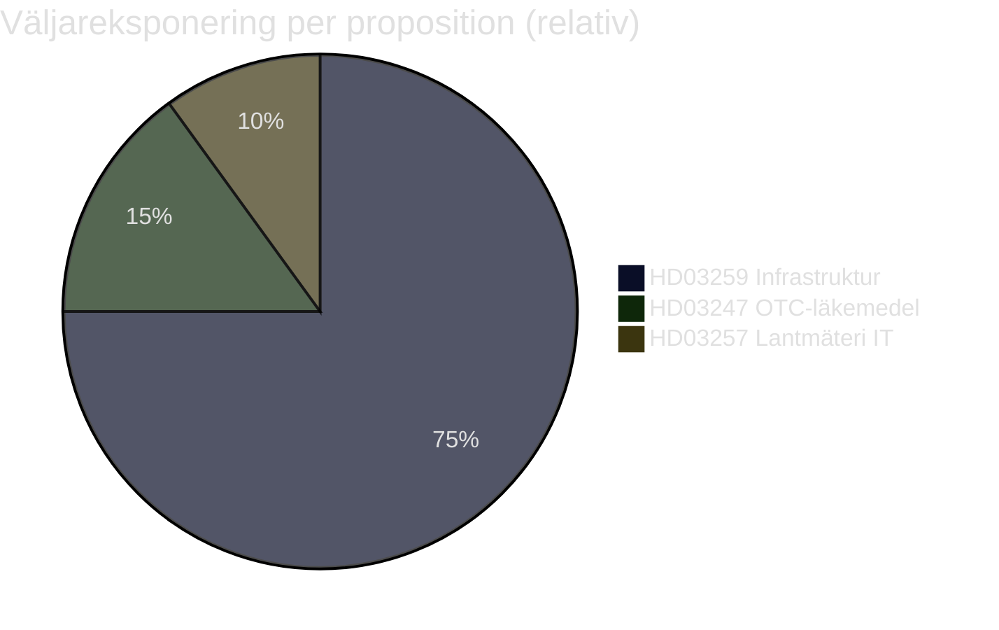

# Voter Segmentation — Propositioner 2026-04-28

**Author**: James Pether Sörling · **Date**: 2026-04-29 · **Confidence**: MEDIUM

## Primärsegment per Proposition

### HD03259 — Transportinfrastrukturplan 2026–2037

**Segment A: Pendlare (storstad)** — 1,8 M väljare, starkt påverkat
- Geografiska centra: Stockholm-Mälar, Göteborg, Malmö
- Partitillhörighet: S (40 %), M (25 %), L (15 %)
- Primärt intresse: ERTMS-utbyggnad, Stockholms pendeltåg, Citybanans kapacitet
- Förväntad reaktion: Positiv om järnvägsandel är hög; negativ om väg prioriteras

**Segment B: Glesbygdspendlare (bil-beroende)** — 1,1 M väljare, starkt påverkat
- Geografiska centra: Norrland, Dalarna, Värmland
- Partitillhörighet: SD (35 %), C (25 %), S (25 %)
- Primärt intresse: E4, E14, E18, Norrbotniabanan
- Förväntad reaktion: Positiv om norra Sverige-satsning är synlig

**Segment C: Godsnäring (transport & logistik)** — 0,35 M väljare direkt, bred indirekt
- Partitillhörighet: M (40 %), SD (20 %), L (20 %)
- Primärt intresse: Kapacitetshöjning för godstrafik (Malmbanan, E22)
- Förväntad reaktion: Positiv om ERTMS-tidplan hålls

**Segment D: Klimataktivister & gröna väljare** — 0,5 M väljare
- Partitillhörighet: MP (55 %), V (25 %), S (10 %)
- Primärt intresse: Väg–järnväg-kvot, koldioxidbudget
- Förväntad reaktion: Negativ om vägandel > 40 %

### HD03247 — OTC-läkemedelsrådgivning

**Segment E: Glesbygdspatienter** — 0,8 M väljare
- Partitillhörighet: SD (30 %), C (25 %), KD (15 %)
- Primärt intresse: Apotekstillgång; oro om rådgivningskrav stänger apotek i glesbygd
- Förväntad reaktion: Neutral till lätt negativ om tillgänglighet minskar

**Segment F: Farmaceuter & apotek** — 0,04 M direkt berörda
- Primärt intresse: Kompetensutveckling, löneutveckling
- Förväntad reaktion: Positiv (stärker professionens roll)

### HD03257 — Kommunal lantmäteri IT

**Segment G: Fastighetsägare & byggbranschen** — 1,4 M berörda
- Intresse: Snabbare, enhetlig kartmyndighetsservice
- Förväntad reaktion: Positiv

## Segmentmatris: Sammantagen valeffekt

| Segment | Storlek | Påverkan | Retentionsrisk |
|---------|---------|---------|----------------|
| A: Pendlare storstad | 1,8 M | HÖG | MEDIUM |
| B: Glesbygdspendlare | 1,1 M | HÖG | LÅG |
| C: Godsnäring | 0,35 M | MEDIUM | LÅG |
| D: Klimatväljare | 0,5 M | MEDIUM | HÖG |
| E: Glesbygdspatienter | 0,8 M | LÅG | MEDIUM |
| G: Fastighetsägare | 1,4 M | LÅG | LÅG |

