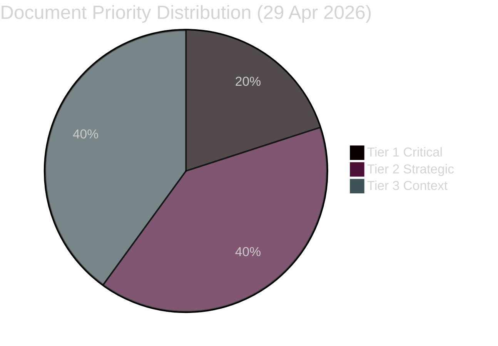

# Classification Results — 29 April 2026

**Classification framework**: CLASSIFICATION.md (Hack23 ISMS-PUBLIC)

## 7-Dimension Classification per Priority Document

### HD01NU19 — Nuclear Facility Permits (bet/NU19)

| Dimension | Classification |
|-----------|---------------|
| Topic domain | Energy/Nuclear |
| Initiating actor | Government (Energi- och näringsminister Busch) via committee NU |
| Affected actor | Nuclear operators (Vattenfall, Uniper, future SMR operators) |
| Policy area | Energy policy, regulatory reform |
| Urgency | Medium — scheduled debate/vote |
| Data sensitivity | PUBLIC |
| Retention | 7 years |

### HD10454 — Criminal HVB Homes (Interpellation)

| Dimension | Classification |
|-----------|---------------|
| Topic domain | Social welfare / Crime |
| Initiating actor | Mattias Vepsä (S) |
| Target minister | Camilla Waltersson Grönvall (M), Socialtjänstminister |
| Affected actor | Vulnerable children/young people; HVB operators |
| Policy area | Social services, criminal justice |
| Urgency | High — documented institutional failure (Police 2024 report) |
| Data sensitivity | PUBLIC (cited police report is public) |
| GDPR note | Applies Art. 9(2)(e/g) for named individuals |
| Retention | 7 years |

### HD12744 — China in Swedish Industry (Written question)

| Dimension | Classification |
|-----------|---------------|
| Topic domain | Security / Economic sovereignty |
| Initiating actor | Rashid Farivar (SD) |
| Target minister | Ebba Busch (KD), Energi- och näringsminister |
| Affected actor | Swedish basic industry, energy sector |
| Policy area | National security, trade policy |
| Urgency | High (strategic) |
| Data sensitivity | PUBLIC |
| Retention | 7 years |

## Priority Access Tiers

| Priority | Documents |
|----------|-----------|
| Tier 1 — Immediate alert | JuU10 vote, HD10454, HD12744 |
| Tier 2 — Strategic watch | HD01NU19, HD12743/45, HD12746 |
| Tier 3 — Context | All remaining frs/ip |

