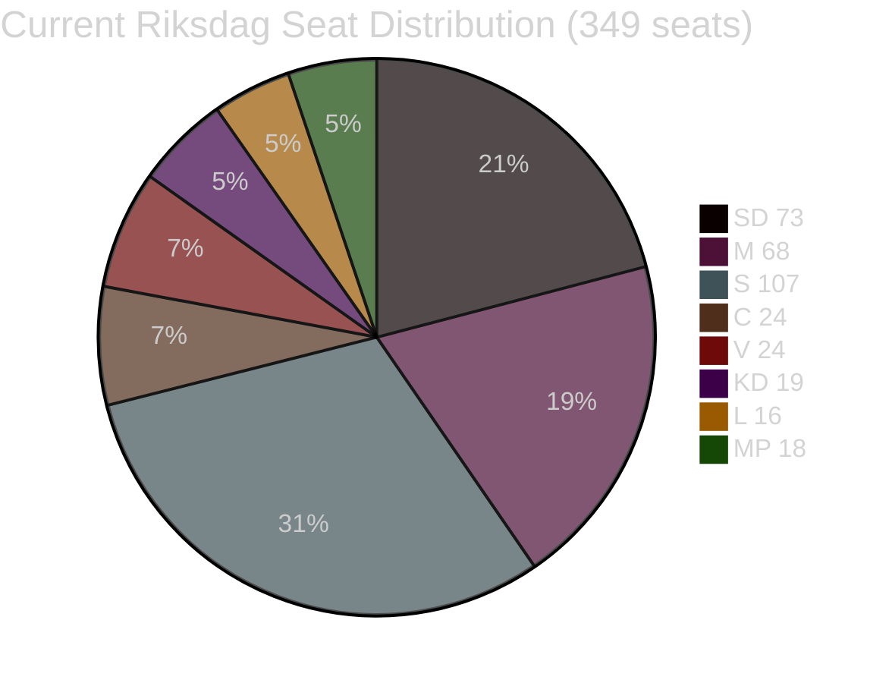

# Coalition Mathematics — 29 April 2026

**Context**: Swedish Riksdag has 349 seats. Simple majority = 175 seats.

## Current Riksdag Composition

| Party | Seats | Block | Government role |
|-------|-------|-------|----------------|
| Sverigedemokraterna (SD) | 73 | Tidöblock | Support party (not in cabinet) |
| Moderaterna (M) | 68 | Tidöblock | Cabinet (Prime Minister) |
| Socialdemokraterna (S) | 107 | Opposition | Main opposition |
| Centerpartiet (C) | 24 | Opposition | Opposition |
| Vänsterpartiet (V) | 24 | Opposition | Opposition |
| Kristdemokraterna (KD) | 19 | Tidöblock | Cabinet |
| Liberalerna (L) | 16 | Tidöblock | Cabinet |
| Miljöpartiet (MP) | 18 | Opposition | Opposition |
| **TOTAL** | **349** | | |

**Tidöblock total**: 73+68+19+16 = **176** (majority = 175)
**Margin**: +1 seat

## Confirmed Vote Outcomes — 29 April 2026 (AFTERNOON UPDATES)

### JuU10 (En ny vapenlag) — ADOPTED 16:13:22 Stockholm

| Party | Vote Punkt 1 (Main) | Notes |
|-------|---------------------|-------|
| S (107 seats) | ✅ JA | Cross-bloc support |
| SD (73 seats) | ✅ JA | Coalition |
| M (68 seats) | ✅ JA | Coalition |
| KD (19 seats) | ✅ JA | Coalition |
| L (16 seats) | ✅ JA | Coalition |
| **C (24 seats)** | **❌ NEJ** | **All ~20 present voted NEJ — bloc defection** |
| V (24 seats) | ❌ NEJ | Opposition |
| MP (18 seats) | ❌ NEJ | Opposition |

**Approximate result**: JA ~266, NEJ ~66. Bill adopted with large margin.

**C bloc defection impact**: Despite voting NEJ, the bill passed comfortably with S supporting. C's defection had no tactical effect but has strategic consequence: it marks C as the only centre-right party opposing this weapons law, creating a public record.

### SfU28 (Skärpta krav för svenskt medborgarskap) — ADOPTED 16:21:06 Stockholm

| Party | Vote Punkt 1 (Main) | Notes |
|-------|---------------------|-------|
| S (107 seats) | ✅ JA (most) | One dissenter: Annika Strandhäll (NEJ) |
| SD (73 seats) | ✅ JA | Coalition |
| M (68 seats) | ✅ JA | Coalition |
| C (24 seats) | ✅ JA | Supported |
| KD (19 seats) | ✅ JA | Coalition |
| L (16 seats) | ✅ JA | Coalition |
| V (24 seats) | ❌ NEJ | Opposition |
| MP (18 seats) | ❌ NEJ | Opposition |
| Ex-left (-) | ❌ NEJ | Former V/ex-party independents |

**SfU28 punkt 2**: S+C+V+MP voted NEJ (unanimous cross-bloc rejection of a specific provision — likely an opposition amendment or a government sub-clause rejected in bipartisan consensus).

**Intelligence significance**: SfU28's adoption with broad S support is the day's clearest indicator of Swedish immigration policy convergence. The main opposition party (S) now officially supports stricter citizenship requirements, reducing the space for V and MP to claim S as an ally on migration. This is a structural shift in Swedish party competition geometry.

## Today's Vote — JuU10 Weapons Law

**Expected result**: Tidöblock votes yes. V and MP file reservations and vote no. S likely splits (some rural S MPs may abstain or vote yes).

**Margin sensitivity**: With 176 seats, the coalition can afford 1 absence/defection. Any 2 defections from Tidöblock requires S support to pass.

**HD01JuU10 vote calculation**:

| Scenario | Votes For | Votes Against | Result |
|----------|-----------|--------------|--------|
| Full Tidöblock + absent SD (2) | 174 | ~165 | **FAIL** |
| Full Tidöblock | 176 | ~163 | **PASS** |
| Tidöblock + 5 cross-party | 181 | ~158 | **PASS (comfortable)** |

**Assessment**: JuU10 passes with standard majority. The 176-seat cushion is thin but adequate for a standard committee-recommended bet.

## Senate Arithmetic for Other Key Documents

### HD01NU19 (Nuclear Permitting Reform)

Cross-party support possible: S has been moderating on nuclear; C supports new-build. This could pass with 190+ seats if framed as energy security.

### HD01CU37 (Housing Guarantees)

Municipal housing — C is ambivalent (municipal autonomy concern). If C defects, M+SD+KD+L = 176 remains adequate.

## Post-Election Scenarios

### Scenario A: Tidöblock retains power (P=40%)

Requires: C stays in opposition; MP below threshold; SD holds 72+ seats.

**Key seats**: 175+ for Tidöblock. SD likely to remain largest party (polls 20-22%).

### Scenario B: S-led government with C+MP+V (P=35%)

Requires: S+C+MP+V > 175. Current: 107+24+18+24 = 173 (2 short). Requires S polling improvement OR C switch.

**Wild card**: C is the kingmaker. Current C leadership (Annie Lööf era residue) moderately opposed to SD; pragmatic on energy. If C joins S bloc, new government is mathematically possible.

### Scenario C: Grand coalition or minority government (P=25%)

Possible if neither bloc can form stable majority.

## Seat Projection Table (Based on Structural Factors — No Fresh Poll)

| Party | Current | Projected Range 2026 | Change |
|-------|---------|---------------------|--------|
| SD | 73 | 68–78 | ±5 |
| M | 68 | 63–72 | -3 |
| S | 107 | 103–113 | ±5 |
| C | 24 | 18–26 | ±4 |
| V | 24 | 20–26 | ±3 |
| KD | 19 | 15–21 | ±2 |
| L | 16 | 12–18 | ±3 |
| MP | 18 | 14–22 | ±4 |

