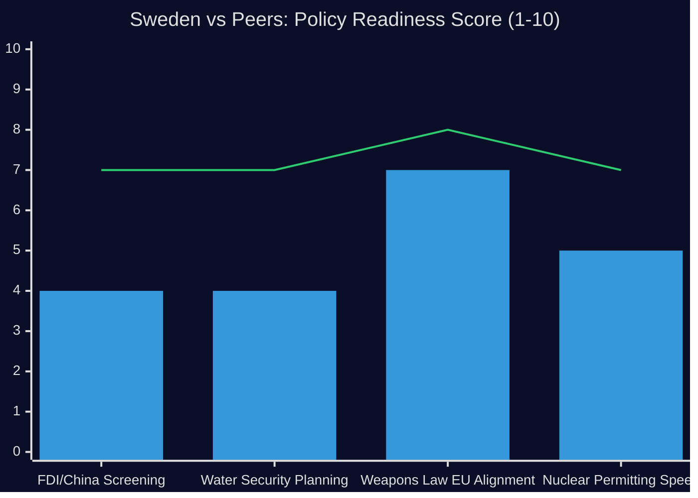

# Comparative International Analysis — 29 April 2026

**Methodology**: Cross-country policy comparison (OECD + EU context)

## Comparator 1: New Weapons Law — EU Alignment

**Swedish context**: HD01JuU10 adopts new civilian weapons legislation

**EU Directive framework**: Directive 2021/555/EU (revised Firearms Directive) — establishes minimum standards for civilian firearms across EU.

**Country comparison**:

| Country | Directive transposition | Notable feature |
|---------|------------------------|-----------------|
| Germany | Complete (2022) | Strict semi-automatic ban; NRW registry enforcement |
| France | Complete (2022) | National register mandatory; dealer traceability |
| Sweden (post-JuU10) | Today — completing transposition | Enhanced licensing, deactivation standards |
| Finland | Ahead of Sweden | Comprehensive reform pre-NATO accession |
| Denmark | Aligned | Nordic harmonisation |

**Assessment**: Sweden is completing EU alignment that most Western EU members completed 2020-2022. JuU10 is not innovative — it is catching-up. The significance is domestic legitimacy and NATO security cooperation, not EU leadership.

## Comparator 2: China FDI Screening — Nordic/European Comparison

**Swedish context**: HD12744 (HD12746) — no comprehensive China FDI strategy

**International landscape**:

| Country | FDI Screening Regime | China-specific provisions |
|---------|---------------------|--------------------------|
| Germany | AWG (Außenwirtschaftsgesetz) amendment 2022 | Mandatory notification for energy/telecom/critical infra; BMWi pre-screening |
| France | FIRME mechanism | Presidential power to block on national security |
| Netherlands | VIFO Act 2023 | Covers vital infrastructure and sensitive technology |
| Finland | Act on Monitoring Foreign Corporate Acquisitions 2021 | Broad sensitive sector coverage |
| **Sweden** | IFÅ (Lag om granskning av utländska direktinvesteringar) 2023 | Narrower scope; no mandatory SÄPO pre-filing |
| UK | National Security and Investment Act 2021 | Mandatory notification for 17 sectors |

**Assessment**: Sweden's IFÅ 2023 is weaker than its Nordic peers and Western European comparators. The parliamentary questions (HD12744) are pointing to a real regulatory gap. Finland and Netherlands offer templates Sweden could follow.

**Recommendation**: Mandate SÄPO consultation as precondition for FDI approvals in energy, telecom, water, and critical manufacturing.

## Comparator 3: Water Security Planning

**Swedish context**: HD12743, HD12745 — civil defence framing of water scarcity in southern Sweden

| Country | Water Security Framework | Civil Defence Integration |
|---------|-------------------------|--------------------------|
| Netherlands | National Water Plan + delta programme; climate-adaptive | Fully integrated into national resilience |
| Denmark | Water Sector Act; municipal + national coordination | MSB-equivalent (Beredskabsstyrelsen) engaged |
| Germany | National Water Strategy 2023 | Integrated Bundesländer + Bund |
| **Sweden** | Vattenförvaltningsförordning (EU WFD transposition); no national drought framework | MSB lacks formal mandate for water coordination |
| Finland | Water supply action plan + NSS 2024 | Emergency water included in hybrid threats plan |

**Assessment**: Sweden lacks the national-level water security coordination that comparable Nordic and EU states have. Finland's approach (water as hybrid threat) maps directly onto the framing in HD12745.

## Comparative Intelligence Chart

*Blue bar = Sweden 2026; Line = Nordic peer average*

