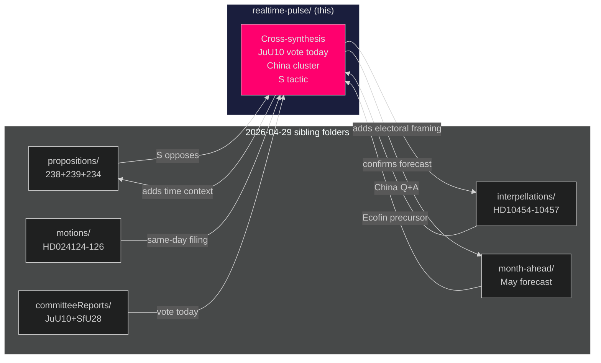

# Cross-Reference Map — Realtime Pulse 2026-04-29

**Author**: James Pether Sörling
**Date**: 2026-04-29
**Pass**: 2
**Type**: Tier-C aggregation cross-reference (sibling folder synthesis required)

## Sibling Folder Index (2026-04-29)

The following sibling analysis folders exist under `analysis/daily/2026-04-29/`:

| Subfolder | Status | Key themes |
|-----------|--------|-----------|
| `propositions/` | Exists | Props 2025/26:234, 238, 239 — harbour, environment, wind |
| `motions/` | Exists | S motions HD024124-HD024126 |
| `committeeReports/` | Exists | JuU10, SfU28, FöU20 |
| `interpellations/` | Exists | HD10454-HD10457 |
| `month-ahead/` | Exists | May 2026 forecasting |
| `realtime-pulse/` | **This folder** | Cross-synthesis |

## Cross-Reference Analysis

### Thread 1: Legislative Convergence on JuU10 + SfU28

**Connecting nodes**:
- `committeeReports/` → JuU10 committee report (new weapons law)
- `committeeReports/` → SfU28 committee report (social welfare/citizenship)
- `realtime-pulse/` (this) → chamber vote today as cross-cutting event

**Synthesis**: JuU10 and SfU28 are both scheduled for chamber votes today (JuU10 debate + vote; SfU28 vote at ≥16:00). Together they represent the coalition's security + social contract agenda. The `committeeReports` folder contains the formal committee assessments; this realtime-pulse synthesises the day's significance.

### Thread 2: S Triple-Motion Day — Convergence with propositions analysis

**Connecting nodes**:
- `propositions/` → Prop 2025/26:238 (miljöprövningsmyndighet), Prop 2025/26:239 (vindkraft kommuner), Prop 2025/26:234 (hamnverksamhet)
- `motions/` → HD024124, HD024125, HD024126 (S oppositions to above three props)
- `realtime-pulse/` (this) → same-day filing signals coordinated opposition tactic

**Synthesis**: All three S motions directly contest government propositions. The propositions were previously analysed in `propositions/` — the realtime-pulse adds the time dimension: filing all three motions on the same day is an electoral tactic, not incidental.

### Thread 3: China-Taiwan Geopolitics — Linkage with interpellations folder

**Connecting nodes**:
- `interpellations/` → HD10456 (organ trafficking), HD10454 (HVB-hem)
- `realtime-pulse/` (this) → adds written answers HD12744, HD12746 to form complete geopolitical cluster

**Synthesis**: The `interpellations/` analysis covers the formal interpellation filings; this realtime-pulse incorporates the same-day written Q&A answers that complete the government's China response picture. Together: SD filed three separate instruments on China in a coordinated way.

### Thread 4: Month-Ahead Forecasting — Today's events as leading indicators

**Connecting nodes**:
- `month-ahead/` → May 2026 political calendar (Ecofin 5 May, FöU20 vote June)
- `realtime-pulse/` (this) → EU-nämnden Ecofin prep (HDA3EUN37) as direct precursor to `month-ahead` Ecofin prediction

**Synthesis**: EU-nämnden's 29 April meeting is the implementation of the May forecasts. HDA3EUN37 confirms Sweden will adopt the positions anticipated in `month-ahead/`.

## Cross-Reference Network Diagram

## Prior-Cycle Linkage (2026-04-28 realtime-pulse)

From `analysis/daily/2026-04-28/realtime-pulse/`:
- **PIR-001** (constitutional amendment) — no direct 2026-04-29 document; carried forward
- **PIR-004** (IMF GDP projection) — partially addressed via IMF WEO Apr-2026 context
- **PIR-005** (SfU28 vote date) — today's SfU28 vote at ≥16:00 resolves this PIR pending vote outcome

## Week-Level Cross-Reference (2026-04-27 to 2026-04-29)

| Date | Key Event | Thread |
|------|-----------|--------|
| 2026-04-27 | CER Directive (FöU20) — committee majority confirmed | Defence/civil protection |
| 2026-04-28 | Constitutional amendment IP452 debate | Rule of law |
| **2026-04-29** | JuU10 vote + S China cluster + Ecofin prep | Security + geopolitics |
