# Cross-Reference Map — 29 April 2026 (Tier-C Synthesis)

**Tier-C requirement**: This realtime-pulse analysis synthesises across sibling subfolders from the past 7 days.

## 7-Day Sibling Analysis Summary

| Date | Subfolder | Key Themes |
|------|-----------|-----------|
| 2026-04-28 | realtime-pulse | Prior-day pulse (security/welfare overlap expected) |
| 2026-04-28 | evening-analysis | Ekofin/EU budget coordination |
| 2026-04-28 | motions | Ongoing motion tracking |
| 2026-04-27 | evening-analysis | General policy cycle |
| 2026-04-26 | weekly-review | Weekly synthesis including China signals |
| 2026-04-26 | realtime-pulse | Continuity items |
| 2026-04-25 | propositions | Government propositions pipeline |

## Cross-Type Intelligence Threads

### Thread 1: China Security — Multi-Week Escalation

**2026-04-21 to 2026-04-29** — Parliamentary questions on China have increased in volume and specificity:
- `analysis/daily/2026-04-26/weekly-review/` — weekly synthesis captured China as an emerging theme
- `analysis/daily/2026-04-29/realtime-pulse/` — three simultaneous instruments (HD12744, HD12746, HD10456) on China
- **Pattern assessment**: Cross-party, multi-week pattern suggests SÄPO briefings or civil society reporting on China risk is driving parliamentary activity. This is NOT random.

### Thread 2: Welfare System — HVB Criminal Infiltration

**2026-04-21 to 2026-04-29** — HVB issue tracking:
- Earlier realtime-pulses captured isolated crime/welfare questions
- `analysis/daily/2026-04-29/realtime-pulse/` — HD10454 elevates to formal interpellation
- **Pattern assessment**: S party systematically building evidence chain for election-season accountability narrative

### Thread 3: Nuclear & Energy — Policy Convergence

**2026-04-20 to 2026-04-29** — Energy policy convergence:
- `analysis/daily/2026-04-26/realtime-pulse/` — energy regulatory discussions
- `analysis/daily/2026-04-28/propositions/` — government propositions include energy components
- `analysis/daily/2026-04-29/realtime-pulse/` — HD01NU19 committee bet on nuclear permitting ready for vote
- **Pattern assessment**: Nuclear regulatory reform is on-track; vote window in the next 2 weeks

### Thread 4: Water/Civil Defence — Rising Urgency

**2026-04-22 to 2026-04-29**:
- Earlier weeks: Water questions in committee and interpellations (background)
- `analysis/daily/2026-04-29/realtime-pulse/` — HD12743+HD12745 dual interpellations raise urgency
- **Pattern assessment**: Civil-defence framing is new (April 29). This represents escalation from "environmental issue" to "national security issue" — a frame shift worth tracking

### Thread 5: EU Coordination Continuity

**Ongoing**:
- `analysis/daily/2026-04-28/evening-analysis/` — EU meeting preparation
- `analysis/daily/2026-04-29/realtime-pulse/` — HDA3EUN37 (EU-nämnden Ecofin briefing, 5 May)
- **Pattern**: Regular EU coordination cadence; Sweden operating within EU fiscal frameworks

## Intra-Day Cross-Reference (Same Date, Different Subfolders)

| Source | Target | Connection |
|--------|--------|-----------|
| `2026-04-29/committeeReports/` | `2026-04-29/realtime-pulse/HD01NU19` | NU19 committee report feeds into today's analysis |
| `2026-04-29/motions/` | `2026-04-29/realtime-pulse/` | Motion database provides opposition policy context |
| `2026-04-29/interpellations/` | `2026-04-29/realtime-pulse/HD10454,HD10455,HD10456,HD10457` | Interpellation registry alignment |

## Cross-Reference Graph

```mermaid
%%{init: {"theme": "dark", "themeVariables": {"primaryColor": "#00d9ff", "background": "#0a0e27", "primaryTextColor": "#e0e0e0", "lineColor": "#ffbe0b"}}}%%
graph TD
    W1[2026-04-26 weekly-review] -->|China signal| RT[2026-04-29 realtime-pulse]
    RA28[2026-04-28 realtime-pulse] -->|China thread cont'd| RT
    RA26[2026-04-26 realtime-pulse] -->|Nuclear energy context| RT
    MA28[2026-04-28 evening-analysis] -->|EU/Ecofin prep| RT
    P25[2026-04-25 propositions] -->|Energy propositions| RT
    CR29[2026-04-29 committeeReports] -->|NU19 nuclear bet| RT
    I29[2026-04-29 interpellations] -->|HD10454-HD10457| RT
    style RT fill:#0a0e27,stroke:#00d9ff,stroke-width:2px
    style W1 fill:#1a1e3d
    style RA28 fill:#1a1e3d
    style RA26 fill:#1a1e3d
```

