# Devil's Advocate Analysis — 29 April 2026

**Purpose**: Challenge dominant narratives; identify where conventional wisdom may be wrong.

## Hypothesis 1: The China Parliamentary Questions Are Performative, Not Substantive

**Conventional view**: Three simultaneous instruments about China (HD12744, HD12746, HD10456) signal a genuine and growing threat assessment.

**Devil's Advocate**: These questions may primarily be electoral positioning — SD (Farivar) and M (Engblom) raising China for domestic nationalist signalling before election. The Government may have already briefed these MPs privately that FDI screening is adequate; the questions serve to create a public record without necessarily driving policy change. 

**Test**: Check if ministers' responses are substantive or formulaic. If formulaic ("The government takes this seriously and..."), the performative hypothesis is confirmed.

**Counter-counter**: Even performative questions create political accountability — if a China incident occurs, these MPs will cite their written questions as proof they raised the alarm. The accountability effect is real regardless of intent.

**Net assessment**: Partially true. Both performative and substantive dynamics are operating simultaneously. [HD12744, HD12746, HD10456]

## Hypothesis 2: JuU10 May Create More Problems Than It Solves

**Conventional view**: Weapons law adoption is a clean governance win — EU alignment, NATO credibility, coalition competence demonstrated.

**Devil's Advocate**: The weapons law creates a new licensing bureaucracy that Swedish police (Polismyndigheten) is not resourced to administer efficiently. In Germany and France, the revised Firearms Directive created significant backlogs. If Swedish gun owners face multi-year licensing delays, the political backlash among SD's rural voter base (hunters, sport shooters) may outweigh the EU credibility gain.

**Evidence**: 40,000+ licensed firearms holders in Sweden; Polismyndigheten already faces resource pressures in other areas.

**Test**: Watch for LRF (Swedish Farmers' Federation) and Jägarnas Riksförbund response to implementation regulations.

**Net assessment**: A medium-term political risk the coalition may underestimate. [HD01JuU10]

## Hypothesis 3: Nuclear Permitting Reform Will Be Captured by Incumbents

**Conventional view**: HD01NU19 faster permitting enables SMRs and new builds — good for Sweden's energy transition.

**Devil's Advocate**: Vattenfall and Uniper are the primary beneficiaries of faster permitting. Small and medium energy actors, as well as SMR startups, may face a tilted playing field where incumbents leverage their regulatory relationships. "Simplification" in permitting often means incumbents' preferred standards become the template, locking out competition.

**Evidence**: Nuclear regulatory reform globally (US NRC, UK ONR) has tended to benefit large operators. Sweden's regulatory tradition is less robust to this capture risk than the UK's.

**Test**: Watch if the simplified framework applies equally to SMR entrants and incumbents, or if incumbents get legacy carve-outs. [HD01NU19]

## Hypothesis 4: Water Crisis Is Being Used to Expand Security State

**Conventional view**: Water scarcity is a genuine civil defence risk requiring national coordination.

**Devil's Advocate**: The "civil defence framing" of water scarcity (HD12745) may be less about water and more about expanding MSB's mandate and budget. Other parts of the civil defence sector (MUST, FRA, MSB) have all successfully used security framing to gain resources post-Ukraine invasion. Water may be the next expansion vector.

**Net assessment**: Even if the civil defence framing is partially strategic, the underlying water risk is real — confirmed by SMHI hydrological data for Skåne. Both dynamics can be true. [HD12745]

## Summary Assessment

```mermaid
%%{init: {"theme": "dark", "themeVariables": {"primaryColor": "#ffbe0b", "background": "#0a0e27", "primaryTextColor": "#e0e0e0"}}}%%
graph TD
    H1[H1: China questions = performative] -->|Partial yes| V1[Accountability effect real anyway]
    H2[H2: JuU10 creates licensing backlog] -->|Medium risk| V2[Watch rural SD voter reaction]
    H3[H3: Nuclear reform captured by incumbents] -->|Risk exists| V3[Monitor SMR access provisions]
    H4[H4: Water = security state expansion] -->|Possible but| V4[Water risk is real regardless]
    style H1 fill:#1a1e3d,stroke:#ffbe0b
    style H2 fill:#1a1e3d,stroke:#ffbe0b
    style H3 fill:#1a1e3d,stroke:#ffbe0b
    style H4 fill:#1a1e3d,stroke:#ffbe0b
```

