# Election 2026 Analysis — 29 April 2026

**Context**: Swedish general election scheduled September 2026 (exact date TBC; likely mid-September per constitutional calendar)

## Political Landscape

### Riksdag seat distribution (current)

| Party | Seats | Group |
|-------|-------|-------|
| Moderaterna (M) | 68 | Coalition |
| Sverigedemokraterna (SD) | 73 | Coalition support |
| Kristdemokraterna (KD) | 19 | Coalition |
| Liberalerna (L) | 16 | Coalition |
| **Coalition total** | **176** | |
| Socialdemokraterna (S) | 107 | Opposition |
| Vänsterpartiet (V) | 24 | Opposition |
| Miljöpartiet (MP) | 18 | Opposition |
| Centerpartiet (C) | 24 | Opposition |
| **Opposition total** | **173** | |

*Threshold: 175 seats for majority. Coalition governs with SD support.*

## Today's Events Through Election Lens

### JuU10 (Weapons Law)

**Electoral framing**: Coalition demonstrates EU-aligned security governance. Risk: SD rural voter base (hunters) may feel constrained by stricter licensing.

**S attack vector**: "Coalition took 4 years to implement an EU directive that Germany implemented in 2022."

### HD10454 (HVB Criminal Homes)

**Electoral weapon for S**: This is the most electorally potent issue from today's session. S strategy is to own "child welfare failure" narrative. If a HVB-related criminal incident occurs in summer 2026, this will be front-page news and Minister Waltersson Grönvall's interpellation response will be replayed.

**Vulnerability assessment**: HIGH political risk for coalition. Welfare failures with named victims are devastating for incumbents.

### China Issues (HD12744, HD12746, HD10456)

**Electoral framing for SD**: SD can claim to have raised China security issues consistently. If China-related incident occurs (acquisition, diplomatic clash), SD will cite these written questions.

**For M/KD**: Moderate security policy — less hawkish than SD framing.

**For S**: Opposition will argue Government lacks coherent China strategy.

## Predictive Polling Context

*Note: No fresh polling data in this cycle. Based on structural factors:*

- Coalition parties (M+SD+KD+L) governing with thin margin
- SD consistently polling at 20-22% (largest single party)
- S at 28-31% but C/MP threshold risk
- Nuclear issue could benefit moderate S and C if they moderate positions

## Election Scenario Mapping

```mermaid
%%{init: {"theme": "dark", "themeVariables": {"primaryColor": "#00d9ff", "background": "#0a0e27", "primaryTextColor": "#e0e0e0"}}}%%
graph TD
    Today[Today 2026-04-29] --> A1{JuU10 passes?}
    A1 -->|Yes| B1[Coalition competence narrative]
    A1 -->|No| B2[Coalition dysfunction narrative]
    B1 --> C1{HVB incident before Sep?}
    C1 -->|Yes| D1[S welfare attack succeeds]
    C1 -->|No| D2[Coalition retains security advantage]
    B2 --> D1
    D1 --> E1[S-led govt Sept 2026 possible]
    D2 --> E2[Ulf Kristersson reelected]
    style Today fill:#0a0e27,stroke:#00d9ff
    style E1 fill:#e8001e,color:#fff
    style E2 fill:#52AADE,color:#fff
```

## Key Pre-Election Risks for Each Party

| Party | Key Risk | Mitigant |
|-------|----------|----------|
| M | HVB scandal; coalition fatigue | Policy delivery on nuclear + weapons |
| SD | Rural voter backlash on JuU10 | China security hawkishness |
| KD | Overshadowed by M | Weapons law co-sponsorship |
| L | Threshold risk (4%) | Individual rights narrative on KU36 |
| S | Lack of clear economic alternative | HVB accountability narrative |
| V | Threshold risk | Pay Transparency Directive |
| MP | Threshold risk (4.2% current polls) | Climate + water crisis frame |
| C | Threshold risk; rural-urban split | Water security, nuclear pragmatism |

