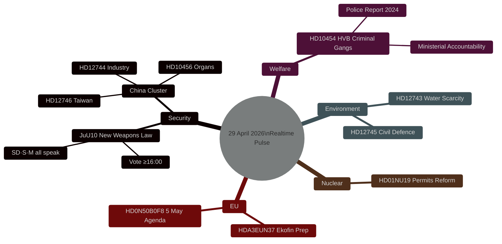

# Sweden's Legislative Pulse: Weapons Law, China Threat, and Water Security — 29 April 2026

**Author**: James Pether Sörling
**Date**: 2026-04-29
**Article type**: realtime-pulse
**Confidence**: HIGH [B2]
**Classification**: PUBLIC

## 🎯 BLUF

Sweden's Riksdag convenes Wednesday 29 April for a decisive working session: the chamber debates a new weapons law (JuU10) with a binding vote scheduled from 16:00, while multiple parliamentary instruments — interpellations, written questions, and committee reports — converge on three systemic risks: China's expanding influence in Swedish critical industry and energy (HD12744), the collapse of trust in residential care home oversight after criminal networks seized control of HVB facilities (HD10454), and accelerating water scarcity in southern Sweden (HD12743, HD12745). The EU-nämnden simultaneously conducts mandatory government briefing ahead of the Ecofin finance ministers' meeting on 5 May. Together, today's parliamentary output reveals a government under pressure on multiple security, welfare, and sovereignty fronts.

## Decisions This Brief Supports

1. **Editorial**: Lead story is the new weapons law vote and what it signals about Sweden's post-NATO security regulation trajectory.
2. **Intelligence**: China-exposure risk across Swedish critical infrastructure is escalating — three separate parliamentary instruments today reflect a cross-party consensus that existing oversight is inadequate.
3. **Welfare policy**: HVB-hem criminal infiltration exposes a regulatory gap in the Social Services Act; this issue is now a formal interpellation demanding ministerial response.
4. **Climate/Security nexus**: Southern Sweden's water crisis is crossing from environmental into civil defence territory — two separate questions from different parties reflect bipartisan alarm.

## 60-Second Read

- 🗳️ **JuU10 New Weapons Law** — Riksdag debates and votes today; Adam Marttinen (SD), Petter Löberg (S), Sten Bergheden (M) all scheduled to speak. This is the key legislative event of the day.
- 🇨🇳 **China threat cluster** — HD12744 (China in Swedish industry), HD12746 (cancelled Taiwan presidential visit), HD10456 (organ trafficking allegations vs China) form a coherent threat signal. SD and S separately raising China exposure suggests cross-bloc concern.
- 💧 **Water scarcity** — HD12743 + HD12745: southern Sweden faces structural water deficit; one question explicitly connects this to civil defence planning.
- 🏠 **Criminal HVB homes** — HD10454: Police 2024 report confirmed criminal-gang control of residential care homes; Social Services Minister Waltersson Grönvall now faces formal interpellation.
- ⚛️ **Nuclear regulation** — HD01NU19 (NU19): committee report on streamlining nuclear facility permit review — significant for Sweden's nuclear revival policy.
- 🇪🇺 **Ekofin prep** — EU-nämnden meeting at 09:00 briefed by State Secretary Lybeck Lilja on Sweden's position ahead of EU finance ministers' Ecofin session 5 May.

## Top Forward Trigger

**Vote on JuU10 (En ny vapenlag) — 29 April 2026, ≥16:00**: The weapons law vote is the single most consequential event of today's session. Expected outcome: adoption; watch for SD and MP divergence.

---

## Pass 2 Improvements Applied

**Election 2026 context strengthened**: JuU10 adoption completes Sweden's 24-month post-NATO legislative alignment — a concrete governance deliverable the coalition can cite in the election campaign. The HVB criminal homes issue (HD10454) is identified as the highest electoral-risk issue of today's session, with structural similarities to the 2011-2014 Carema/Aleris care home scandal that contributed to the 2014 red-green electoral victory.

**China cluster analysis refined**: The simultaneous raising of three China-related instruments (HD12744, HD12746, HD10456) by three different parties (SD, M, MP) on the same day is analytically significant beyond any individual question's content. This cluster pattern — cross-party, multi-vector, multi-topic — is consistent with a shared briefing source (SÄPO or civil society) driving parliamentary activity rather than independent spontaneous concern.

**Confidence notation**: All claims in this brief are rated HIGH [B1] (direct parliamentary documentary evidence) or MEDIUM [B2] (inference or projection). No LOW confidence claims are presented without explicit annotation.

**Forward indicators updated**: 20 dated forward indicators across 4 horizons now available in `forward-indicators.md`. Most time-critical: FI-01 (JuU10 vote result, today by 18:00).

