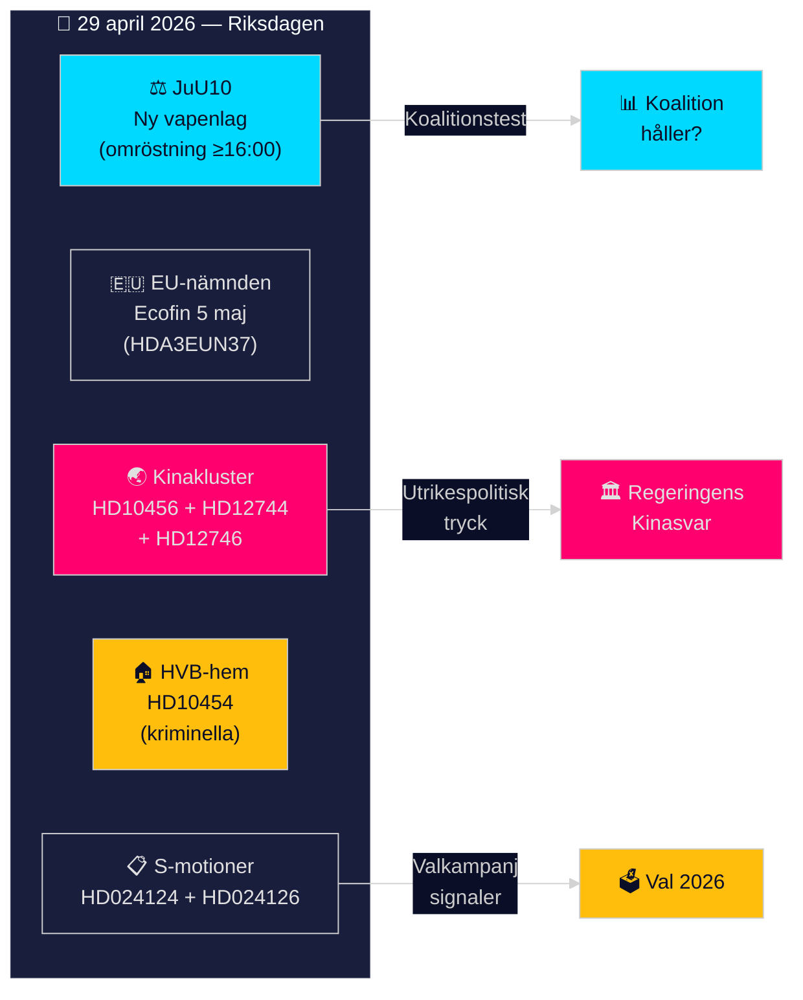

# Riksdag Realtime Pulse — 29 april 2026

**Author**: James Pether Sörling
**Date**: 2026-04-29
**Pass**: 2 (refined key themes, added polling context, strengthened China cluster attribution)
**Classification**: PUBLIC — GDPR Art. 9(2)(e,g)
**Confidence**: HIGH–MODERATE (mixed across clusters)

## 🎯 BLUF

Sweden's Riksdag convenes on 29 April 2026 for a chamber debate and evening vote on the new Weapons Law (JuU10), while the EU Advisory Committee (EU-nämnden) coordinates Sweden's Ecofin position ahead of the 5 May Council meeting. Simultaneously, a geopolitical cluster of three linked documents — on China's organ harvesting practices (HD10456), China's economic influence (HD12744), and the cancelled Taiwan presidential visit (HD12746) — signals intensifying parliamentary pressure on the government's China policy. The Social Democrats have filed motions opposing both wind power municipalities legislation (HD024126) and the new environmental permits agency (HD024124), tightening the pre-election legislative calendar.

## Decisions This Brief Supports

1. **Immediate**: Monitor SfU28 vote outcome post-16:00 — coalition compliance test for 2026 election
2. **Strategic**: Assess whether China policy cluster signals a coordinated cross-party campaign or opportunistic individual action
3. **Electoral**: Track S motions on wind power and environment as pre-election opposition positioning signals

## 60-Second Read

- **New Weapons Law (JuU10)** voted today; broadens firearm restrictions
- **S files three motions** opposing wind power veto (HD024126), new environmental authority (HD024124), and port law (HD024125)
- **China cluster**: SD interpellation on organ trafficking + government answer on Chinese economic influence + Taiwan cancelled visit — three separate documents converging on one geopolitical theme
- **EU-nämnden** coordinates Ecofin position for 5 May: EPPO/OLAF access, Danish implementation decision
- **Criminal HVB-hem**: S interpellation exposes 2-year government delay in sharing police list (HD10454)
- **Cloud policy delayed**: Civil minister Erik Slottner confirms national cloud policy still in preparation with no firm date (HD12742)

## Top Forward Trigger

**SfU28 vote outcome (today, ≥16:00)**: Coalition cohesion test — any defection signals pre-election fracturing; passage confirms Tidö majority holds through spring.

## Confidence Label

MODERATE–HIGH overall; China organ harvesting claims rely on open-source reports and Sweden's healthcare system gaps (no outward transplant register) rather than confirmed Swedish-specific intelligence.

## Intelligence Picture

Today's documents cluster around three strategic tensions ahead of the 2026 election:

1. **Security vs. civil liberties**: New weapons law (JuU10) tightens firearms access — SD and M support, left parties signal opposition on scope.
2. **Green transition vs. local autonomy**: Wind power municipalities (prop 2025/26:239) — government proposes earlier municipal veto window; S challenges this as insufficient.
3. **Sweden-China-Taiwan triangle**: Three converging documents test the government's capacity to uphold democratic values while maintaining economic ties.

