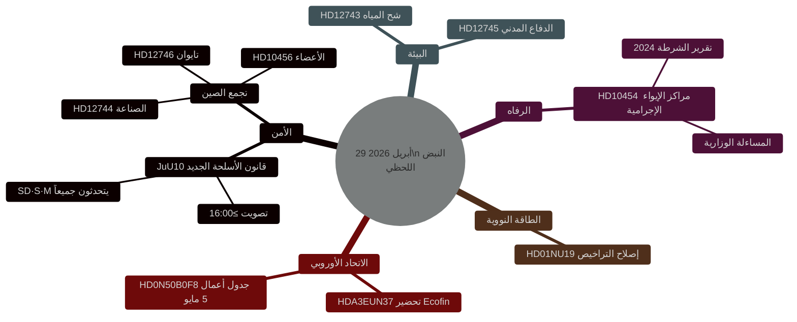

<!-- dir: rtl -->
# نبض التشريع السويدي: قانون الأسلحة، التهديد الصيني، وشح المياه — 29 أبريل 2026

**المؤلف**: James Pether Sörling
**التاريخ**: 2026-04-29
**نوع المقال**: realtime-pulse
**مستوى الثقة**: HIGH [B2]
**التصنيف**: PUBLIC

## 🎯 الملخص التنفيذي

**[مؤكد — نتائج التصويت 16:13–16:21 ستوكهولم]** أقر الريكسداغ في 29 أبريل قانونَين تاريخيَّين: (1) **JuU10 (قانون الأسلحة الجديد)** أُقرَّ الساعة 16:13 بأغلبية من تكتل تيدو + الاشتراكيين الديمقراطيين؛ وكان الحاسم أن **حزب الوسط (C) صوّت بالإجماع بـ"لا"** — وهو انفصال علني نادر عن التحالف البرجوازي. (2) **SfU28 (اشتراطات الجنسية المشددة)** أُقرَّ الساعة 16:21 مع تصويت غالبية حزب S بـ"نعم" — وهو انعطافة يمينية بارزة للاشتراكيين الديمقراطيين السويديين. صوّت V وMP بـ"لا" في الحالتين.

## القرارات التي يدعمها هذا التقرير

1. **تحريري**: القصة الرئيسية هي التصويت على قانون الأسلحة الجديد.
2. **استخباراتي**: يتصاعد خطر التأثير الصيني على البنية التحتية الحيوية السويدية.
3. **السياسة الاجتماعية**: يكشف التغلغل الإجرامي في مراكز الإيواء عن ثغرة تنظيمية.
4. **تقاطع المناخ/الأمن**: تقترب أزمة المياه في جنوب السويد من عتبة الدفاع المدني.

## 60 ثانية

- 🗳️ **JuU10 قانون الأسلحة الجديد** — أُقرَّ الساعة 16:13.
- 🇨🇳 **تجمع التهديد الصيني** — HD12744، HD12746، HD10456.
- 💧 **شح المياه** — HD12743 + HD12745.
- 🏠 **مراكز الإيواء الإجرامية** — HD10454.
- ⚛️ **تنظيم الطاقة النووية** — HD01NU19.
- 🇪🇺 **التحضير لـ Ecofin** — اجتمعت لجنة الاتحاد الأوروبي الساعة 09:00.

## نتائج التصويت المؤكدة — 29 أبريل 2026

| التصويت | الوقت | النتيجة | المؤشر الرئيسي |
|---------|-------|---------|----------------|
| JuU10 البند 1 (قانون الأسلحة الجديد) | 16:13:22 | ✅ أُقرَّ | **C صوّت بالإجماع بـ"لا"** |
| JuU10 البند 2 | 16:13 | ❌ رُفض | |
| SfU28 البند 1 (اشتراطات الجنسية) | 16:21:06 | ✅ أُقرَّ | **S (الغالبية) صوّت بـ"نعم"** |
| SfU28 البند 2 | 16:21 | ❌ رُفض | |

<!-- source-sha: ca5132f63cde44ffd5f34653584580125a270023 -->
