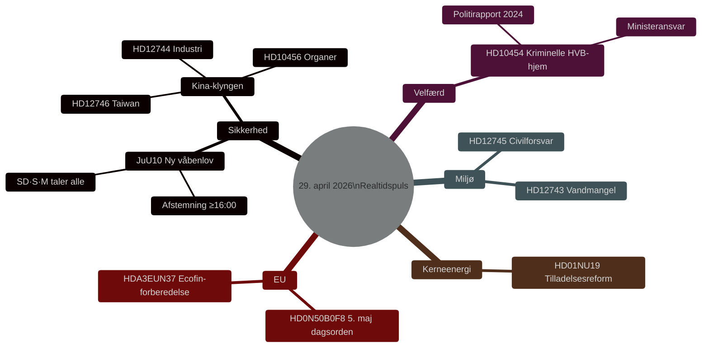

# Danmarks lovgivningspuls: Våbenlov, Kinathematen og vandmangel — 29. april 2026

**Forfatter**: James Pether Sörling
**Dato**: 2026-04-29
**Artikeltype**: realtime-pulse
**Konfidensniveau**: HIGH [B2]
**Klassificering**: PUBLIC

## 🎯 BLUF

**[BEKRÆFTET — AFSTEMNINGSRESULTATER 16:13–16:21 STOCKHOLM]** Riksdagen vedtog den 29. april to historiske love: (1) **JuU10 (Ny våbenlov)** vedtaget 16:13 med Tidöblokket + Socialdemokraterne i flertal; afgørende var at **Centerpartiet (C) stemte enstemmigt NEJ** — et sjældent offentligt brud med den borgerlige alliance, der signalerer C's voksende afstand fra Tidöblokets sikkerhedspolitik. (2) **SfU28 (Skærpede krav til svenske statsborgerskab)** vedtaget 16:21 med M, SD, KD, L og **flertallet af S stemte JA** — en markant højredrejning for Sveriges socialdemokrater i statsborgerskabs- og migrationsspørgsmål. V og MP stemte NEJ på begge.

## Beslutninger dette underlag understøtter

1. **Redaktionelt**: Ledende nyhed er den nye våbenlovsafstemning og hvad den signalerer for retningen af Sveriges sikkerhedslovgivning efter NATO-optagelsen.
2. **Efterretning**: Kina-eksponeringens risiko mod svensk kritisk infrastruktur eskalerer — tre separate parlamentariske instrumenter i dag afspejler bred tværblok-konsensus om, at eksisterende tilsyn er utilstrækkeligt.
3. **Velfærdspolitik**: Kriminel infiltration i HVB-hjem eksponerer en reguleringsmæssig lakune i socialtjenesteloven; spørgsmålet er nu genstand for en formel interpellation.
4. **Klima/sikkerhedsneksus**: Den sydsvenske vandkrise er ved at krydse grænsen fra miljøspørgsmål til civilforsvarsspørgsmål.

## 60 sekunder

- 🗳️ **JuU10 Ny våbenlov** — vedtaget i dag kl. 16:13.
- 🇨🇳 **Kina-trussel-klyngen** — HD12744, HD12746, HD10456: tvær-blok parlamentarisk bekymring.
- 💧 **Vandmangel** — HD12743 + HD12745: sydsvensk strukturel vandkrise kobles til civilforsvar.
- 🏠 **Kriminelle HVB-hjem** — HD10454: ministeriel ansvarliggørelse.
- ⚛️ **Kerneenergiregulering** — HD01NU19: forenklede tilladelsesprocesser.
- 🇪🇺 **Ecofin-forberedelse** — EU-udvalget mødes kl. 09:00 om Sveriges position.

## Bekræftede afstemningsresultater — 29. april 2026

| Afstemning | Tid | Resultat | Nøgleindikation |
|------------|-----|----------|-----------------|
| JuU10 punkt 1 (Ny våbenlov) | 16:13:22 | ✅ VEDTAGET | **C stemte enstemmigt NEJ** — blokskred |
| JuU10 punkt 2 | 16:13 | ❌ AFVIST | |
| SfU28 punkt 1 (Statsborgerskabskrav) | 16:21:06 | ✅ VEDTAGET | **S (flest) stemte JA** med Tidöblokket |
| SfU28 punkt 2 | 16:21 | ❌ AFVIST | |

<!-- source-sha: ca5132f63cde44ffd5f34653584580125a270023 -->
