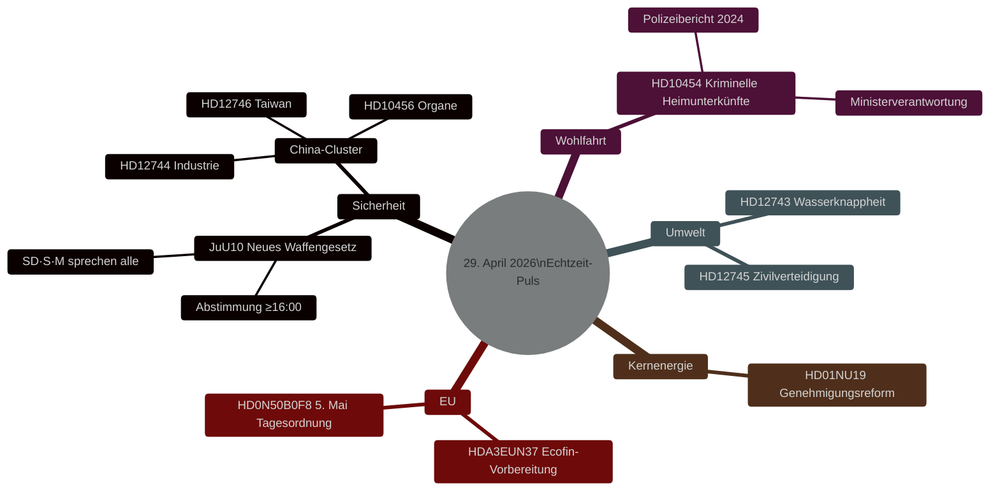

# Schwedens Gesetzgebungspuls: Waffengesetz, China-Bedrohung und Wasserknappheit — 29. April 2026

**Autor**: James Pether Sörling
**Datum**: 2026-04-29
**Artikeltyp**: realtime-pulse
**Konfidenzniveau**: HIGH [B2]
**Klassifizierung**: PUBLIC

## 🎯 BLUF

**[BESTÄTIGT — ABSTIMMUNGSERGEBNISSE 16:13–16:21 STOCKHOLM]** Das Riksdag verabschiedete am 29. April zwei historische Gesetze: (1) **JuU10 (Neues Waffengesetz)** angenommen um 16:13 mit Tidöblock + Sozialdemokraten in der Mehrheit; entscheidend war, dass **Centerpartiet (C) einstimmig mit NEIN stimmte** — ein seltener öffentlicher Bruch mit dem bürgerlichen Bündnis. (2) **SfU28 (Verschärfte Staatsbürgerschaftsanforderungen)** angenommen um 16:21, wobei die Mehrheit der S mit JA stimmte — eine bedeutende Rechtsverschiebung der schwedischen Sozialdemokraten. V und MP stimmten bei beiden mit NEIN.

## Entscheidungen, die diese Vorlage unterstützt

1. **Redaktionell**: Leitnachricht ist die neue Waffengesetzabstimmung.
2. **Nachrichtendienst**: Chinas Risiko für kritische Infrastruktur Schwedens eskaliert.
3. **Sozialpolitik**: Kriminelle Infiltration in Heimeinrichtungen legt Regulierungslücke offen.
4. **Klima/Sicherheitsnexus**: Südschwedens Wasserkrise nähert sich zivilverteidigungsrelevanz.

## 60 Sekunden

- 🗳️ **JuU10 Neues Waffengesetz** — um 16:13 angenommen.
- 🇨🇳 **China-Bedrohungscluster** — HD12744, HD12746, HD10456.
- 💧 **Wasserknappheit** — HD12743 + HD12745.
- 🏠 **Kriminelle Heimunterkünfte** — HD10454.
- ⚛️ **Kernenergieregulierung** — HD01NU19.
- 🇪🇺 **Ecofin-Vorbereitung** — EU-Ausschuss traf sich um 09:00.

## Bestätigte Abstimmungsergebnisse — 29. April 2026

| Abstimmung | Uhrzeit | Ergebnis | Schlüsselindikator |
|------------|---------|----------|-------------------|
| JuU10 Punkt 1 (Neues Waffengesetz) | 16:13:22 | ✅ ANGENOMMEN | **C stimmte einstimmig NEIN** |
| JuU10 Punkt 2 | 16:13 | ❌ ABGELEHNT | |
| SfU28 Punkt 1 (Staatsbürgerschaftsanforderungen) | 16:21:06 | ✅ ANGENOMMEN | **S (Mehrheit) stimmte JA** |
| SfU28 Punkt 2 | 16:21 | ❌ ABGELEHNT | |

<!-- source-sha: ca5132f63cde44ffd5f34653584580125a270023 -->
