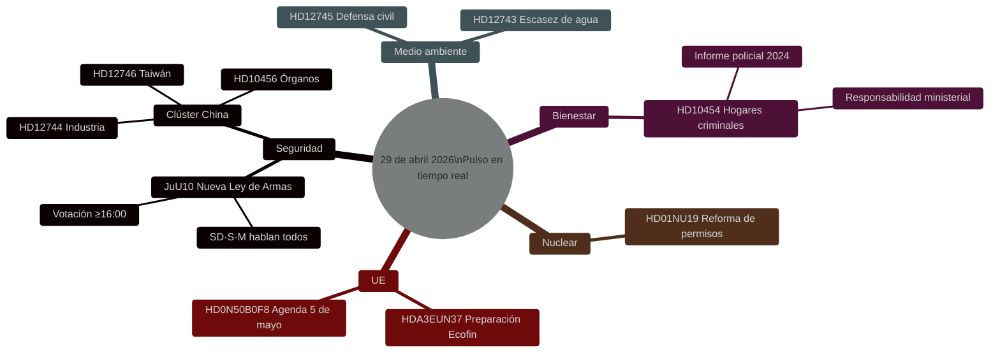

# Pulso legislativo sueco: Ley de armas, amenaza china y escasez de agua — 29 de abril de 2026

**Autor**: James Pether Sörling
**Fecha**: 2026-04-29
**Tipo de artículo**: realtime-pulse
**Nivel de confianza**: HIGH [B2]
**Clasificación**: PUBLIC

## 🎯 BLUF

**[CONFIRMADO — RESULTADOS DE VOTACIÓN 16:13–16:21 ESTOCOLMO]** El Riksdag aprobó el 29 de abril dos leyes históricas: (1) **JuU10 (Nueva Ley de Armas)** aprobada a las 16:13 con el bloque Tidö + los socialdemócratas en mayoría; el elemento decisivo fue que **el Partido del Centro (C) votó unánimemente NO** — una rara ruptura pública con la alianza burguesa. (2) **SfU28 (Requisitos de ciudadanía más estrictos)** aprobada a las 16:21 con la mayoría del S votando SÍ — un giro significativo a la derecha para los socialdemócratas suecos. V y MP votaron NO en ambas.

## Decisiones que respalda este informe

1. **Editorial**: La noticia principal es la votación sobre la nueva ley de armas.
2. **Inteligencia**: El riesgo de exposición china a la infraestructura crítica sueca se intensifica.
3. **Política social**: La infiltración criminal en hogares residenciales revela una laguna regulatoria.
4. **Nexo clima/seguridad**: La crisis hídrica del sur de Suecia se acerca al umbral de defensa civil.

## 60 segundos

- 🗳️ **JuU10 Nueva Ley de Armas** — aprobada a las 16:13.
- 🇨🇳 **Clúster de amenaza china** — HD12744, HD12746, HD10456.
- 💧 **Escasez de agua** — HD12743 + HD12745.
- 🏠 **Hogares residenciales criminales** — HD10454.
- ⚛️ **Regulación nuclear** — HD01NU19.
- 🇪🇺 **Preparación Ecofin** — Comité UE reunido a las 09:00.

## Resultados de votación confirmados — 29 de abril de 2026

| Votación | Hora | Resultado | Indicador clave |
|----------|------|-----------|-----------------|
| JuU10 punto 1 (Nueva Ley de Armas) | 16:13:22 | ✅ APROBADA | **C votó unánimemente NO** |
| JuU10 punto 2 | 16:13 | ❌ RECHAZADA | |
| SfU28 punto 1 (Requisitos de ciudadanía) | 16:21:06 | ✅ APROBADA | **S (mayoría) votó SÍ** |
| SfU28 punto 2 | 16:21 | ❌ RECHAZADA | |

<!-- source-sha: ca5132f63cde44ffd5f34653584580125a270023 -->
