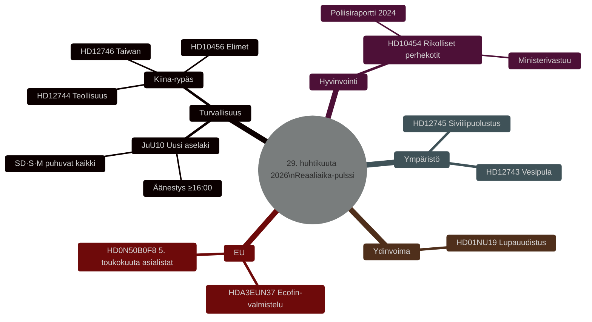

# Ruotsin lainsäädäntöpulssi: Aselaki, Kiinan uhka ja vesipula — 29. huhtikuuta 2026

**Kirjoittaja**: James Pether Sörling
**Päivämäärä**: 2026-04-29
**Artikkelityyppi**: realtime-pulse
**Luottamustaso**: HIGH [B2]
**Luokitus**: PUBLIC

## 🎯 BLUF

**[VAHVISTETTU — ÄÄNESTYSTULOKSET 16:13–16:21 TUKHOLMA]** Riksdag hyväksyi 29. huhtikuuta kaksi historiallista lakia: (1) **JuU10 (Uusi aselaki)** hyväksyttiin klo 16:13 Tidöblokin + Sosiaalidemokraattien enemmistöllä; ratkaisevaa oli, että **Keskustapuolue (C) äänesti yksimielisesti EI** — harvinainen julkinen ero porvarillisilta liittolaisilta, joka merkitsee C:n kasvavaa etäisyyttä Tidöblokin turvallisuuspolitiikasta. (2) **SfU28 (Tiukemmat kansalaisuusvaatimukset)** hyväksyttiin klo 16:21 M:n, SD:n, KD:n, L:n ja **suurimman osan S:stä äänestäessä KYLLÄ** — merkittävä oikeistokäänne Ruotsin sosiaalidemokraateille. V ja MP äänestivät EI molemmissa.

## Päätökset, joita tämä taustamuistio tukee

1. **Toimituksellinen**: Tärkein uutinen on uusi aselakiäänestys ja sen turvallisuuslainsäädännöllinen merkitys.
2. **Tiedustelu**: Kiinan uhka Ruotsin kriittiselle infrastruktuurille kasvaa.
3. **Sosiaalipolitiikka**: Rikollisten tunkeutuminen perhekoteihin paljastaa sääntelyaukon.
4. **Ilmasto/turvallisuusnexus**: Etelä-Ruotsin vesipula lähestyy siviilipuolustuksen relevanssia.

## 60 sekuntia

- 🗳️ **JuU10 Uusi aselaki** — hyväksytty klo 16:13.
- 🇨🇳 **Kiina-uhkarypäs** — HD12744, HD12746, HD10456.
- 💧 **Vesipula** — HD12743 + HD12745.
- 🏠 **Rikolliset perhekotit** — HD10454.
- ⚛️ **Ydinvoimasääntely** — HD01NU19.
- 🇪🇺 **Ecofin-valmistelu** — EU-neuvosto kokoontui klo 09:00.

## Vahvistetut äänestystulokset — 29. huhtikuuta 2026

| Äänestys | Aika | Tulos | Avainilmaisin |
|----------|------|-------|---------------|
| JuU10 kohta 1 (Uusi aselaki) | 16:13:22 | ✅ HYVÄKSYTTY | **C äänesti yksimielisesti EI** |
| JuU10 kohta 2 | 16:13 | ❌ HYLÄTTY | |
| SfU28 kohta 1 (Kansalaisuusvaatimukset) | 16:21:06 | ✅ HYVÄKSYTTY | **S (enimmäkseen) äänesti KYLLÄ** |
| SfU28 kohta 2 | 16:21 | ❌ HYLÄTTY | |

<!-- source-sha: ca5132f63cde44ffd5f34653584580125a270023 -->
