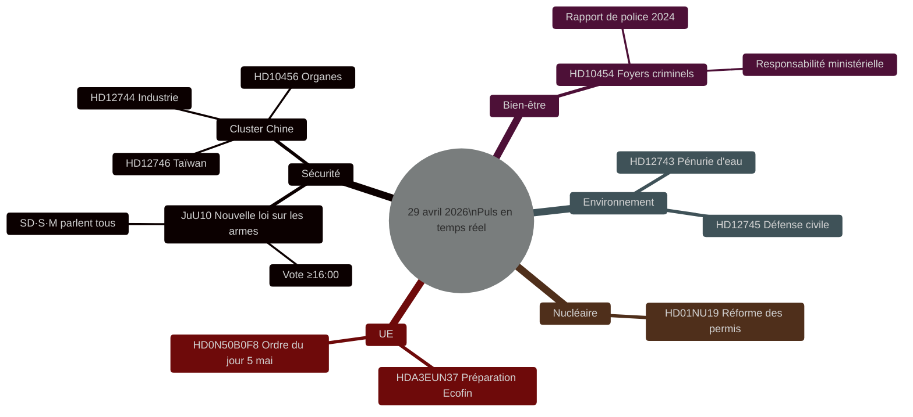

# Puls législatif suédois : Loi sur les armes, menace chinoise et pénurie d'eau — 29 avril 2026

**Auteur** : James Pether Sörling
**Date** : 2026-04-29
**Type d'article** : realtime-pulse
**Niveau de confiance** : HIGH [B2]
**Classification** : PUBLIC

## 🎯 BLUF

**[CONFIRMÉ — RÉSULTATS DES VOTES 16:13–16:21 STOCKHOLM]** Le Riksdag a adopté le 29 avril deux lois historiques : (1) **JuU10 (Nouvelle loi sur les armes)** adoptée à 16:13 avec le bloc Tidö + les sociaux-démocrates en majorité ; l'élément décisif est que **le Parti du Centre (C) a voté unanimement NON** — une rupture publique rare avec l'alliance bourgeoise. (2) **SfU28 (Conditions de citoyenneté renforcées)** adoptée à 16:21 avec la majorité du S votant OUI — un virage significatif vers la droite pour les sociaux-démocrates suédois. V et MP ont voté NON aux deux votes.

## Décisions soutenues par cette note

1. **Éditorial** : La principale information est le vote sur la nouvelle loi sur les armes.
2. **Renseignement** : Le risque de l'exposition chinoise à l'infrastructure critique suédoise s'intensifie.
3. **Politique sociale** : L'infiltration criminelle dans les foyers d'hébergement révèle une lacune réglementaire.
4. **Nexus climat/sécurité** : La crise hydrique du sud de la Suède approche du seuil de défense civile.

## 60 secondes

- 🗳️ **JuU10 Nouvelle loi sur les armes** — adoptée à 16:13.
- 🇨🇳 **Cluster de menace chinoise** — HD12744, HD12746, HD10456.
- 💧 **Pénurie d'eau** — HD12743 + HD12745.
- 🏠 **Foyers d'hébergement criminels** — HD10454.
- ⚛️ **Régulation nucléaire** — HD01NU19.
- 🇪🇺 **Préparation Ecofin** — Comité UE réuni à 09:00.

## Résultats de votes confirmés — 29 avril 2026

| Vote | Heure | Résultat | Indicateur clé |
|------|-------|----------|----------------|
| JuU10 point 1 (Nouvelle loi sur les armes) | 16:13:22 | ✅ ADOPTÉ | **C a voté unanimement NON** |
| JuU10 point 2 | 16:13 | ❌ REJETÉ | |
| SfU28 point 1 (Conditions de citoyenneté) | 16:21:06 | ✅ ADOPTÉ | **S (majorité) a voté OUI** |
| SfU28 point 2 | 16:21 | ❌ REJETÉ | |

<!-- source-sha: ca5132f63cde44ffd5f34653584580125a270023 -->
