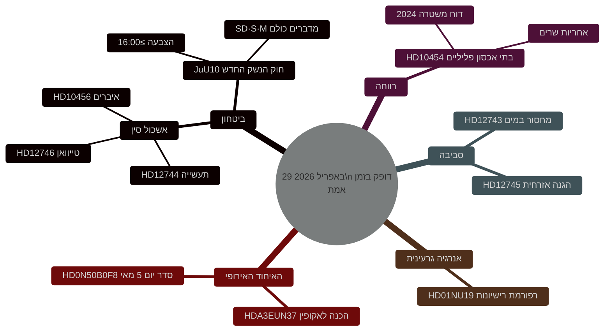

<!-- dir: rtl -->
# דופק החקיקה השוודי: חוק הנשק, האיום הסיני ומחסור במים — 29 באפריל 2026

**מחבר**: James Pether Sörling
**תאריך**: 2026-04-29
**סוג מאמר**: realtime-pulse
**רמת ביטחון**: HIGH [B2]
**סיווג**: PUBLIC

## 🎯 תקציר מנהלים

**[מאושר — תוצאות הצבעה 16:13–16:21 שטוקהולם]** הריקסדאג אישר ב-29 באפריל שני חוקים היסטוריים: (1) **JuU10 (חוק הנשק החדש)** אושר בשעה 16:13 עם גוש טידו + הסוציאל-דמוקרטים ברוב; המכריע היה ש**מפלגת המרכז (C) הצביעה פה אחד נגד** — שבירה פומבית נדירה עם הברית הבורגנית. (2) **SfU28 (דרישות אזרחות מחמירות)** אושר בשעה 16:21 עם רוב חברי S שהצביעו בעד — הטיה ימנית משמעותית לסוציאל-דמוקרטים השוודים. V וMP הצביעו נגד בשניהם.

## החלטות שדוח זה תומך בהן

1. **עריכתי**: הידיעה המרכזית היא הצבעה על חוק הנשק החדש.
2. **מודיעין**: הסיכון הסיני לתשתית קריטית שוודית מסלים.
3. **מדיניות חברתית**: חדירה פלילית לבתי אכסון חושפת פרצה רגולטורית.
4. **ממשק אקלים/ביטחון**: משבר המים בדרום שוודיה מתקרב לסף ההגנה האזרחית.

## 60 שניות

- 🗳️ **JuU10 חוק הנשק החדש** — אושר בשעה 16:13.
- 🇨🇳 **אשכול האיום הסיני** — HD12744, HD12746, HD10456.
- 💧 **מחסור במים** — HD12743 + HD12745.
- 🏠 **בתי אכסון פליליים** — HD10454.
- ⚛️ **רגולציה גרעינית** — HD01NU19.
- 🇪🇺 **הכנה לאקופין** — ועדת האיחוד האירופי נפגשה בשעה 09:00.

## תוצאות הצבעה מאושרות — 29 באפריל 2026

| הצבעה | שעה | תוצאה | מחוון מפתח |
|-------|-----|-------|------------|
| JuU10 סעיף 1 (חוק הנשק החדש) | 16:13:22 | ✅ אושר | **C הצביעה פה אחד נגד** |
| JuU10 סעיף 2 | 16:13 | ❌ נדחה | |
| SfU28 סעיף 1 (דרישות אזרחות) | 16:21:06 | ✅ אושר | **S (רוב) הצביעה בעד** |
| SfU28 סעיף 2 | 16:21 | ❌ נדחה | |

<!-- source-sha: ca5132f63cde44ffd5f34653584580125a270023 -->
