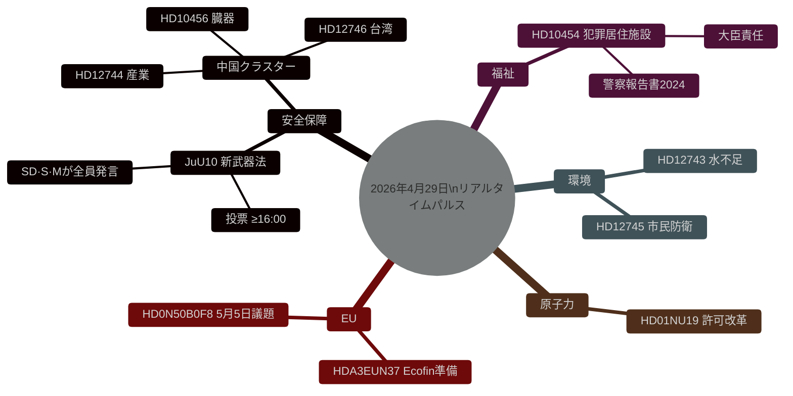

# スウェーデン立法パルス：武器法、中国の脅威、水不足 — 2026年4月29日

**著者**: James Pether Sörling
**日付**: 2026-04-29
**記事タイプ**: realtime-pulse
**信頼性レベル**: HIGH [B2]
**分類**: PUBLIC

## 🎯 要約

**[確認済み — 投票結果 16:13–16:21 ストックホルム]** リクスダーグは4月29日、歴史的な2つの法律を可決した：(1) **JuU10（新武器法）** はティードーブロック＋社会民主党の多数派で16:13に可決；決定的だったのは**中央党（C）が全会一致で反対票を投じた**ことで、市民連合との公的な決裂という珍しい出来事であり、ティードーブロックの安全保障政策からのCの距離感が拡大していることを示す。(2) **SfU28（市民権要件の強化）** はM、SD、KD、Lおよび**Sの過半数が賛成票を投じ**16:21に可決——スウェーデン社会民主党にとって市民権・移民問題での顕著な右傾化。VとMPは両方とも反対票を投じた。

## この報告書が支援する意思決定

1. **編集上**: 主要ニュースは新武器法の投票とスウェーデンのNATO加盟後の安全保障立法の方向性。
2. **情報分析**: スウェーデンの重要インフラへの中国のリスクが高まっている。
3. **社会政策**: 児童福祉施設への犯罪組織の浸透が規制上の抜け穴を露呈。
4. **気候・安全保障の交差点**: 南スウェーデンの水不足が市民防衛の関連性に近づいている。

## 60秒サマリー

- 🗳️ **JuU10 新武器法** — 16:13に可決。
- 🇨🇳 **中国脅威クラスター** — HD12744、HD12746、HD10456。
- 💧 **水不足** — HD12743 + HD12745。
- 🏠 **犯罪組織が関与する居住施設** — HD10454。
- ⚛️ **原子力規制** — HD01NU19。
- 🇪🇺 **Ecofin準備** — EU委員会が09:00に集合。

## 確認済み投票結果 — 2026年4月29日

| 投票 | 時刻 | 結果 | 主要指標 |
|-----|------|------|---------|
| JuU10 点1（新武器法） | 16:13:22 | ✅ 可決 | **C全会一致反対** |
| JuU10 点2 | 16:13 | ❌ 否決 | |
| SfU28 点1（市民権要件） | 16:21:06 | ✅ 可決 | **S（過半数）賛成** |
| SfU28 点2 | 16:21 | ❌ 否決 | |

<!-- source-sha: ca5132f63cde44ffd5f34653584580125a270023 -->
