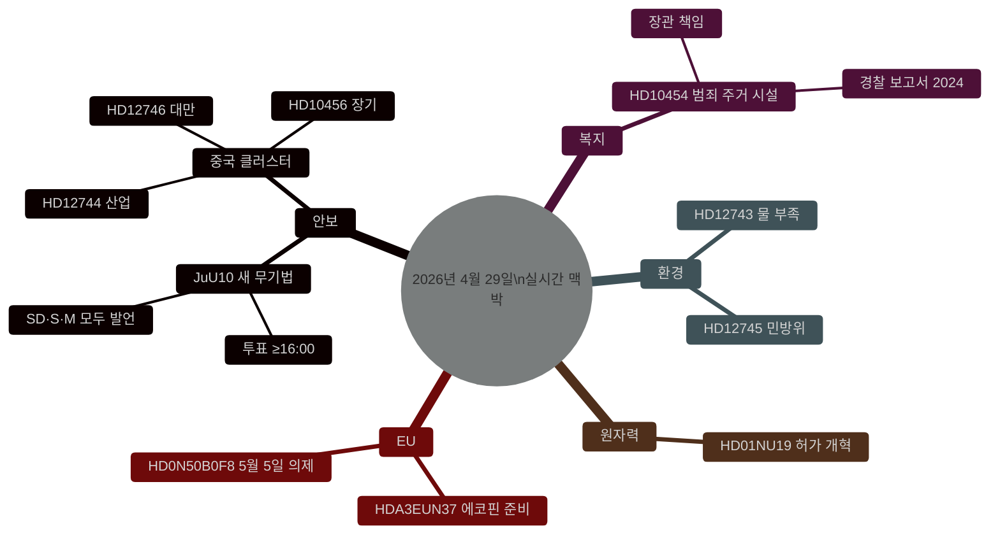

# 스웨덴 입법 맥박: 무기법, 중국 위협, 물 부족 — 2026년 4월 29일

**저자**: James Pether Sörling
**날짜**: 2026-04-29
**기사 유형**: realtime-pulse
**신뢰도 수준**: HIGH [B2]
**분류**: PUBLIC

## 🎯 요약

**[확인됨 — 투표 결과 16:13–16:21 스톡홀름]** 릭스다겐은 4월 29일 두 개의 역사적인 법률을 통과시켰다: (1) **JuU10 (새 무기법)** 은 티도 블록 + 사회민주당의 다수결로 16:13에 통과됐다; 결정적 요소는 **중앙당(C)이 만장일치로 반대표를 던진 것**으로, 시민 연합과의 보기 드문 공개적 결별이었다. (2) **SfU28 (시민권 요건 강화)** 은 M, SD, KD, L과 **S의 다수가 찬성표를 던져** 16:21에 통과됐다. V와 MP는 둘 다 반대표를 던졌다.

## 이 보고서가 지원하는 결정

1. **편집부**: 주요 뉴스는 새 무기법 투표와 스웨덴 안보 입법의 방향.
2. **정보**: 스웨덴 핵심 인프라에 대한 중국의 위험이 고조되고 있다.
3. **사회 정책**: 주거 시설에 대한 범죄 조직 침투가 규제 허점을 드러냈다.
4. **기후/안보 넥서스**: 스웨덴 남부 물 위기가 민방위 관련성 임계점에 가까워지고 있다.

## 60초

- 🗳️ **JuU10 새 무기법** — 16:13에 통과.
- 🇨🇳 **중국 위협 클러스터** — HD12744, HD12746, HD10456.
- 💧 **물 부족** — HD12743 + HD12745.
- 🏠 **범죄 주거 시설** — HD10454.
- ⚛️ **원자력 규제** — HD01NU19.
- 🇪🇺 **에코핀 준비** — EU 위원회 09:00에 회의.

## 확인된 투표 결과 — 2026년 4월 29일

| 투표 | 시간 | 결과 | 핵심 지표 |
|-----|------|------|---------|
| JuU10 항목 1 (새 무기법) | 16:13:22 | ✅ 통과 | **C 만장일치 반대** |
| JuU10 항목 2 | 16:13 | ❌ 부결 | |
| SfU28 항목 1 (시민권 요건) | 16:21:06 | ✅ 통과 | **S (다수) 찬성** |
| SfU28 항목 2 | 16:21 | ❌ 부결 | |

<!-- source-sha: ca5132f63cde44ffd5f34653584580125a270023 -->
