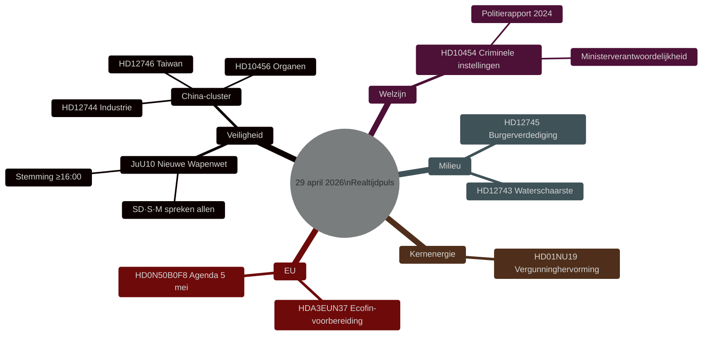

# Zweeds wetgevingspuls: Wapenwet, China-dreiging en waterschaarste — 29 april 2026

**Auteur**: James Pether Sörling
**Datum**: 2026-04-29
**Artikeltype**: realtime-pulse
**Betrouwbaarheidsniveau**: HIGH [B2]
**Classificatie**: PUBLIC

## 🎯 BLUF

**[BEVESTIGD — STEMRESULTATEN 16:13–16:21 STOCKHOLM]** De Riksdag nam op 29 april twee historische wetten aan: (1) **JuU10 (Nieuwe Wapenwet)** aangenomen om 16:13 met het Tidöblok + Sociaal-Democraten in meerderheid; beslissend was dat **Centerpartiet (C) unaniem NEE stemde** — een zeldzame publieke breuk met de burgerlijke alliantie. (2) **SfU28 (Aangescherpte burgerschapseisen)** aangenomen om 16:21 waarbij de meerderheid van S JA stemde — een significante rechtse verschuiving voor Zweedse sociaal-democraten. V en MP stemden NEE bij beide.

## Beslissingen die dit rapport ondersteunt

1. **Redactioneel**: Hoofdnieuws is de nieuwe wapenwetstemming.
2. **Inlichtingen**: Het Chinese risico voor Zweedse kritieke infrastructuur escaleert.
3. **Sociaal beleid**: Criminele infiltratie in residentiële instellingen legt een regelgevingskloof bloot.
4. **Klimaat/veiligheidsnexus**: De watercrisis in Zuid-Zweden nadert de drempel van burgerverdediging.

## 60 seconden

- 🗳️ **JuU10 Nieuwe Wapenwet** — aangenomen om 16:13.
- 🇨🇳 **China-dreigingscluster** — HD12744, HD12746, HD10456.
- 💧 **Waterschaarste** — HD12743 + HD12745.
- 🏠 **Criminele residentiële instellingen** — HD10454.
- ⚛️ **Kernenergieregelgeving** — HD01NU19.
- 🇪🇺 **Ecofin-voorbereiding** — EU-commissie bijeengekomen om 09:00.

## Bevestigde stemresultaten — 29 april 2026

| Stemming | Tijd | Resultaat | Sleutelindicator |
|----------|------|-----------|-----------------|
| JuU10 punt 1 (Nieuwe Wapenwet) | 16:13:22 | ✅ AANGENOMEN | **C stemde unaniem NEE** |
| JuU10 punt 2 | 16:13 | ❌ VERWORPEN | |
| SfU28 punt 1 (Burgerschapseisen) | 16:21:06 | ✅ AANGENOMEN | **S (meerderheid) stemde JA** |
| SfU28 punt 2 | 16:21 | ❌ VERWORPEN | |

<!-- source-sha: ca5132f63cde44ffd5f34653584580125a270023 -->
