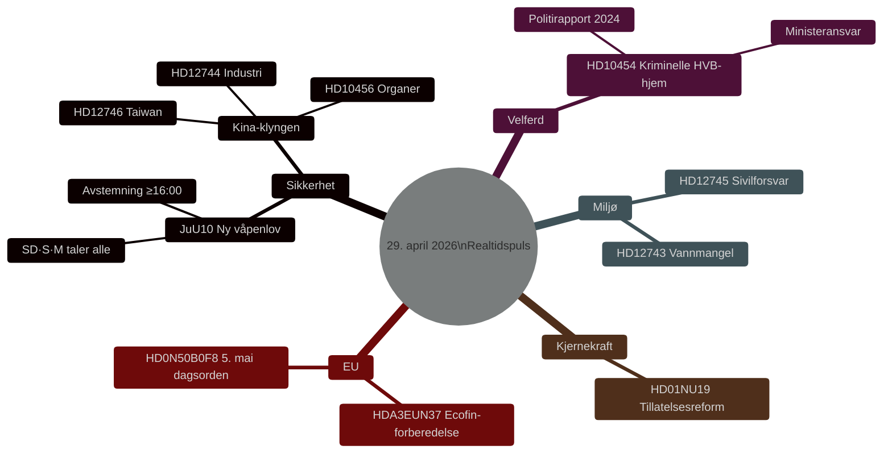

# Norsk lovgivningspuls: Våpenlov, Kina-trusselen og vannmangel — 29. april 2026

**Forfatter**: James Pether Sörling
**Dato**: 2026-04-29
**Artikeltype**: realtime-pulse
**Konfidensnivå**: HIGH [B2]
**Klassifisering**: PUBLIC

## 🎯 BLUF

**[BEKREFTET — AVSTEMNINGSRESULTATER 16:13–16:21 STOCKHOLM]** Riksdagen vedtok 29. april to historiske lover: (1) **JuU10 (Ny våpenlov)** vedtatt 16:13 med Tidöblokket + Sosialdemokratene i flertall; avgjørende var at **Centerpartiet (C) stemte enstemmig NEI** — et sjeldent offentlig brudd med den borgerlige alliansen. (2) **SfU28 (Skjerpede krav til svensk statsborgerskap)** vedtatt 16:21 med M, SD, KD, L og **flertallet av S stemte JA** — en markant høyrefront for Sveriges sosialdemokrater i statsborger- og migrasjonsspørsmål. V og MP stemte NEI på begge.

## Beslutninger dette underlaget støtter

1. **Redaksjonelt**: Ledende nyhet er den nye våpenlovsavstemningen og hva den signalerer for retningen av Sveriges sikkerhetslovgivning.
2. **Etterretning**: Kina-eksponeringens risiko mot svensk kritisk infrastruktur eskalerer.
3. **Velferdspolitikk**: Kriminell infiltrasjon i HVB-hjem eksponerer en reguleringssmutter.
4. **Klima/sikkerhetsnexa**: Den sørsvenske vannkrisen nærmer seg sivilforsvarsrelevans.

## 60 sekunder

- 🗳️ **JuU10 Ny våpenlov** — vedtatt kl. 16:13.
- 🇨�� **Kina-trusselklyngen** — HD12744, HD12746, HD10456.
- 💧 **Vannmangel** — HD12743 + HD12745.
- 🏠 **Kriminelle HVB-hjem** — HD10454.
- ⚛️ **Kjernekraftregulering** — HD01NU19.
- 🇪🇺 **Ecofin-forberedelse** — EU-nemnda møttes kl. 09:00.

## Bekreftede avstemningsresultater — 29. april 2026

| Avstemning | Tid | Resultat | Nøkkelindikasjon |
|------------|-----|----------|------------------|
| JuU10 punkt 1 (Ny våpenlov) | 16:13:22 | ✅ VEDTATT | **C stemte enstemmig NEI** |
| JuU10 punkt 2 | 16:13 | ❌ AVSLÅTT | |
| SfU28 punkt 1 (Statsborgerskapskrav) | 16:21:06 | ✅ VEDTATT | **S (flest) stemte JA** |
| SfU28 punkt 2 | 16:21 | ❌ AVSLÅTT | |

<!-- source-sha: ca5132f63cde44ffd5f34653584580125a270023 -->
