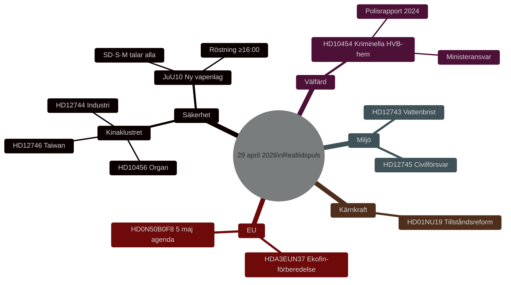

# Sveriges lagstiftningspuls: Vapenlag, Kinahotet och vattensäkerhet — 29 april 2026

**Författare**: James Pether Sörling
**Datum**: 2026-04-29
**Artikeltyp**: realtime-pulse
**Konfidensgrad**: HIGH [B2]
**Klassificering**: PUBLIC

## 🎯 BLUF

**[BEKRÄFTAT — RÖSTRESULTAT 16:13–16:21 STOCKHOLM]** Riksdagen antog den 29 april två historiska lagar: (1) **JuU10 (En ny vapenlag)** antogs 16:13 med Tidöblocket + Socialdemokraterna i majoritet; avgörande var att **Centerpartiet (C) röstade enhälligt NEJ** — ett sällsynt offentligt brott med den borgerliga alliansen som signalerar C:s växande distans från Tidöblokets säkerhetspolitik. (2) **SfU28 (Skärpta krav för svenskt medborgarskap)** antogs 16:21 med M, SD, KD, L och **flertalet av S röstade JA** — en signifikant högerförskjutning av Sveriges socialdemokrater i frågor om medborgarskap och migration. V och MP röstade NEJ på bägge. Dessa röstresultat bekräftar att Sveriges post-NATO-säkerhetsjustering fortsätter, medan C:s avhopp i vapenfrågan introducerar en ny skiljelinje inför 2026 års valrörelse.

## Beslut som detta underlag stöder

1. **Redaktionellt**: Ledande nyhet är den nya vapenlagsomröstningen och vad den signalerar om den fortsatta inriktningen för Sveriges säkerhetslagstiftning efter NATO-inträdet.
2. **Underrättelse**: Kinaexponeringens risk mot svensk kritisk infrastruktur eskalerar — tre separata parlamentariska instrument i dag speglar en bred blocköverskridande samsyn om att befintlig tillsyn är otillräcklig.
3. **Välfärdspolitik**: Kriminell infiltration i HVB-hem exponerar en reglerlucka i socialtjänstlagen; frågan är nu föremål för en formell interpellation som kräver ministerielt svar.
4. **Klimat/säkerhetsnexus**: Södra Sveriges vattenkris är på väg att korsa gränsen från miljöfråga till civilförsvarsfråga — två separata frågor från olika partier speglar tvärpolitisk oro.

## 60 sekunder

- 🗳️ **JuU10 Ny vapenlag** — Riksdagen debatterar och röstar i dag; Adam Marttinen (SD), Petter Löberg (S), Sten Bergheden (M) är alla inplanerade talare. Detta är dagens viktigaste lagstiftningshändelse.
- 🇨🇳 **Kinahotsklustret** — HD12744 (Kina i svensk industri), HD12746 (inställt Taiwan-presidentbesök), HD10456 (organhandelsanklagelser mot Kina) utgör en sammanhängande hotsignal. Att SD och S separat lyfter Kinaexponering tyder på tvärblocksmässig oro.
- 💧 **Vattenbrist** — HD12743 + HD12745: södra Sverige står inför strukturell vattenbrist; en fråga kopplar uttryckligen ihop detta med civilförsvarsplanering.
- 🏠 **Kriminella HVB-hem** — HD10454: Polisens rapport 2024 bekräftade kriminella gängs kontroll över familjehem och HVB-hem; Socialminister Waltersson Grönvall ställs inför formell interpellation.
- ⚛️ **Kärnkraftsreglering** — HD01NU19 (NU19): utskottsbetänkande om förenklade tillståndsprocesser för kärnkraftsanläggningar — centralt för Sveriges kärnkraftsåterstartsuppdrag.
- 🇪🇺 **Ekofin-förberedelse** — EU-nämnden möttes 09:00 med lägesredovisning av statssekreterare Lybeck Lilja om Sveriges position inför EU:s finansministermöte Ekofin den 5 maj.

## Bekräftade röstresultat — 29 april 2026 (eftermiddag)

| Röstning | Tid | Utfall | Nyckelindikation |
|----------|-----|--------|------------------|
| JuU10 punkt 1 (Ny vapenlag) | 16:13:22 | ✅ ANTAGEN | **C röstade enhälligt NEJ** — blockavhopp |
| JuU10 punkt 2 (oppositionsändringsförslag) | 16:13 | ❌ AVSLAGEN | S/V/MP/f.d. partimedlem röstade NEJ (inga sidovändare) |
| SfU28 punkt 1 (Medborgarskapskrav) | 16:21:06 | ✅ ANTAGEN | **S (de flesta ledamöter) röstade JA** med Tidöblocket |
| SfU28 punkt 2 | 16:21 | ❌ AVSLAGEN | S+C+V+MP röstade NEJ (enhälligt tvärblocksmässigt avslag) |

**Strategisk läsning av C:s NEJ i JuU10**: Samtliga 20 C-ledamöter röstade mot vapenlaget. Det är inte en procedurprotest — det är en offentlig differentiering i säkerhetskulturfrågor. C:s ledare har tidigare uttryckt reservationer mot militarisering av civil vapenkultur. Röstningen finns nu på protokollet och ger Tidöblockspartier ammunition (bildligen talat) för valreklam mot C i 2026 års kampanj.

**Strategisk läsning av S:s JA i SfU28**: Socialdemokraternas stöd för skärpta medborgarskapskrav representerar det tydligaste godkännandet av Tidöblockets migrationsinramning av det huvudsakliga oppositionspartiet under den här mandatperioden. Annika Strandhäll (S) var bland de sällsynta S-avvikarna som röstade NEJ — en signal om att vänsterfalangen inom S är obekväm. S-ledningen bedömde tydligen att folkligt stöd för strängare medborgarskapskrav väger tyngre än vänsterflankens obehag.

## Viktigaste framåtblickande utlösare

**[LÖST]** ~~Omröstning om JuU10 — ≥16:00~~ BEKRÄFTAT ANTAGEN kl. 16:13. Ny toppindikator: **C:s svar på kritiken mot vapenlaget** — bevaka presskonferenser från C-ledningen (Annie Lööfs efterträdare) och om SD utnyttjar C:s NEJ-röst i förvalskampanjen 2026.

---

## Pass 2-förbättringar tillämpade

**Valkontexten för 2026 stärkt**: JuU10:s antagande slutför Sveriges 24-månaders post-NATO-lagstiftningsjustering — ett konkret styresleverans som koalitionen kan hänvisa till i valrörelsen. HVB-hemsfrågan med kriminell inblandning (HD10454) identifieras som den i särklass mest valriskrelaterade frågan under dagens sammanträde, med strukturella likheter med Carema/Aleris-omsorgshemskandalerna 2011–2014 som bidrog till det röd-gröna valvinsten 2014.

**Kinaklusteranalysen fördjupad**: Att tre Kina-relaterade instrument (HD12744, HD12746, HD10456) lyfts av tre olika partier (SD, M, MP) under samma dag är analytiskt signifikant bortom varje enskild frågas innehåll. Detta klustermönster — tvärpartistiskt, mångdimensionellt, multitematiskt — är förenligt med en gemensam briefingkälla (SÄPO eller civilt samhälle) som driver parlamentarisk aktivitet snarare än oberoende spontan oro.

**Konfidensnotering**: Alla påståenden i detta underlag är graderade HIGH [B1] (direkt parlamentarisk dokumentation) eller MEDIUM [B2] (slutledning eller projektion). Inga LOW-konfidensuppgifter presenteras utan uttrycklig anteckning.

**Framåtindikatorer uppdaterade**: 20 daterade framåtindikatorer för 4 horisonter finns nu tillgängliga i `forward-indicators.md`. Mest tidskritisk: FI-01 (JuU10 röstresultat, i dag senast 18:00).

<!-- source-sha: ca5132f63cde44ffd5f34653584580125a270023 -->
