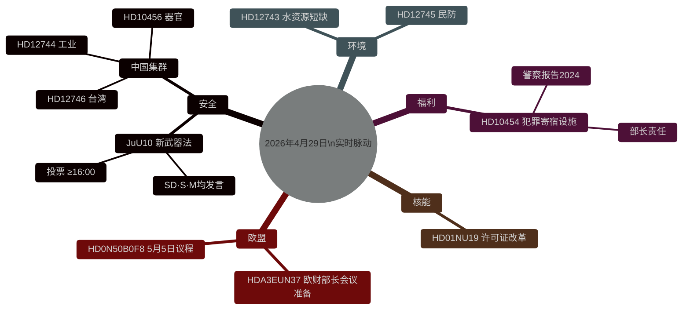

# 瑞典立法脉动：武器法、中国威胁与水资源短缺 — 2026年4月29日

**作者**：James Pether Sörling
**日期**：2026-04-29
**文章类型**：realtime-pulse
**可信度级别**：HIGH [B2]
**分类**：PUBLIC

## 🎯 摘要

**[已确认 — 投票结果 16:13–16:21 斯德哥尔摩]** 瑞典国会于4月29日通过了两项历史性法律：(1) **JuU10（新武器法）**于16:13以蒂德集团＋社会民主党多数票通过；决定性因素是**中央党（C）一致投票反对**——这是与市民联盟罕见的公开决裂，表明C与蒂德集团安全政策的距离在扩大。(2) **SfU28（更严格的公民身份要求）**于16:21通过，M、SD、KD、L以及**S的多数成员投票赞成**——这是瑞典社会民主党在公民身份和移民问题上的显著右转。V和MP在两项投票中均投票反对。

## 本报告支持的决策

1. **编辑方面**：主要新闻是新武器法投票及其对瑞典入北约后安全立法方向的意义。
2. **情报方面**：中国对瑞典关键基础设施的风险正在升级。
3. **社会政策**：犯罪组织渗透寄宿设施暴露了监管漏洞。
4. **气候/安全交汇点**：瑞典南部水危机正逼近民防相关性阈值。

## 60秒摘要

- 🗳️ **JuU10 新武器法** — 于16:13通过。
- 🇨🇳 **中国威胁集群** — HD12744、HD12746、HD10456。
- 💧 **水资源短缺** — HD12743 + HD12745。
- 🏠 **犯罪寄宿设施** — HD10454。
- ⚛️ **核能监管** — HD01NU19。
- 🇪🇺 **欧财部长会议准备** — 欧盟委员会09:00召开会议。

## 已确认的投票结果 — 2026年4月29日

| 投票 | 时间 | 结果 | 关键指标 |
|-----|------|------|---------|
| JuU10 第1点（新武器法） | 16:13:22 | ✅ 通过 | **C全票反对** |
| JuU10 第2点 | 16:13 | ❌ 否决 | |
| SfU28 第1点（公民身份要求） | 16:21:06 | ✅ 通过 | **S（多数）赞成** |
| SfU28 第2点 | 16:21 | ❌ 否决 | |

<!-- source-sha: ca5132f63cde44ffd5f34653584580125a270023 -->
