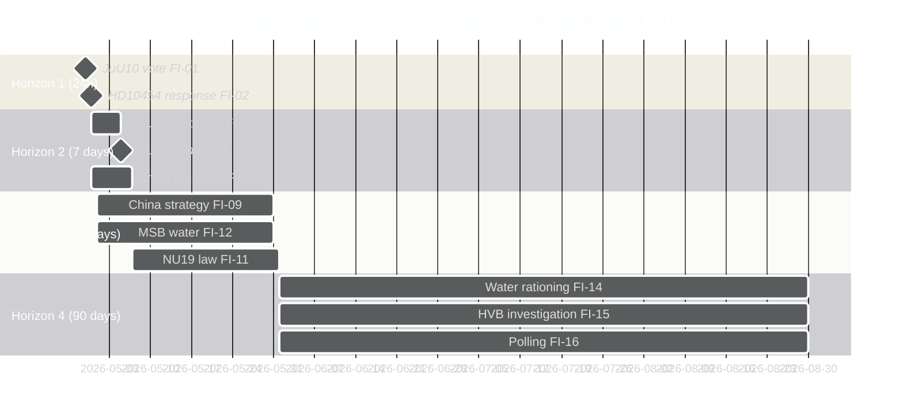

# Forward Indicators — 29 April 2026

**Purpose**: Dated indicators across 4 temporal horizons for monitoring today's key developments

## Horizon 1: Next 24 Hours (2026-04-29 to 2026-04-30)

| # | Indicator | Threshold | Source | dok_id |
|---|-----------|---------|--------|--------|
| FI-01 | JuU10 vote result in chamber | ✅ CONFIRMED ADOPTED 16:13 — C voted NEJ (all ~20 present) | riksdag-regering MCP voteringar | coalition-mathematics |
| FI-02 | Waltersson Grönvall response to HD10454 interpellation | Substantive or formulaic | Riksdagen anföranden | HD10454 |
| FI-03 | Government press release on JuU10 | Within 24h of vote = high priority | Regeringen.se | HD01JuU10 |
| FI-04 | Media coverage volume on HVB homes | >3 major outlets = elevated risk | Google News / TT |  HD10454 |

## Horizon 2: Next 7 Days (2026-04-30 to 2026-05-06)

| # | Indicator | Threshold | Source | dok_id |
|---|-----------|---------|--------|--------|
| FI-05 | NU19 nuclear permitting vote scheduled | Scheduled in riksdag.se agenda | Riksdagen kalender | HD01NU19 |
| FI-06 | Written question responses from ministers on HD12744, HD12746 | Substantive = China policy shift | Riksdagen dokument | HD12744, HD12746 |
| FI-07 | SMHI May seasonal forecast (drought) | Drought risk >50% = elevated water alert | smhi.se | HD12743, HD12745 |
| FI-08 | EU-nämnden Ekofin outcome (5 May) | Sweden position paper published | Riksdagen EU-nämnden | HDA3EUN37 |

## Horizon 3: Next 30 Days (2026-05-01 to 2026-05-31)

| # | Indicator | Threshold | Source | dok_id |
|---|-----------|---------|--------|--------|
| FI-09 | Government announces China strategy or FDI review | Announced=YES = policy shift | Regeringen.se | HD12744 |
| FI-10 | IVO or Police confirm action on HVB criminal homes | Action announced = political pressure effective | IVO.se / Police | HD10454 |
| FI-11 | NU19 nuclear permitting law in force | Law published in SFS | SFS (Rättsinformation) | HD01NU19 |
| FI-12 | MSB water security working group activated | Press release from MSB | MSB.se | HD12745 |
| FI-13 | C party (Centerpartiet) position on nuclear clarified | Support=YES = cross-party energy consensus | Party press release | HD01NU19 |

## Horizon 4: Next 90 Days (2026-06-01 to 2026-08-31)

| # | Indicator | Threshold | Source | dok_id |
|---|-----------|---------|--------|--------|
| FI-14 | Municipal water rationing in Skåne | >1 municipality = water crisis confirmed | Länsstyrelse Skåne | HD12743 |
| FI-15 | HVB media investigation published | Major SVT/DN investigation = electoral impact | SVT/DN | HD10454 |
| FI-16 | Swedish opinion polling — party support | SD or S >5pp change = election volatility | SIFO/Novus | coalition-mathematics |
| FI-17 | China FDI screening enforcement action | First SÄPO/government block under IFÅ | Regeringen.se | HD12744 |
| FI-18 | JuU10 implementation regulations published | Published in SFS = implementation track | SFS | HD01JuU10 |
| FI-19 | MP (Miljöpartiet) polling above/below 4% | Below 4% three consecutive polls = threshold risk | SIFO/Novus | voter-segmentation |
| FI-20 | S-C government coalition announcement | Announced = election scenario B activating | Major media | coalition-mathematics |

## Forward Indicator Dashboard

## NEW Forward Indicators from Afternoon Votes

| ID | Indicator | Trigger condition | Source | Related artifact |
|----|-----------|------------------|--------|-----------------|
| FI-21 | C party response to JuU10 NEJ record | Press conference or public statement by C leadership | Major Swedish media | coalition-mathematics |
| FI-22 | SD/M campaign use of C weapons law NEJ vote | Social media ad or campaign material citing C's NEJ | social media / party comms | coalition-mathematics |
| FI-23 | S left-wing (Strandhäll faction) reaction to SfU28 JA | Open dissent in S riksdag group or party press release | Swedish media | synthesis-summary |
| FI-24 | SfU28 citizenship law implementation timeline | Government SFS publication for new citizenship rules | SFS register | HD01SfU28 |
