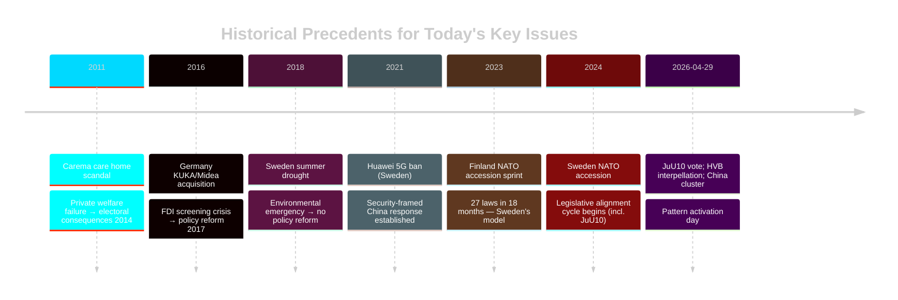

# Historical Parallels — 29 April 2026

**Purpose**: Place today's parliamentary events in historical context

## Parallel 1: JuU10 — NATO Integration and Legislative Alignment

**Current event**: Sweden adopts JuU10 aligning civilian firearms law with EU Directive. [HD01JuU10]

**Historical parallel**: Finland's NATO accession (April 2023) was preceded by a rapid legislative sprint to align national security-adjacent laws with NATO standards. Finland completed 27 legislative amendments in 18 months.

**Swedish comparison**: Sweden joined NATO April 2024. JuU10 today is part of a 24-month legislative alignment programme. The parallel with Finland holds — NATO new members go through a standardisation cycle.

**Significance**: This is not extraordinary — it is procedural. The question is whether Sweden completes this cycle faster than Finland (which took 18 months) or slower (suggesting coalition coordination difficulties).

## Parallel 2: China FDI Concern — Historical Precedents

**Current event**: Multiple parliamentary instruments on China's role in Swedish industry. [HD12744, HD12746]

**Historical parallels**:
1. **Germany 2016**: KUKA acquisition by Midea Group (China) triggered BMWI review; led to strengthened FDI screening law (2017). Parallels Sweden's current gap.
2. **UK 2020**: Huawei 5G ban — parliamentary pressure preceded government action. Pattern: MP questions → NCSC classified briefing → government action.
3. **Sweden 2021**: Swedish government previously blocked Huawei from 5G under pressure from FRA/SÄPO. Pattern established.

**Assessment**: The Swedish pattern of China-concern → parliamentary questions → eventual policy tightening is well-established (Huawei precedent). The current cluster (HD12744, HD12746) likely presages a new policy cycle, possibly FDI screening tightening within 12 months.

## Parallel 3: HVB Homes — Systemic Welfare Failures as Election Triggers

**Current event**: HD10454 — criminal gangs in HVB residential care homes. [HD10454]

**Historical parallels**:
1. **Boden/Norrmalmsskolan 2007**: Sweden's IVO predecessor institution (Socialstyrelsen) failed to detect systematic abuse in a school — became major election issue.
2. **Carema/Aleris care home scandal 2011-12**: Private care homes accused of cutting quality; became major 2014 election issue, contributing to Red-Green victory in 2014.
3. **Gang violence in schools 2021-2024**: Persistent media and political focus eventually led to 2022 election mandate for Tidöblocket on security.

**Pattern**: Welfare institution failure + political exposure + election proximity = major electoral liability.

**Assessment**: The HVB criminal infiltration has structural similarities to the Carema/Aleris care home scandal. If media coverage builds a similar case-study narrative, it could replicate the 2014 electoral dynamic — but in reverse (damaging the current coalition instead of the previous one). [HD10454]

## Parallel 4: Water Security — Environmental Crises as Policy Accelerators

**Current event**: HD12745 frames southern Sweden water scarcity as civil defence issue. [HD12745]

**Historical parallels**:
1. **Netherlands 1953 flood disaster**: Created the Delta Works programme — a generational infrastructure investment. Frame shift from "engineering problem" to "national survival."
2. **Sweden's 2018 summer drought**: Severe drought in southern Sweden prompted water utility emergency protocols but no permanent institutional reform.
3. **Germany's Ahr valley flood 2021**: Created political momentum for climate adaptation investment within months.

**Pattern**: Environmental emergencies become policy accelerators only when they reach visible crisis point and are framed as civil defence/national security rather than environmental management.

**Assessment**: HD12745's civil-defence framing is the parliamentary precondition for the policy acceleration pattern to activate. If summer 2026 brings severe drought, the frame is already established.

## Historical Trend Line

