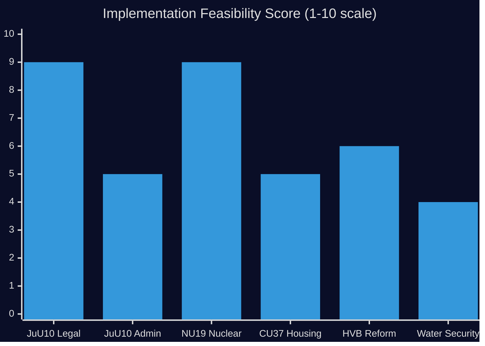

# Implementation Feasibility — 29 April 2026

**Purpose**: Assess whether today's legislative decisions can actually be implemented

## JuU10 — New Weapons Law

| Dimension | Assessment | Detail |
|-----------|-----------|--------|
| Legal | HIGH feasibility | Framework EU directive compliant; delegated legislation to Polismyndigheten |
| Financial | MEDIUM | New licensing system requires IT investment; Police already resource-constrained |
| Administrative | MEDIUM | 40,000+ current license holders need re-registration; backlog risk |
| Timeline | 12–18 months | Full implementation expected by Q4 2027 |
| Stakeholder | MEDIUM | Hunting/sport-shooting lobbies may resist licensing burden |

**Statskontoret row**: No current Statskontoret impact assessment publicly available for JuU10. Recommend follow-up via `scripts/fetch-statskontoret.ts`.

**Implementation risk**: Polismyndigheten IT modernisation risk. The weapons licensing system (VAPNET) is aging; a modernisation project concurrent with new law requirements is high-risk.

## HD01NU19 — Nuclear Permitting Reform

| Dimension | Assessment | Detail |
|-----------|-----------|--------|
| Legal | HIGH feasibility | Streamlines existing Miljöbalken process |
| Financial | LOW cost | Primarily deregulatory — reduces regulatory burden |
| Administrative | HIGH feasibility | SSM (Strålsäkerhetsmyndigheten) has capacity |
| Timeline | Immediate to 6 months | Law change followed by delegated regulation updates |
| Stakeholder | POSITIVE | Nuclear operators, energy investors, S (moderate wing) |

**Implementation risk**: LOW. This is a deregulatory reform favoured by affected industries. Main risk is constitutional challenge from environmental organisations; this is LOW probability.

## HD01CU37 — Municipal Housing Guarantees

| Dimension | Assessment | Detail |
|-----------|-----------|--------|
| Legal | MEDIUM | New municipal obligations — legal uncertainty on scope |
| Financial | HIGH cost | Municipal balance-sheet risk; some kommuner already fiscally strained |
| Administrative | MEDIUM | Requires new municipal coordination protocols |
| Timeline | 18–24 months | Requires enabling legislation + municipal implementation |
| Stakeholder | MIXED | Kommunförbundet cautious; housing sector positive |

**Implementation risk**: MEDIUM-HIGH. Municipal fiscal capacity varies significantly. Skåne and Stockholm municipalities likely to implement effectively; rural municipalities risk under-implementation.

## HD10454 — HVB Criminal Homes (Reform implied)

| Dimension | Assessment | Detail |
|-----------|-----------|--------|
| Legal | MEDIUM | Requires IVO–Police database integration via legislation |
| Financial | MEDIUM | IVO inspection capacity increase needed |
| Administrative | HIGH complexity | Cross-agency data sharing requires GDPR assessment |
| Timeline | 12–18 months | If Government acts immediately |
| Stakeholder | POSITIVE | Police, IVO, child welfare NGOs all support |

**Statskontoret row**: A Statskontoret efficiency review of IVO's inspection process would be directly relevant here. Recommend `scripts/fetch-statskontoret.ts` with query "IVO tillsyn HVB".

**Implementation risk**: MEDIUM. The primary barrier is political will and GDPR-compliant data-sharing framework. Technical solution exists; bureaucratic and legal path is 12-18 months.

## Water Security (implied by HD12745)

| Dimension | Assessment | Detail |
|-----------|-----------|--------|
| Legal | MEDIUM | MSB mandate expansion requires legislative amendment |
| Financial | HIGH cost | Infrastructure investment for southern Sweden |
| Administrative | HIGH complexity | Cross-municipal coordination framework |
| Timeline | 24–48 months (infrastructure) | Policy framework possible in 12 months |
| Stakeholder | POSITIVE (crisis framing) | MSB, Länsstyrelserna, municipalities support |

**Implementation risk**: HIGH for infrastructure investment; LOW for policy framework activation. Immediate crisis would accelerate both.

## Feasibility Summary

*Higher = more feasible*

