# Intelligence Assessment — 29 April 2026

**Standard**: ICD 203 (Key Judgements) | **Classification**: PUBLIC | **Cycle**: realtime-pulse

## Key Judgements (KJ)

### KJ-1: Sweden is completing a delayed NATO-aligned security legislative cycle today

**Confidence**: HIGH [B1]

**Assessment**: The adoption of JuU10 (new weapons law) represents the final piece of Sweden's post-NATO-accession domestic security legislative package. With NU19 (nuclear permitting) and KU36 (privacy/technology oversight) also on the calendar, Sweden will have completed a significant regulatory modernisation across three security-adjacent domains by the end of this parliamentary session. This strengthens Sweden's credibility with NATO partners and reduces institutional vulnerability in security-related EU negotiations.

**Key assumptions**: Vote proceeds today without procedural delay. V/MP reservations do not become amendments that change the substance.

**Indicators to monitor**: JuU10 vote result; Riksdag chamber announcements by 18:00.

### KJ-2: China's multi-vector engagement with Sweden is under-assessed by the Government

**Confidence**: HIGH [B1]

**Assessment**: Parliamentary instruments raised today — HD12744 (industrial acquisition), HD12746 (diplomatic pressure via Taiwan visit cancellation), HD10456 (organ trafficking) — span economic, diplomatic, and human rights dimensions. The concurrent raising of these issues across three different parliamentary parties (SD, M, MP) and two types of instrument (frs + ip) suggests broader parliamentary concern than any single party would express. The Government's current FDI screening regime (IFÅ 2023) is weaker than Nordic peers (Finland, Netherlands). This assessment is HIGH confidence because the documentary evidence is direct parliamentary record.

**Key assumption**: No classified SÄPO assessments exist that would change this picture. If SÄPO has briefed ministers on specific cases, minister responses may appear formulaic while policy is actually changing.

### KJ-3: The HVB-homes criminal infiltration crisis will define social welfare accountability ahead of September 2026 election

**Confidence**: MEDIUM [B2]

**Assessment**: The Social Democrats' tactical deployment of the interpellation (HD10454) — citing the Police's own 2024 report — is designed to create a durable political narrative: "The coalition knew about gang-controlled care homes and did nothing." The Government's likely response (citing ongoing inquiry) will be inadequate if a serious incident at a gang-controlled HVB home occurs before election day. Confidence is MEDIUM because the electoral dynamic depends on events that have not yet occurred.

**Probability**: 40% chance of a high-profile HVB incident before September 2026 election, based on current trend data.

### KJ-4: Water security is transitioning from environmental policy to civil defence — watch for budget implications

**Confidence**: MEDIUM-HIGH [B1/B2]

**Assessment**: The framing shift in HD12745 — from "water management" to "civil defence" — is analytically significant. In Sweden's post-Ukraine security environment, civil defence framing unlocks budget windows unavailable under environmental spending. MSB is the likely vehicle for national coordination. The transition to civil defence framing will probably result in a new appropriation within the 2027 budget cycle.

## Priority Intelligence Requirements (PIRs)

| PIR | Question | Indicator | Watch Date |
|-----|---------|---------|----------|
| PIR-1 | Will JuU10 pass without substantive amendment? | Chamber vote record | 2026-04-29 |
| PIR-2 | When will Government announce comprehensive China strategy? | Press release | 2026-05-31 |
| PIR-3 | Will Skåne water rationing begin before August? | MSB/Länsstyrelse advisory | 2026-07-31 |
| PIR-4 | Will NU19 (nuclear permitting) pass in May? | Riksdag calendar | 2026-05-14 |
| PIR-5 | Will Ecofin coordination (HDA3EUN37) produce Swedish position paper? | Government statement post-5 May | 2026-05-07 |

## Prior-Cycle PIR Ingestion

| Prior PIR | Prior cycle | Status | Notes |
|-----------|-------------|--------|-------|
| Nuclear regulatory reform progress | 2026-04-26/realtime-pulse | RESOLVED — NU19 on today's calendar | HD01NU19 confirms committee report approved |
| China parliamentary activity | 2026-04-26/weekly-review | SUSTAINED — three new instruments today | Multi-week pattern confirmed |
| Water security urgency | 2026-04-24/realtime-pulse | ELEVATED — civil defence framing adopted | HD12745 is frame shift |
| Coalition stability signals | 2026-04-28/realtime-pulse | STABLE — no coalition stress signals | Normal legislative operations |

## Intelligence Gaps

1. **Gap**: No confirmed information on whether Government has a classified China strategy under preparation. **Impact**: KJ-2 confidence might need to be downgraded if classified preparatory work exists.

2. **Gap**: Actual gang-controlled HVB home count not publicly confirmed beyond Police 2024 summary. **Impact**: KJ-3 probability estimate has high uncertainty.

3. **Gap**: SMHI summer drought probability not yet published (normally May). **Impact**: KJ-4 timeline uncertain.

```mermaid
%%{init: {"theme": "dark", "themeVariables": {"primaryColor": "#00d9ff", "background": "#0a0e27", "primaryTextColor": "#e0e0e0"}}}%%
graph LR
    KJ1[KJ-1 NATO Security HIGH] --> P1[PIR-1 JuU10 vote]
    KJ2[KJ-2 China Under-Assessed HIGH] --> P2[PIR-2 China Strategy]
    KJ3[KJ-3 HVB Election Narrative MED] --> P3[PIR-3 HVB Incident]
    KJ4[KJ-4 Water Civil Defence MED-HIGH] --> P4[PIR-3 Water Rationing]
    style KJ1 fill:#0a0e27,stroke:#00d9ff
    style KJ2 fill:#0a0e27,stroke:#00d9ff
    style KJ3 fill:#0a0e27,stroke:#ffbe0b
    style KJ4 fill:#0a0e27,stroke:#ffbe0b
```

---

## Pass 2 Review — Additional Confidence Context

**KJ-2 China refinement**: The cross-party nature of today's China instruments deserves additional analytical weight. SD (security-nationalism), M (centre-right foreign policy), and MP (human rights) are ideologically divergent parties. When they all raise China concerns on the same day — even via different instruments and different ministers — the probability of a shared underlying briefing source is high. This supports upgrading KJ-2 to HIGH [B1] rather than treating it as circumstantial.

**KJ-3 probability update**: The 40% probability estimate for a HVB incident before September 2026 is based on:
- Police 2024 report: documented gang presence in multiple homes
- IVO capacity constraints: currently unable to inspect all homes within standard timeframe  
- Time horizon: 5 months remains for an incident to occur and be reported
- Historical base rate: similar systemic failures in care settings have produced public incidents within 12-18 months of documentation

**Cross-check with scenario analysis**: KJ-1 through KJ-4 map directly to Scenarios 1-3 in `scenario-analysis.md`. Scenario 2 (Downside, P=25%) is driven primarily by KJ-3 materialising.

