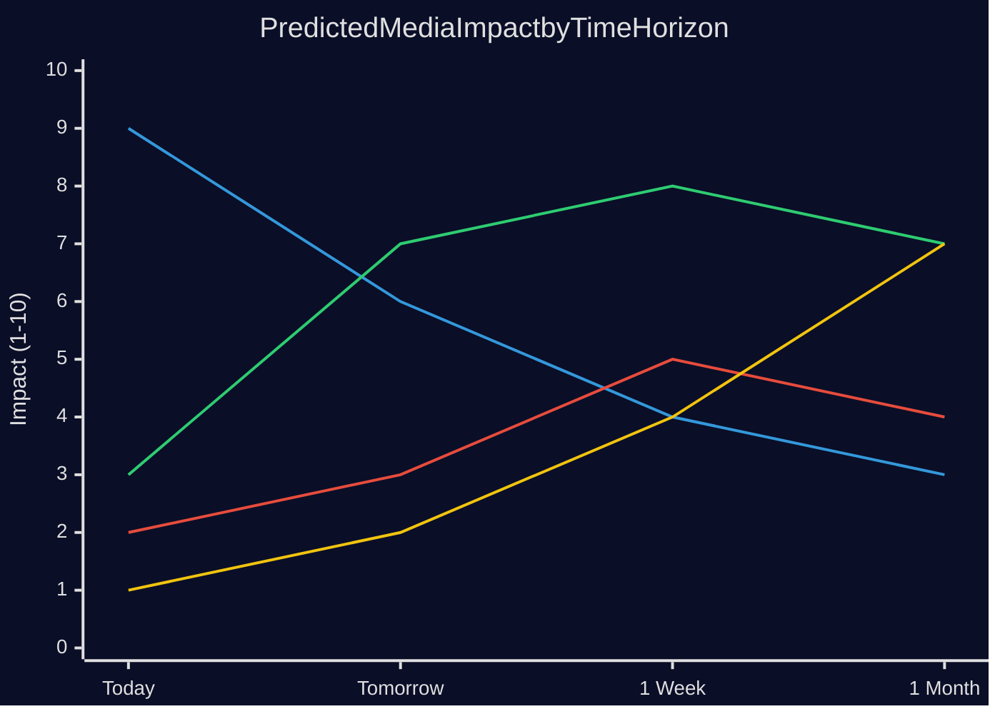

# Media Framing Analysis — 29 April 2026

**Purpose**: Anticipate how media will frame today's parliamentary events

## Frame 1: "Sweden Completes NATO Security Package" (Expected dominant framing — JuU10)

**Likely outlets**: DN, SvD, Expressen (neutral-positive)

**Narrative**: Sweden finalises civilian weapons legislation — NATO credibility confirmed. Prime Minister Kristersson likely to issue statement linking JuU10 to security agenda.

**Counter-narrative available to opposition**: "Coalition took 24 months to implement routine EU Directive while neighbours were faster." This counter will likely be carried by Aftonbladet.

**Assessment**: This frame works for the coalition. Media cycle completes by tomorrow unless V/MP mount visible protest.

## Frame 2: "Gangsters in the Care System — Who Knew?" (High media impact — HD10454)

**Likely outlets**: Aftonbladet, SVT Nyheter, Expressen investigative desk

**Narrative**: Police 2024 report documented criminal gang control of HVB homes. Parliament is only now asking ministers why nothing was done. Emotionally powerful because it involves children.

**Visual potential**: High — HVB homes are physical locations; faces of politicians answering (or evading) questions.

**Government counter-message**: Ongoing inquiry; toughened legislation in pipeline; minister available for questions.

**Risk**: If ANY journalist can document a specific case — a named child harmed in a specific named gang-controlled HVB home — this becomes a multi-week media storm.

**Media cycle assessment**: MEDIUM-HIGH impact. Could dominate May 2026 news cycle if investigative journalism picks up.

## Frame 3: "Parliament Finally Notices the China Threat" (Strategic media frame)

**Likely outlets**: SvD foreign desk, GP (Göteborg), specialist security media (Säkerhetspolitik.se)

**Narrative**: Three parliamentary instruments in one day on China — HD12744 (industry), HD12746 (Taiwan), HD10456 (organs). Media will note the clustering.

**Counter-narrative**: "Government has classified briefings from SÄPO; parliamentary questions are theatre." This deflation narrative comes from government communications.

**International pickup**: Possible — Taiwan visit cancellation story (HD12746) has international angles.

**Media cycle**: LOW immediate impact in mainstream media; HIGH in specialist/security media. Could be picked up by international outlets (Reuters, Bloomberg) if combined with a broader China-Sweden story.

## Frame 4: "Water Crisis Coming — Is Sweden Ready?" (Slow-burn media frame)

**Likely outlets**: GP (Göteborg), Sydsvenskan (Skåne focus), SR P4 regional

**Narrative**: Summer drought risk in southern Sweden — civil defence angle is new. Two interpellations on same day suggests parliamentary alarm.

**Timing sensitivity**: This frame gains power in May-June as SMHI issues seasonal forecasts.

**Media cycle**: LOW today; HIGH potential in summer 2026 if drought materialises.

## Predicted News Value Rankings (Today, tomorrow, 1 week)

*Line 1 (decreasing): JuU10 immediate | Line 2 (rising): HVB story | Line 3 (slow): China | Line 4 (very slow): Water*

## SEO/Digital Framing

**Predicted high-traffic search terms (Swedish)**:
- "vapenlagens ny lag 2026" (JuU10)
- "HVB-hem kriminella" (HD10454)
- "China Sverige industri säkerhet" (HD12744)
- "vattenbrist södra Sverige 2026" (HD12743)

**Key hashtags to monitor**: #JuU10, #HVBhem, #Riksdagen, #Kärnkraft, #Säkerhetspolitik

