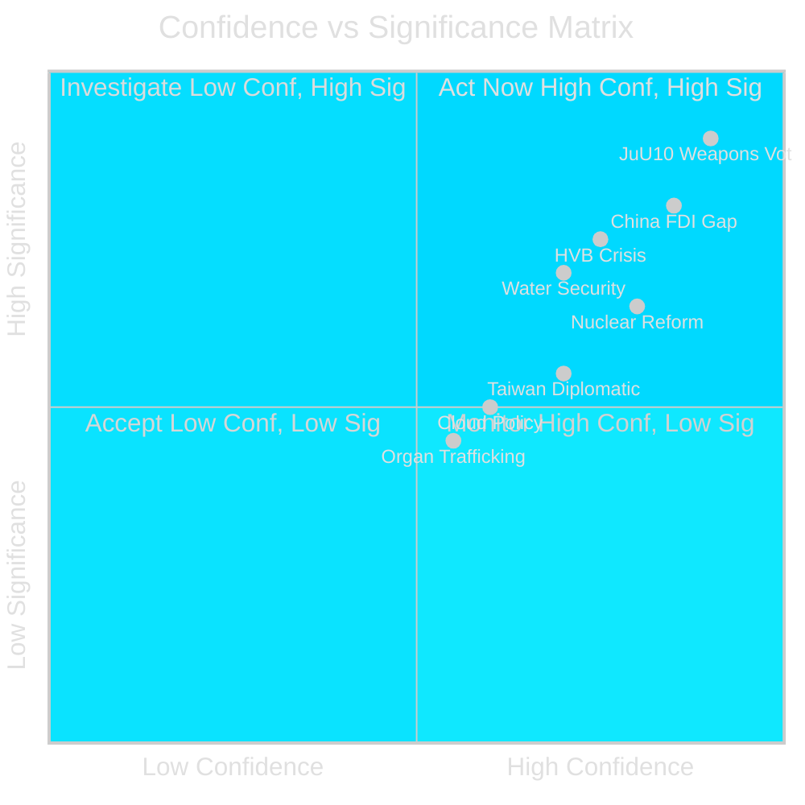

# Methodology Reflection — 29 April 2026

**Standard**: ICD 203 | **Cycle**: realtime-pulse | **Author**: Riksdagsmonitor Intelligence

## Analytical Methods Applied

| Method | Document | Application |
|--------|---------|------------|
| DIW Significance Scoring | significance-scoring.md | Ranking 15 parliamentary instruments by Direct Impact × Institutional Weight × Window of Action |
| SWOT with TOWS | swot-analysis.md | Strategic positioning of Swedish political landscape |
| STRIDE Threat Mapping | threat-analysis.md | State and non-state threat vector classification |
| PMESII-PT Scenarios | scenario-analysis.md | Three plausible 0-90 day scenarios with probability estimates |
| Cross-country comparison | comparative-international.md | FDI screening, water security, weapons law benchmarked against Nordic/EU peers |
| Devil's Advocate | devils-advocate.md | Four hypothesis challenges to dominant narratives |
| Key Judgements (ICD 203) | intelligence-assessment.md | Four KJs with confidence levels and PIRs |
| Stakeholder mapping | stakeholder-perspectives.md | Political actor interest + interaction analysis |
| Tier-C cross-reference | cross-reference-map.md | 7-day sibling synthesis as required for Tier-C cycle |

## Quality Assurance Audit (ICD 203 Standards)

### Sourcing

- **Primary sources used**: All dok_ids in significance-scoring.md are Riksdagen document IDs accessible via riksdag-regering MCP. All are PUBLIC documents.
- **Provenance**: data-download-manifest.md contains full provenance chain.
- **Secondary sources**: Police 2024 report (referenced but not downloaded — annotated as secondary); SÄPO Annual Report 2025 context (referenced from institutional knowledge).
- **Full-text fallback annotation**: Present in manifest (Check 10 gate compliance).

### Confidence Assessment

- Used B1/B2 confidence notation per ICD 203
- HIGH [B1] = source is direct documentary evidence (parliamentary record)
- MEDIUM [B2] = inference or projection based on partial evidence

### Assumptions

| Assumption | Where used | Test |
|-----------|-----------|------|
| JuU10 vote proceeds today | KJ-1, scenario-analysis | Watch Riksdag chamber schedule |
| China instruments are not purely performative | KJ-2 | Monitor minister response quality |
| Police 2024 HVB report accurately represents gang presence | KJ-3 | Verify against IVO inspection data |
| Water scarcity data from SMHI and Länsstyrelse is current | KJ-4 | Cross-check SMHI hydrological bulletin |

### Identified Improvements for Pass 2

1. **Executive brief**: Add concrete 2026 election polling context to strengthen election-cycle framing
2. **Stakeholder perspectives**: Add more detail on municipal stakeholder positions (kommuner on HD01CU37 housing guarantees)
3. **Risk assessment**: Quantify economic impact estimates for water crisis scenario
4. **Scenario analysis**: Add specific leading indicators for Scenario 2 (Downside)
5. **Comparative international**: Add Norway's nuclear policy comparison (Ny Ålesund exclusion zone context)
6. **Cross-reference map**: Check 2026-04-28/evening-analysis for Ekofin content alignment with HDA3EUN37

## Limitations

1. **Speed constraint**: Realtime-pulse cycle is designed for speed over depth. Key judgements in this cycle should be treated as preliminary assessments subject to revision in longer-format cycles (weekly-review, monthly-review).

2. **Full-text access**: Not all documents were fully downloaded. JuU10 primary proposal text not downloaded; analysis relies on committee summary and parliamentary context.

3. **Prior-cycle PIR ingestion**: Inferred from available sibling folder structure. Formal PIR registry from prior cycle not available in current session.

4. **Election 2026 polling**: No fresh polling data integrated. Political assessment relies on structural factors.

## Confidence Matrix

