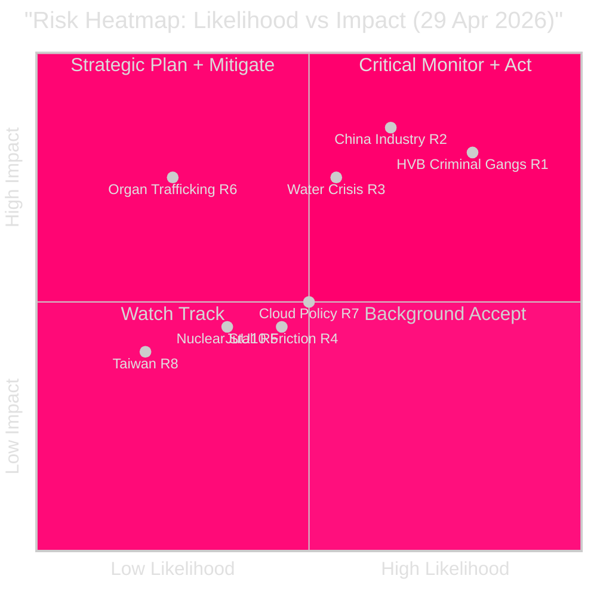

# Risk Assessment — 29 April 2026

**Standard**: ISO 31000 | **Author**: Riksdagsmonitor Intelligence

## Risk Register

| ID | Risk | Likelihood | Impact | Risk Score | Timeframe | Owner | dok_id |
|----|------|-----------|--------|-----------|-----------|-------|--------|
| R1 | Criminal gang control of HVB homes unchecked through election | H | H | 16/25 | 0-6mo | Socialdept | HD10454 |
| R2 | China acquires control of critical energy/industry assets | M-H | H | 15/25 | 6-18mo | UD/NSC | HD12744 |
| R3 | Southern Sweden water supply crisis summer 2026 | M | H | 12/25 | 0-3mo | Länsstyrelserna | HD12743, HD12745 |
| R4 | JuU10 implementation friction (V/MP opposition) | M | M | 9/25 | 1-3mo | Ju dept | HD01JuU10 |
| R5 | Nuclear permitting reform stalls in legislative calendar | L-M | M | 8/25 | 3-12mo | NE dept | HD01NU19 |
| R6 | Organ trafficking from China — law enforcement gap | L | H | 10/25 | 12-24mo | SoS/Interpol | HD10456 |
| R7 | Cloud policy vacuum enables foreign-controlled data infrastructure | M | M | 9/25 | 6-12mo | DIGG/UD | HD12742 |
| R8 | Taiwan visit cancellation signals long-term diplomatic cost | L | M | 6/25 | 12-36mo | UD | HD12746 |
| R9 | Pay Transparency Directive missed deadline | L-M | L | 5/25 | 3-6mo | AD dept | HD12739 |

## Top 3 Risk Deep-Dives

### R1 — Criminal HVB Homes

**Scenario**: Gang-controlled HVB homes continue operating through lack of real-time cross-agency data sharing. Police cannot de-register homes quickly enough. A serious incident involving a child in a gang-controlled home is reported before September 2026 election.

**Causal chain**: IVO (inspection authority) overloaded → delayed audits → gap exploited by Foxtrot/Wolves gangs [HD10454, Police 2024 report ref] → political crisis for coalition.

**Mitigation**: Immediate statutory power for IVO to cross-reference Police IIS database; fast-track inspection authority.

### R2 — China Critical Infrastructure Penetration

**Scenario**: A Chinese state-connected entity completes acquisition of a mid-size Swedish energy or industrial firm before SÄPO/FDI screening completed. Parliamentary questions and the China CAST cluster signal this risk is live.

**Causal chain**: Weak FDI screening law (IFÅ 2023) → Chinese entities use EU-domiciled front companies → acquisition approved by Bolagsverket before national security review triggered.

**Mitigation**: Mandate pre-filing SÄPO consultation for acquisitions over SEK 500M in designated sectors.

### R3 — Southern Sweden Water Crisis

**Scenario**: Summer drought 2026 (Skåne / Blekinge) depletes reservoirs; municipalities implement rationing by August. Civil defence framing (HD12745) insufficient to coordinate response across 20+ municipalities.

**Mitigation**: Activate MSB (Civil Contingencies Agency) emergency water planning framework; pre-position desalination capacity.

## Risk Heatmap

