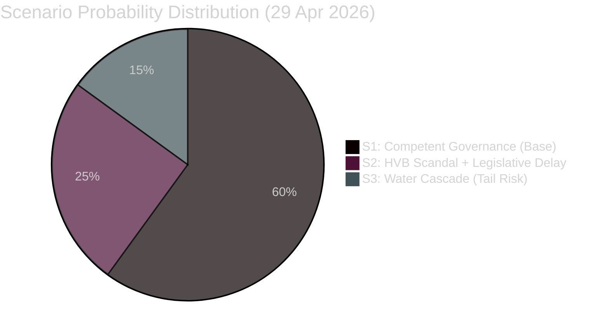

# Scenario Analysis — 29 April 2026

**Methodologies**: PMESII-PT, Cone of Plausibility | **Horizon**: 0–90 days

## Scenario 1: Weapons Law Passes, China Framework Launched (Base Case — P=60%)

**Trigger**: JuU10 adopted in chamber vote today. Within 2 weeks, the Government announces a cross-ministry China strategy (SÄPO + UD + NE + DIGG).

**Sequence**:
1. JuU10 passes with M/SD/KD/L majority (possible KD hesitation on licensing, resolved by symbolic amendment) [HD01JuU10]
2. China strategy announcement: references HD12744, HD12746 as parliamentary mandate
3. NU19 nuclear permitting reform passes in the next sitting week [HD01NU19]
4. Water security plan issued under MSB framework [HD12745]

**Political effect**: Coalition demonstrates governance competence on security; narrows S attack surface ahead of election.

**Indicators to watch**: Government press releases on China; Ekofin May 5 outcome [HDA3EUN37]; NU19 vote scheduling

## Scenario 2: Weapons Law Delayed, HVB Scandal Breaks (Downside — P=25%)

**Trigger**: JuU10 vote postponed due to last-minute procedural challenge from V/MP. Simultaneously, a serious incident at a HVB home (gang-related) breaks into media.

**Sequence**:
1. Weapons law delay creates news vacuum — opposition fills with "coalition incompetent" narrative
2. HVB scandal triggers Riksdag emergency debate; Minister Waltersson Grönvall faces no-confidence motion threat
3. China questions (HD12744) amplified by media after SÄPO leak or NGO report
4. Coalition forced into reactive governance mode 5 months before election [HD10454, HD12744]

**Political effect**: S + V + MP opposition coalition strengthened; Government approval ratings drop 3-5pp

**Indicators to watch**: V/MP procedural motions; media on HVB homes; SÄPO press releases

## Scenario 3: Climate Cascade (Tail Risk — P=15%)

**Trigger**: SMHI issues drought warning for Skåne by mid-May. Municipal water rationing begins in 2 municipalities.

**Sequence**:
1. Water crisis becomes front-page news [HD12743, HD12745]
2. MSB lacks formal mandate to coordinate; municipalities conflict
3. Government emergency meeting; civil defence framing of water crisis officially adopted
4. Budgetary reallocation from other priorities to water infrastructure

**Political effect**: Climate/environment parties gain. Government forced to accelerate water infrastructure investment. Potential electoral benefit to MP and C.

**Indicators to watch**: SMHI drought index; Länsstyrelse Skåne advisories; MSB water working group activation

## Scenario Probability Matrix

## Early Warning Indicators

| Indicator | Scenario | Watch By |
|-----------|---------|---------|
| JuU10 vote result (today) | S1 vs S2 | 2026-04-29 17:00 |
| Waltersson Grönvall's answer to HD10454 | S1 vs S2 | 2026-04-30 |
| Government China statement | S1 | 2026-05-15 |
| SMHI May drought forecast | S3 | 2026-05-07 |
| MSB water planning press release | S1/S3 | 2026-05-31 |
| NU19 vote scheduled | S1 | 2026-05-07 |
| Ekofin outcome (5 May) | S1 | 2026-05-05 |

