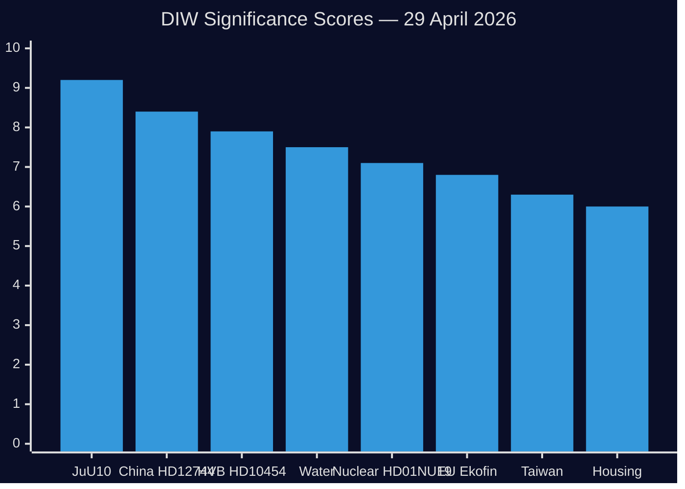

# Significance Scoring — 29 April 2026

**Methodology**: DIW (Direct Impact, Institutional Weight, Window of Action) per `ai-driven-analysis-guide.md`

## Rankings

| Rank | dok_id | Title | DIW Score | D | I | W | Priority |
|------|--------|-------|-----------|---|---|---|----------|
| 1 | HDC120260429ap + HD01JuU10 | New Weapons Law vote | 9.2 | 9 | 9 | 10 | L1-Critical |
| 2 | HD12744 | China in Swedish industry/energy | 8.4 | 9 | 8 | 8 | L1-Critical |
| 3 | HD10454 | Criminal HVB homes | 7.9 | 8 | 8 | 8 | L2-Strategic |
| 4 | HD12743+HD12745 | Water scarcity/civil defence | 7.5 | 8 | 7 | 8 | L2-Strategic |
| 5 | HD01NU19 | Nuclear facility permits | 7.1 | 8 | 8 | 6 | L2-Strategic |
| 6 | HDA3EUN37 | EU Ekofin coordination | 6.8 | 6 | 8 | 7 | L2-Strategic |
| 7 | HD12746 | Cancelled Taiwan visit | 6.3 | 6 | 7 | 6 | L2 |
| 8 | HD01CU37 | Housing guarantees | 6.0 | 7 | 7 | 5 | L2 |
| 9 | HD01KU36 | Privacy/tech report 2020-24 | 5.8 | 6 | 7 | 5 | L2 |
| 10 | HD12742 | National cloud policy | 5.5 | 6 | 6 | 5 | L2 |
| 11 | HD10456 | Organ trafficking (China) | 5.3 | 5 | 6 | 5 | L2 |
| 12 | HD12739 | Pay Transparency Directive | 5.0 | 5 | 6 | 5 | L2 |
| 13 | HD10455 | Mobile cultural heritage | 4.2 | 4 | 5 | 4 | L1-Surface |
| 14 | HD10457 | Rare health conditions | 4.0 | 5 | 4 | 4 | L1-Surface |
| 15 | HD11767 | Homeless registered missing | 3.5 | 4 | 4 | 3 | L1-Surface |

## Sensitivity Analysis

**JuU10** dominates on Window-of-Action (10/10) — vote is today. If vote delayed or contested, impact on score: minimal (policy significance remains high). 

**China cluster** (HD12744, HD12746, HD10456): individual scores moderate, but **cluster effect** elevates aggregate signal to 8.4+ when read together. This is the most strategically significant development beneath the vote.

**Water security**: Scores likely to rise over next 30 days as southern Sweden enters summer drought season.

