# Stakeholder Perspectives — 29 April 2026

## Primary Stakeholders

### Government Parties (M, SD, KD, L)

**Position on JuU10 (New Weapons Law)**:
Coalition as a block supports adoption. JuU10 was a campaign pledge for M and SD in 2022. SD's Rashid Farivar also raises China/security issues (HD12744, HD12746) — consistent with SD's assertive security-first framing. Adoption today is expected. [HDC120260429ap]

**Position on China Threat**:
Government has been reactive rather than proactive. Multiple ministers (Busch, Slottner) receive written questions on China but no cross-government strategy has been announced. Risk: opposition can claim government is behind the curve. [HD12744, HD12742, HD12746]

**Position on HVB Homes**:
Minister Waltersson Grönvall (M) will face interpellation from Vepsä (S) on HD10454. Government will likely cite ongoing Utredning (inquiry) as response. However, this is a politically vulnerable position given the Police 2024 report's directness.

### Social Democrats (S)

**Key actor**: Mattias Vepsä raises HD10454 (HVB criminal gangs) — designed to put maximum political pressure on coalition welfare ministers. S strategy: own the "child welfare failure" narrative before September 2026 election.

**On nuclear**: Evolving position — some S MPs now support nuclear new-build if existing plants extended. HD01NU19 creates quiet opportunity for S to moderate historically hard anti-nuclear stance. [HD01NU19]

### Sweden Democrats (SD)

**Key actor**: Rashid Farivar leads on China security questions (HD12744, HD12746) and national cloud policy (HD12742). SD positioning as tough on China and digital sovereignty. Consistent with SD's security-nationalism framing.

### Vänsterpartiet (V) and Miljöpartiet (MP)

**V**: MP Ciczie Weidby raises Pay Transparency Directive (HD12739) — EU social rights agenda. V will oppose or abstain on JuU10 (historical anti-weapons-expansion position).

**MP**: Nasser Miri raises organ trafficking (HD10456) — signals MP's continuation of human rights advocacy on China despite being out of government. Also raises mobile cultural heritage (HD10455) — consistent with MP's cultural diversity agenda.

### Non-Parliamentary Stakeholders

| Actor | Interest | Position |
|-------|---------|----------|
| Vattenfall / Uniper | HD01NU19 nuclear permitting | Strongly support faster permitting — enables plant lifetime extensions |
| Jägarnas Riksförbund | JuU10 weapons law | Mixed — supports parts, concerns over licensing burden |
| IVO (Inspektionen för vård och omsorg) | HD10454 | Resources insufficient; will request more inspection authority |
| SÄPO | HD12744, HD12746 | Would welcome mandatory FDI pre-screening; current IFÅ law insufficient |
| MSB (Civil Contingencies) | HD12745 water | Needs formal mandate and budget for national water security coordination |
| Länsstyrelsen Skåne | HD12743 | Direct operational responsibility; chronically underfunded for water management |
| Swedish municipalities (kommuner) | HD01CU37 housing | Cautious — housing guarantees increase municipal balance-sheet risk |

## Stakeholder Interaction Map

```mermaid
%%{init: {"theme": "dark", "themeVariables": {"primaryColor": "#00d9ff", "background": "#0a0e27", "primaryTextColor": "#e0e0e0"}}}%%
graph LR
    GOV[Coalition Govt M/SD/KD/L] -->|interpelled by| S[Social Democrats]
    GOV -->|challenged by| MP[Miljöpartiet]
    GOV -->|aligned on security| SD2[SD China agenda]
    S -->|HD10454| IVO[IVO Inspektionen]
    SD2 -->|HD12744| SAPO[SÄPO Security]
    MP -->|HD10456| INT[Interpol/Health Ministry]
    GOV -->|HD01NU19| NUC[Nuclear operators]
    GOV -->|HD12745| MSB[MSB Civil Defence]
    style GOV fill:#0a0e27,stroke:#00d9ff
    style S fill:#e8001e,color:#fff
    style SD2 fill:#DDDD00,color:#000
    style MP fill:#00a550,color:#fff
```

