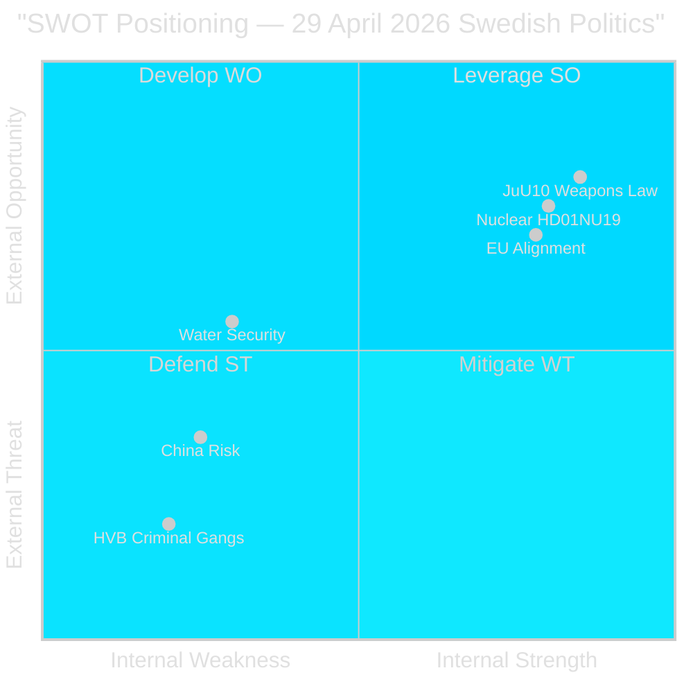

# SWOT Analysis — 29 April 2026 Political Landscape

**Author**: James Pether Sörling | **Date**: 2026-04-29

## Strengths

- **Legislative momentum on security**: JuU10 (new weapons law) advances today after sustained cross-party alignment. Sweden's post-NATO security regulatory update is on track. [HDC120260429ap, HD01JuU10]
- **Nuclear energy reform**: HD01NU19 (NU19) signals parliamentary readiness to streamline nuclear permitting — a structural enabler for Sweden's declared new-build programme. [HD01NU19, Energimyndigheten policy alignment 2026]
- **EU alignment**: Government proactively engaging EU-nämnden (HDA3EUN37) on Ecofin position; Sweden is positioned as constructive EU partner on financial regulation. [HDA3EUN37, HD0N50B0F8]
- **Parliamentary oversight functioning**: Multiple interpellations and written questions show opposition is actively exercising scrutiny on China, welfare, and environment — the system is working. [HD10454, HD12744, HD12743]

## Weaknesses

- **HVB-hem oversight failure**: Police confirmed in 2024 that criminal gangs operate HVB (residential care) homes; no effective legislative response delivered before this interpellation. Government has been slow to close regulatory gap. [HD10454 — Mattias Vepsä (S)]
- **National cloud policy stalled**: HD12742 (Farivar/SD → Minister Slottner) reveals that the government's national cloud policy work is delayed. Digital sovereignty risk in an era of AI and foreign data-centre expansion. [HD12742]
- **China risk assessment lagging**: Three separate instruments (HD12744, HD12746, HD10456) signal no comprehensive, publicly articulated China threat framework from the government. Ministers respond reactively rather than proactively. [HD12744, HD12746]
- **Water infrastructure under-investment**: Southern Sweden's water scarcity is reaching civil-defence threshold with no clear national response plan. [HD12743, HD12745]

## Opportunities

- **Weapons law modernisation**: Adoption of JuU10 today opens path to EU-aligned civilian firearms framework — international credibility gain post-NATO accession. [HDC120260429ap]
- **China policy coalescence**: Cross-party parliamentary pressure (SD + S both raising issues) creates political space for a government-led comprehensive China strategy. [HD12744, HD12746]
- **Water security framing**: Civil defence framing of water scarcity (HD12745) opens budgetary window for infrastructure investment under the defence budget umbrella. [HD12745]
- **Nuclear regulatory modernisation**: HD01NU19 enables faster permitting for SMRs and extensions — critical for Sweden's 2035 zero-carbon electricity target. [HD01NU19]
- **Pay transparency implementation**: HD12739 (Weidby/V → Minister Larsson) creates pressure for timely EU Pay Transparency Directive implementation, potentially improving gender pay gap metrics before election. [HD12739]

## Threats

- **Criminal infiltration of welfare system**: HVB homes controlled by gangs represent a systemic risk to vulnerable children. Without urgent reform, political fallout intensifies through 2026 election cycle. [HD10454]
- **China economic penetration**: Without a national framework, China's acquisition of Swedish basic industry and critical infrastructure positions continues unchecked. [HD12744, SÄPO Annual Report 2025 context]
- **Climate security cascade**: Water shortages in Skåne risk cascading into agricultural, food security, and municipal supply failures — especially severe in a drought summer. [HD12743, HD12745]
- **Weapons law opposition**: V and MP reservations on JuU10 may complicate implementation and generate sustained opposition pressure on licensing. Watch for protest movements among hunting/sport-shooting communities. [HD01JuU10]
- **Pay directive backlash**: Industry lobby resistance to EU Pay Transparency Directive could create coalition tension if SD moderates on gender-equality requirements. [HD12739]

## TOWS Matrix

| | Strengths | Weaknesses |
|---|-----------|-----------|
| **Opportunities** | SO: Use JuU10 momentum to build NATO-aligned security framework (HD01JuU10 + HD12744 China); Use nuclear regulatory window (HD01NU19) for SMR fast-track | WO: China risk assessment gap + cloud policy delay = window for comprehensive digital sovereignty legislation |
| **Threats** | ST: Use functioning parliamentary oversight (multiple IPs) to demonstrate accountability on HVB crisis | WT: HVB failure + water scarcity + China penetration = triple institutional-failure narrative that opposition can weaponise before September 2026 election |

