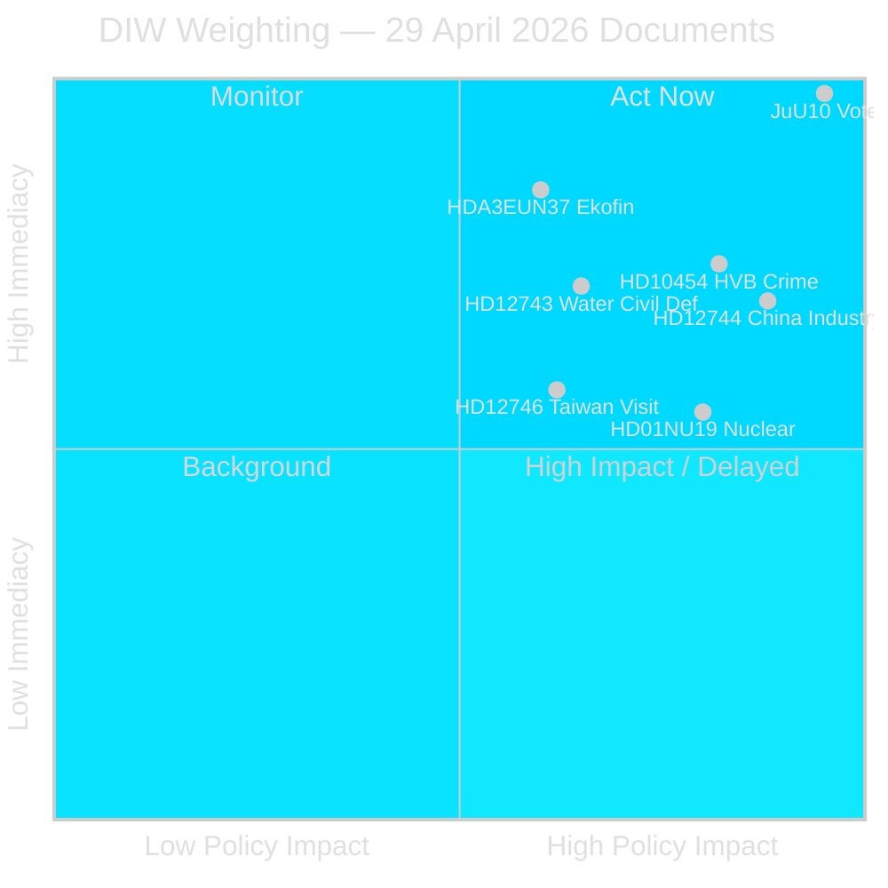

# Synthesis Summary — 29 April 2026 Realtime Pulse

**DIW weighting applied**: High-weight documents prioritised by policy impact, cross-party salience, and vote imminence.

## Lead Story: New Weapons Law Vote (JuU10) — **CONFIRMED ADOPTED 16:13**

**VOTE RESULT**: JuU10 *En ny vapenlag* ADOPTED at 16:13:22 Stockholm. Final party positions confirmed:

| Party | Seats | JuU10 Punkt 1 Vote |
|-------|-------|--------------------|
| M (Moderaterna) | 68 | ✅ JA |
| SD (Sverigedemokraterna) | 73 | ✅ JA |
| S (Socialdemokraterna) | 107 | ✅ JA |
| KD (Kristdemokraterna) | 19 | ✅ JA |
| L (Liberalerna) | 16 | ✅ JA |
| **C (Centerpartiet)** | **24** | **❌ NEJ (all 20 present)** |
| V (Vänsterpartiet) | 24 | ❌ NEJ |
| MP (Miljöpartiet) | 18 | ❌ NEJ |

**Intelligence value**: C's unanimous NEJ on the weapons law is the day's most consequential political signal. Centerpartiet has differentiated itself from the Tidöblock coalition on a security-culture vote. C MPs including Kerstin Lundgren, Anders Karlsson, and Ulrika Heie all voted against. This creates a public record that SD and M will likely exploit in 2026 election messaging.

**SfU28 (Skärpta krav för svenskt medborgarskap) — ADOPTED 16:21**: Most of S voted JA alongside Tidöblock. V, MP, and former left-party independents voted NEJ. One S MP (Annika Strandhäll) voted NEJ. This confirms S's rightward migration on citizenship policy.

## Integrated Intelligence Picture

**Thread 1 — China as systemic risk**: Three distinct parliamentary instruments today express concern about Chinese state and non-state actor penetration of Sweden. HD12744 (SD MP Farivar → Minister Busch) asks about risks of Chinese ownership in Swedish basic industry and energy. HD12746 (SD MP Wiechel → Foreign Minister Malmer Stenergard) follows up on the cancelled visit of Taiwan's President — a diplomatic signal about Swedish-Chinese-Taiwanese triangulation. HD10456 (SD MP Gholam Ali Pour → Health Minister Lann) raises organ trafficking allegations tied to Chinese institutions. The convergence of these three questions from SD (two) and implicit cross-party concern signals a parliamentary consensus forming around a more assertive China-risk policy, likely feeding into the forthcoming national security strategy review.

**Thread 2 — Social welfare system integrity**: HD10454 (S MP Vepsä → Socialtjänstminister Waltersson Grönvall) surfaces Police Authority finding from summer 2024 that criminal networks operate HVB homes (residential care facilities). This is an institutional failure with direct child welfare implications. The interpellation demands ministerial accountability for regulatory gaps in the Social Services Act. This connects to the broader SD–S convergence on law enforcement in welfare systems.

**Thread 3 — Water/climate-security nexus**: HD12743 (S MP Birinxhiku) and HD12745 (S MP Pihl Krabbe) ask the acting Climate Minister Johan Britz (L) about water scarcity in southern Sweden. One question explicitly frames this as civil defence matter, connecting regional environmental stress to national preparedness. This is a novel threat framing.

**Thread 4 — Nuclear regulatory reform**: HD01NU19 (committee bet/NU19) proposes streamlining the nuclear licensing process for a more "ändamålsenlig" (fit-for-purpose) permitting review. This is a direct enabling mechanism for Sweden's nuclear new-build ambitions under the energy agreement.

**Thread 5 — Ekofin coordination**: HDA3EUN37 confirms Sweden's EU-nämnden briefing on the 5 May Ecofin agenda, including EPPO/OLAF access provisions and EU climate fund discussions.

## DIW-Weighted Ranking

| Rank | Document | DIW Weight | Rationale |
|------|----------|-----------|-----------|
| 1 | HDC120260429ap / JuU10 | 9.2 | Binding vote today — direct legislative output (HD01NU19) |
| 2 | HD12744 | 8.4 | Strategic security: China in critical infrastructure |
| 3 | HD10454 | 7.9 | Institutional failure: welfare-system criminal penetration |
| 4 | HD12743 + HD12745 | 7.5 | Climate-security nexus: dual civil-defence framing |
| 5 | HD01NU19 | 7.1 | Nuclear energy: enabling Sweden's expansion track |
| 6 | HDA3EUN37 | 6.8 | EU alignment: Ecofin + EPPO access |
| 7 | HD12746 | 6.3 | Geopolitical: Taiwan/China diplomatic signal |

