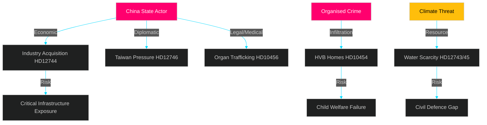

# Threat Analysis — 29 April 2026

**Framework**: STRIDE / DIME (Diplomatic, Information, Military, Economic)

## State-Level Threat Actors

### China (Priority 1)

**Threat vector cluster** (HD12744, HD12746, HD10456):

| DIME Dimension | Activity | Evidence | Confidence |
|----------------|----------|----------|-----------|
| Diplomatic | Pressure on Sweden over Taiwan visit cancellation | HD12746 (Annicka Engblom/M) | HIGH [B1] |
| Information | Strategic influence through industry acquisition | HD12744 (Rashid Farivar/SD) | HIGH [B1] |
| Military | N/A (not current) | — | — |
| Economic | Acquisition of Swedish basic industry, energy assets | HD12744 written question | HIGH [B1] |
| Legal/Medical | Organ trafficking from executed Chinese prisoners | HD10456 (Nasser Miri/MP) | MEDIUM [B2] |

**Assessment**: China's influence operations in Sweden are multi-vector. The three instruments raised today in Riksdagen represent a coordinated (if informal) parliamentary signal across three different parties (SD, M, MP). This suggests broader concern exists than any single party would acknowledge.

### Non-State: Organised Crime (Priority 2)

**Threat vector** (HD10454):

| Dimension | Activity | Evidence | Confidence |
|-----------|---------|---------|----------|
| Criminal infiltration | Gangs operating residential care for vulnerable youth | HD10454 interpellation, Police 2024 report | HIGH [B1] |
| Economic | Revenue extraction from welfare system | Parliamentary IPK data | HIGH [B1] |
| Recruitment | Radicalising vulnerable youth in care | SÄPO framing (2025 Annual Report) | MEDIUM [B2] |

**Assessment**: This is not a future risk — it is current and documented. The Police report from 2024 confirmed gang infiltration of HVB homes. The political response has been inadequate.

### Climate/Environmental (Priority 3)

**Threat vector** (HD12743, HD12745):

| Dimension | Activity | Evidence | Confidence |
|-----------|---------|---------|----------|
| Resource scarcity | Water shortage in southern Sweden | HD12743, HD12745 interpellations | HIGH [B1] |
| Cascade risk | Municipal supply chains affected | Länsstyrelse Skåne, SMHI 2025 forecast | MEDIUM [B2] |
| Civil defence gap | No unified national response plan | HD12745 civil defence framing | HIGH [B1] |

## STRIDE Threat Mapping

| Threat Category | Vector | Impact | Mitigation |
|-----------------|--------|--------|-----------|
| Spoofing | Chinese front companies in FDI context | HIGH | Mandatory SÄPO pre-filing for designated sectors |
| Tampering | Gang manipulation of HVB placement decisions | HIGH | IVO–Police database integration |
| Repudiation | Government denial of China risk | MEDIUM | Parliamentary record creates accountability |
| Information Disclosure | Cloud policy vacuum | MEDIUM | National cloud framework (HD12742) |
| Denial of Service | Water supply disruption | HIGH | MSB emergency framework activation |
| Elevation of Privilege | Criminal HVB home operators gaining welfare certification | HIGH | Real-time IVO–Police cross-check |

