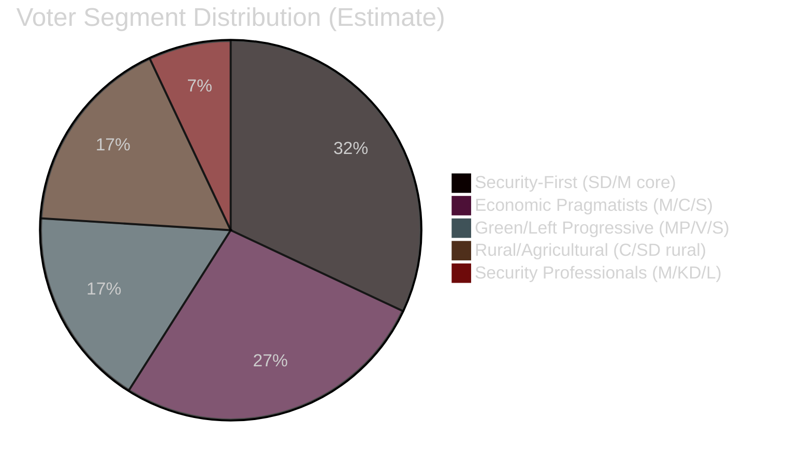

# Voter Segmentation — 29 April 2026

**Framework**: Political psychology + geographic + demographic segmentation

## Segment 1: Security-First Voters (SD core, M sympathisers)

**Estimated size**: 30-35% of electorate

**Key issues today**: JuU10 (weapons law), China threat (HD12744, HD12746), HVB criminal homes (HD10454)

**Reaction to today's news**:
- JuU10 passage: POSITIVE for urban security-first voters; cautious among rural hunters
- China issues: HIGH resonance — SD's Farivar explicitly raising these signals to this segment
- HVB criminal infiltration: HIGHLY negative for incumbent coalition — "government hasn't protected children"

**Election implication**: SD retains this segment but M may lose suburban security voters to S if HVB scandal dominates.

## Segment 2: Economic Pragmatists (M+C middle-class, older S voters)

**Estimated size**: 25-30% of electorate

**Key issues today**: Nuclear permitting (HD01NU19), Pay Transparency (HD12739), EU coordination (HDA3EUN37)

**Reaction to today's news**:
- Nuclear reform: POSITIVE — energy cost concerns drive support for stable baseload
- Pay Transparency: Positive for women in workforce; neutral-positive for employers if implementation flexible
- EU Ecofin coordination: Largely invisible to this segment but signals economic competence

**Election implication**: This segment could swing election. Nuclear reform appeals; HVB failure alienates.

## Segment 3: Green/Left Progressives (MP, V, young S voters)

**Estimated size**: 15-20% of electorate

**Key issues today**: Organ trafficking (HD10456), mobile cultural heritage (HD10455), pay transparency (HD12739)

**Reaction to today's news**:
- Organ trafficking from China: High human rights resonance; MP's Miri raises profile
- Pay transparency: Strong V/MP resonance
- Water security: Climate narrative fits this segment

**Election implication**: If MP and V both pass 4% threshold, centre-left bloc has viable government majority. If either fails threshold, seats redistributed — likely benefiting S.

## Segment 4: Rural/Agricultural Voters (C, SD rural, some M)

**Estimated size**: 15-20% of electorate

**Key issues today**: Water scarcity in southern Sweden (HD12743, HD12745), JuU10 licensing impact on hunters

**Reaction to today's news**:
- Water crisis: VERY HIGH resonance — agricultural water security directly affects livelihoods
- JuU10: Mixed — supports weapons ownership but concerned about licensing burden
- Nuclear reform: Positive on energy security (agricultural cost concerns)

**Election implication**: C may recover in rural areas via water security narrative. SD risks losing some rural voters if JuU10 licensing burden perceived as too high.

## Segment 5: Security/Defence-Oriented Professionals (M, KD, some L)

**Estimated size**: 8-12% of electorate

**Key issues today**: HD12744 (China FDI), HD12746 (Taiwan), JuU10 NATO alignment

**Reaction**: High engagement; JuU10 passage is strongly positive. China FDI gap concerns this segment.

## Segmentation Diagram

## Swing Voter Alert: The HVB Parent Voter

A specific micro-segment warrants special attention: parents of children in or at risk of entering the social welfare system. HD10454's core message — criminal gangs operating residential care — is visceral and personal. This segment voted M/SD in 2022 on security grounds but could switch to S in 2026 if child welfare failure narrative dominates.

**Estimated size**: 3-5% of electorate (potentially decisive).
**Current lean**: Soft coalition support.
**Trigger for switch**: Single documented child harmed in gang-controlled HVB home.

